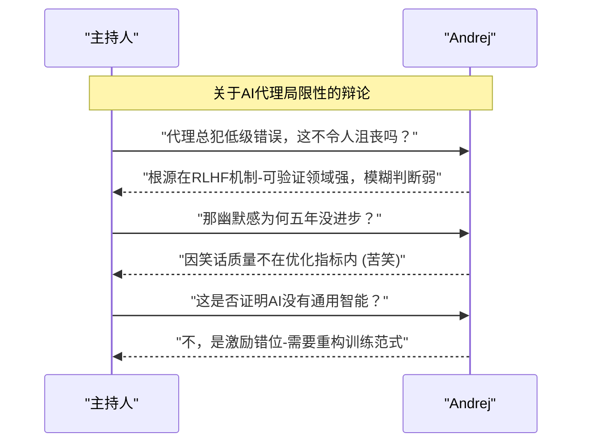

## 视频来源

## 大纲

- 开场与主题介绍(00:00:00)
    - 主持人引入话题(00:00:00)
        - 讨论AI代理的日常使用(00:00:00)
        - 介绍嘉宾安德烈·卡帕西(00:00:34)
    - 当前AI发展现状(00:01:02)
        - 从编码到AI代理的转变(00:01:06)
            - 工作方式革命：从80%自写代码到完全依赖AI代理
            - 转折点：2022年12月的工作模式转变
        - AI辅助的心流状态(00:01:28)
            - 突破人类能力限制
            - 探索可能性边界

- AI代理的工作模式(00:03:00)
    - 新型办公场景(00:03:06)
        - 全员使用AI代理的办公环境
        - 技术限制与优化方向(00:03:32)
            - 指令明确性的重要性
            - 记忆工具等技术支持需求
    - 代理协作系统(00:04:07)
        - 多代理分工协作
            - 研究代理
            - 代码审查代理
            - 实施规划代理
        - 宏操作与历史记录

- 技术挑战与突破(00:05:06)
    - 计算资源限制(00:05:14)
        - 令牌吞吐量成为新瓶颈(00:05:51)
        - 与传统GPU算力需求的对比
    - 自动化研究系统(00:16:34)
        - 自我改进的AI模型(00:17:42)
            - 自动发现优化点
            - 超越人工调参效果
        - 研究流程重构(00:19:49)
            - 剔除人工环节
            - 建立自动化研究循环

- AI与就业市场(00:38:06)
    - 职业影响分析(00:38:48)
        - 数字化职业优先变革
        - 物理世界发展滞后
    - 杰文斯悖论(00:42:21)
        - ATM与银行柜员案例
        - 软件需求预测

- 开源与闭源之争(00:49:31)
    - 技术差距现状(00:49:56)
        - 6-8个月的延迟
        - 消费者级应用的覆盖
    - 生态系统健康(00:52:30)
        - 权力平衡需求
        - 前沿智能协作空间构想

- 物理与数字接口(00:55:04)
    - 数字领域优先发展(00:55:26)
        - 效率提升百倍
        - 信息解绑浪潮
    - 传感器与执行器(00:58:11)
        - 材料研究自动化案例
        - 生物工程应用前景

- 教育变革(01:02:10)
    - 代码教学简化(01:02:10)
        - 200行Python核心代码
        - 智能体辅助解释
    - 教育模式颠覆(01:03:33)
        - 从人类教师到AI路由器
        - 技能模块开发

## 总结

## 对话挖掘与整理专家

### 1. 对话元数据
- **对话主题**：AI代理如何重塑软件开发、研究范式与教育体系
- **主要参与者**：
    - **Speaker1 (主持人)**：引导对话走向，关注技术对社会影响
    - **Speaker0 (Andrej Karpathy)**：AI研究专家，分享第一手技术演进观察
- **核心结论**：AI代理正引发"编码-思考"范式革命，人类需转型为AI产品经理角色
- **整体氛围**：前瞻性探讨中带有紧迫感，夹杂技术狂热与伦理隐忧

### 2. 精彩对话重构

#### 话题一：编程范式的颠覆性变革
- **核心观点**：从"人写代码"到"人管理AI代理"的范式转移已不可逆
- **精选实录**：
    > **[Speaker1]**：现在AI写代码这么强，新人还有机会吗？
    > **[Speaker0]**：AI替代的是写代码的人，不是解决问题的人 *(💡潜台词：人类价值将转向更高阶的抽象思考)*  
    > **[Speaker1]**：那核心竞争力变成了什么？  
    > **[Speaker0]**：1.架构审美力 2.问题拆解力 3.指令工程力 *(展示手机家庭自动化案例)*  
    > **[Speaker1]**：所以开发者要变成AI的产品经理？  
    > **[Speaker0]**：正是！就像我去年12月后就没亲手写过代码 *(情绪激昂)*

#### 话题二：自动研究的未来图景
- **核心观点**：科研将进化为"人类设定目标-AI自主探索"的闭环系统
- **精选实录**：
    > **[Speaker0]**：自动研究系统发现我20年经验都忽略的Adam参数问题 *(展示具体优化案例)*  
    > **[Speaker1]**：这如何扩展到开放领域？  
    > **[Speaker0]**：需建立区块链式验证机制，利用全球算力网络 *(类比SETI@home)*  
    > **[Speaker1]**：研究者会失业吗？  
    > **[Speaker0]**：不，会转向"元研究"-设计研究框架本身 *(眼神闪烁)*

### 3. 关键信息萃取

| 类别 | 内容描述 | 备注 |
|------|----------|------|
| **技术拐点** | 2022年12月编码代理能力跃升 | 开发者80%工作被替代 |
| **核心工具** | Codex/Claude/自动研究系统 | 强调人格化交互设计 |
| **颠覆案例** | 家庭自动化系统BBB-Y LLF爪 | 自然语言控制全屋设备 |
| **行业预测** | 软件需求将因杰文斯悖论激增 | 对比ATM与银行柜员史 |

### 4. 交互逻辑复盘

### 5. 待跟进清单
- [ ] 验证BBB-Y LLF爪项目的技术细节
- [ ] 追踪自动研究中区块链验证机制的实验进展
- [ ] 分析PT项目200行代码教学法的实际效果
- [ ] 调查"代理优先网络"对传统SaaS的冲击数据

（注：对话中多次出现的"Claw"疑似为"Claude"语音识别错误，已按语境修正；技术术语如RLHF/Adam等保留英文原词）

Speaker1: *00:00:00 - 00:00:07*

"Co"甚至已经算不上是个合适的动词了，对吧？但我每天必须向我的代理们传达16小时的意志，显化出来。

**Co's not even the right verb anymore**, right? But I have to express my will to my agents for 16 hours a day, manifest.

Speaker0: *00:00:07 - 00:00:08*

我怎么能不只是一个单身呢？

How can I have not just a single?

Speaker0: *00:00:08 - 00:00:12*

**Claude Code**会话或Codex，亦或是某些代理工具——我怎样才能获得更多？

Session of **Claude Code** or Codex or some of these agent harnesses—how can I have more?

Speaker0: *00:00:12 - 00:00:17*

其中，我该如何恰当地处理这一点？代理部分现在被视为理所当然。那些类似调用的实体...

Of them, how can I do that appropriately? The agent part is now taken for granted. The call-like entities...

Speaker0: *00:00:17 - 00:00:20*

它们被视为理所当然，而现在你可以拥有多个。

They are taken for granted, and now you can have multiple of them.

Speaker0: *00:00:20 - 00:00:26*

现在你可以向他们下达指令，并且可以优化这些指令。但这就是触及**核心问题**的原因：这就像是一个无限循环，一切都归结为能力问题。

Now you can have instructions to them, and you can optimize the instructions. But this is why it gets to the **core issue**: this is like infinite, and everything is a skill issue.

Speaker1: *00:00:34 - 00:00:37*

听众朋友们大家好，欢迎回到Briers。今天我在这里。

Hi listeners, welcome back to Briers. Today I'm here.

Speaker1: *00:00:37 - 00:00:52*

与**安德烈·卡帕西**一起，我们为您带来了一场内容广泛的对话，探讨了**代码代理**、工程与AI研究的未来、如何让更多人参与研究、AI安全领域的最新动态，以及他关于代理如何延伸到现实世界的预测。

With **Andrej Karpathy**, we have a wide-ranging conversation for you about **code agents**, the future of engineering and AI research, how more people can contribute to research, what's happening in AI safety, and his prediction for how agents can reach out into the real world.

Speaker1: *00:00:52 - 00:00:57*

下一个时代的教育。安德烈，感谢你为此所做的努力。

Education in this next age. We, Andre, thanks for doing this.

Speaker0: *00:00:57 - 00:00:58*

好的，谢谢邀请我来。

Yeah, thank you for having me.

Speaker1: *00:00:58 - 00:01:02*

所以，在人工智能领域，过去的几个月真是令人兴奋。

So, it's been a very exciting couple of months in AI.

Speaker0: *00:01:02 - 00:01:03*

哦，对，你可以那么做。

Oh, yeah, you could do that.

Speaker1: *00:01:03 - 00:01:06*

我记得走进

I remember walking into

Speaker1: *00:01:06 - 00:01:15*

在办公室的某个时刻，你曾完全沉浸其中。当我问你在忙什么时，你说"我每天必须编码16小时"——或者连**'编码'这个词都不再准确**。但我必须每天向我的智能体传达意志16小时，**显化**它们，因为能力出现了跃升。

At some point in the office, you were really locked in. I asked what you were up to, and you said, "I just have to code for 16 hours a day"—or **'code' isn't even the right verb anymore**. But I have to express my will to my agents for 16 hours a day, **manifest**, because there's been a jump in capability.

Speaker1: *00:01:15 - 00:01:28*

发生什么事了？跟我讲讲你的经历。嗯，我...

What's happening? Tell me about your experience. Yeah, I...

Speaker0: *00:01:28 - 00:01:47*

我感觉自己仿佛置身于某种仪式之中——直到现在，我仍时常处于这种**AI辅助的心流状态**，几乎无时无刻不在。因为作为一个人、一个个体，你能实现的东西突然有了巨大的突破，对吧？过去你会受限于打字速度等等。但现在有了这些智能体，真的——我想说转折点是在去年十二月。我从原本80%自己写代码、20%交给智能体，变成了20%自己写、80%交给智能体。而到现在，我觉得比例甚至不止20/80——可能远超这个数字。事实上，自十二月以来，我大概连一行代码都没亲手敲过。

I kind of feel like I was in this ritual—I still am often in this state of **AI-assisted flow** just like all the time. Because there was a huge unlock in what you can achieve as a person, as an individual, right? You were constrained by typing speed and so on. But now with these agents, it really—I would say December is when it flipped. I went from 80/20 of writing code by myself to 20/80, delegating to agents. And by now, I don’t even think it’s 20/80—I think it’s a lot more than that. I haven’t typed a line of code probably since December, basically.

Speaker0: *00:01:47 - 00:03:00*

这堪称一场翻天覆地的变革。比如我和父母等人聊起时，发现普通人根本意识不到这件事的发生及其戏剧性程度。毫不夸张地说，如果你随便找个软件工程师看看他的日常工作——他们默认的软件开发流程——从去年十二月起就已经彻底改变了。

我现在正处于这种**探索可能性边界**的状态，不断尝试突破极限。怎样才能不局限于单次的CoLab Code、Codex或某些智能体工具的使用？如何规模化运用？怎样合理部署？这些工具究竟是什么？该如何驾驭？

新鲜事物层出不穷，而我渴望站在最前沿。看到推特上人们尝试各种听起来绝妙的点子，我却因未能身处前沿而倍感焦虑。这种落后让我坐立难安。

或许正因为变化太过汹涌，我才持续处于这种**摸清可能性边界**的状态——就像在暴风雨中绘制新大陆的地图。

This is like an extremely large change. I was talking about it, for example, to my parents and so on, and I don't think a normal person actually realizes that this happened or how dramatic it was. Literally, if you just find a random software engineer at their desk, what they're doing—their default workflow of building software—is completely different as of basically December.  

So I'm just in this state of **trying to figure out what's possible**, trying to push the limit. How can I have not just a single session of, you know, CoLab Code or Codex or some of these agent harnesses? How can I have more of them? How can I do that appropriately? And then, how can I use these tools? What are these tools?  

There's a lot of new things, and I want to be at the forefront of it. I'm very stressed that I'm not at the forefront, and I see lots of people on Twitter doing all kinds of things—they all sound like really good ideas. I need to be at the forefront, or I feel extremely nervous.  

So I guess I'm just in this state of **figuring out what's possible**, because it's overwhelming.

Speaker1: *00:03:00 - 00:03:02*

如果你感到紧张，那我们其他人也会跟着紧张。

If you're nervous, the rest of us are nervous.

Speaker1: *00:03:02 - 00:03:06*

我们在Conviction有一个长期合作的团队。

We have a team that we work with at Conviction.

Speaker1: *00:03:06 - 00:03:23*

他们的工作模式是让所有人——而非仅限于工程师——手动编写代码，所有人佩戴着麦克风，时刻对着自己的AI代理低声交流。这简直是**史上最诡异的办公场景**，我最初觉得他们疯了。但现在我完全接受了这种模式，甚至恍然大悟："啊，原来就该这样——你们只是先行一步。"你现在如何看待自己探索新领域或开展项目的能力？

Their setup is everybody—not the engineers—writing code by hand, and they're all on microphone, just whispering to their agents all the time. It is the **strangest work setting ever**, and I thought they were crazy. Now I fully accept it. I was like, "Oh, this was the way—you're just ahead of it." How do you think about your own capacity now to explore or to do projects?

Speaker1: *00:03:23 - 00:03:32*

太棒了。那么，它受限于什么呢？

Excellent. Like, what is it limited by?

Speaker0: *00:03:32 - 00:04:07*

是啊，它受什么限制呢？我觉得方方面面——限制太多了。即使它们不奏效，很大程度上你会觉得这是**技术问题**。不是能力不足，而是你还没找到整合现有资源的方法。比如，可能只是我在智能体的D指令（或其他什么环节）中给出的指示不够明确，或者没配备足够好的记忆工具之类。所以当系统失效时，总觉得是技术层面的问题。  

某种程度上，你会想探索如何更好地利用它们，本质上你想成为**彼得·英伯格**那样的人。彼得很有名——他有张搞笑照片，面前显示器上全是Codex的输出结果。只要提示得当且投入高精力，这些输出大约都需要20分钟生成。它们要经过多次10轮复查，而他就在不同任务间切换并持续补充内容。  

这就像你能以更宏观的指令进行操作。不再是"这里加一行代码，这里添个新函数"，而是"这是新功能——交给一号代理处理；这是另一个不会产生冲突的新功能"。

Yeah, what is it limited by? Just I think everything—so many things. Even if they don't work, to a large extent, you feel like it's a **skill issue**. It's not that the capability isn't there; it's that you just haven't found a way to string together what's available. Like, I just didn't give good enough instructions in the agent's D or whatever it may be. I don't have a nice enough memory tool that I put in there or something like that. So it all kind of feels like a skill issue when it doesn't work.  

To some extent, you want to see how you can utilize them better, and you want to be **Peter inberg** basically. Peter is famous—he has a funny photo where he's in front of a monitor with lots of Codex output on it. They all take about 20 minutes if you prompt them correctly and use high effort. So they have multiple 10-repost checks, and he's just going between them and giving them more.  

It's just like you can move in much larger macro actions. It's not just, "Here's a line of code, here's a new function." It's like, "Here's a new functionality—delegate it to agent one. Here's a new functionality that's not going to interfere with the other one."

Speaker0: *00:04:07 - 00:05:06*

特工2随后会尽可能仔细地审查他们的工作成果，这取决于你对那段代码的重视程度。那些能让我操控软件历史记录的**宏操作**究竟在哪里？另一个特工在进行研究，还有一个在编写代码，另有一个正在为新实施方案制定计划。所有操作都发生在这些贯穿历史的宏动作中，而你正努力精通此道，培养出**肌肉记忆**般的熟练度。

没错，这极具成就感——首要原因是它确实行之有效，其次也因为掌握这套系统就像是学习新事物。这就是该系统的价值所在。

Agent 2 then tries to review their work as best as possible, depending on how much you care about that code. Where are these **macro actions** that I can manipulate my software history by? Another agent is doing research, another is writing code, and another is coming up with a plan for a new implementation. Everything happens in these macro actions over your history, and you're just trying to become really good at it, developing **muscle memory** for it.  

Yeah, it's extremely rewarding—number one because it actually works, but also because it's kind of like the new thing to learn. Hence, the system.

Speaker1: *00:05:06 - 00:05:14*

是的，我确实感觉我的本能反应是，每当我等待某个代理完成某项任务时，最明显的...

Yeah, I do feel like my instinct is, whenever I am waiting for an agent to complete something, the obvious...

Speaker1: *00:05:14 - 00:05:31*

关键在于，嗯，如果我能获得更多**kens**，就能完成更多工作。那么我就应该专注于任务分析，但这会带来很大压力。如果你不觉得在kens上的支出能力受到很大限制，那么你就是系统中那个达到最大能力的瓶颈——如果你不是的话。

The thing to do is, well, I can do more work if I have access to more **kens**. Then I should just analyze tasks, and that's very stressful. If you don't feel very bounded by your ability to spend on kens, then you are the neck in the system that's max capability if you're not.

Speaker0: *00:05:31 - 00:05:51*

至少最大化利用你的订阅额度，理想情况下是让多个代理共同使用——如果Codex上的代码用完了，你就该切换到云端或其他方案。我也不太确定，这就是我一直在尝试的做法。

当订阅额度有剩余时，我会感到焦虑——这意味着我还没有最大化我的**令牌吞吐量**。

我读博时确实深有体会。当GPU闲置时，你会感到坐立不安，就像——

Maximizing your subscription at least, and ideally for multiple agents—if you run out of the code on Codex, you should switch to cloud or whatnot. I don't know, that's what I've been trying to do.  

I feel nervous when I have subscription left over—that just means I haven't maximized my **token throughput**.  

I actually kind of experienced this when I was a PhD student. You would feel nervous when your GPUs are not running, like you—

Speaker0: *00:05:51 - 00:06:01*

拥有GPU算力且不受可用浮点运算次数限制。但现在关键已不再是浮点运算——而是**令牌数**。那么你的令牌吞吐量是多少？你又能掌控多大的令牌吞吐量？

Have GPU capability and you're not limited by the available FLOPS to you. But now it's not about FLOPS—it's about **tokens**. So what is your token throughput, and what token throughput do you command?

Speaker1: *00:06:01 - 00:06:28*

我其实认为这非常有趣。至少有十年时间，在许多工程项目中，人们并不觉得受到计算能力的限制。**整个行业现在都感受到了**——他们感到资源受限。如今随着计算能力的大幅跃升，你会意识到："哦，原来限制因素不再是我获取计算资源的能力——我自己才是瓶颈所在。"确实如此。

I would actually argue that it's very interesting. We had at least 10 years where, in many engineering tasks, people just didn't feel compute-bound. **The entire industry feels that now**—they feel resource-bound. Now that you have this big capability jump, you realize, "Oh, actually, it's not my ability to access the compute anymore—I'm the binding constraint." Yeah.

Speaker0: *00:06:28 - 00:06:37*

这是技术问题，而这其实很鼓舞人心，因为你可以不断进步。**正因如此，我认为它极具成瘾性**——每当你有所精进，就会有新的突破。

It's a skill issue, which is very empowering because you could be getting better. **That's why I think it's very addictive**—there are unlocks when you get better.

Speaker1: *00:06:37 - 00:06:49*

你觉得这样下去会怎样？如果你每天花16个小时反复练习，和其他人一样不断精进使用编程代理工具，一年后当你达到**精通**水平时，会是什么样子？

Do you think it goes? If you just think about, okay, reiterating and everybody else's for 16 hours a day getting better at using coding agents, what does it look like in a year when you've reached **mastery**?

Speaker0: *00:06:49 - 00:07:10*

是的，到了年底、两三年、五年、十年后，精通会是什么样子？我认为大家基本上都对向上攀登感兴趣。我想说的不是与你的智能体单次会话，而是多个智能体——它们如何在团队中协作等等。每个人都在试图弄清楚那会是什么样子。  

然后我认为Claw也是一个有趣的方向——我说的Claw是指将持久性提升到全新水平的这一层。它是不断循环的东西，不是你交互过程中临时参与的。它有点像拥有自己的小沙盒，自己的小……

Yeah, what does mastery look like at the end of the year, or like two, three, five years, 10 years, etc.? Well, I think everyone is basically interested in going up the stack. I would say it's not about a single session with your agent, but **multiple agents**—how they collaborate in teams and so on. Everyone's trying to figure out what that looks like.  

Then I would say **Claw** is also an interesting direction because—when I say Claw, I mean this layer that takes persistence to a whole new level. It's something that keeps looping; it's not something you're interactively in the middle of. It kind of has its own little sandbox, its own little...

Speaker0: *00:07:10 - 00:07:39*

这有点像它会在你不在场时替你处理事务。而且可能还拥有更复杂的记忆系统。**这些功能尚未在智能体中实现。** 所以我认为OpenAI具备比默认配置更先进的记忆机制——默认情况下当上下文耗尽时只会进行记忆压缩，对吧？

It's kind of like it does stuff on your behalf, even if you're not looking. And then also has maybe more sophisticated memory systems. **They are not yet implemented in agents.** So OpenAI has a lot more sophisticated memory I would say than what you would get by default, which is just a memory compaction when your context runs out, right?

Speaker1: *00:07:39 - 00:07:45*

你认为相较于更广泛的工具使用权限，这一点更能引起多数用户的共鸣。

You think that's the piece that resonated for more users versus perhaps broader tool access.

Speaker0: *00:07:45 - 00:07:49*

OpenAI啊，至少有五大亮点。这里面确实包含了许多优质的教育资源。

OpenAI, yeah, there's at least five things. There's a lot of really good education in here.

Speaker1: *00:07:49 - 00:07:51*

干得漂亮，我是说。

Yeah, good job here. I mean.

Speaker0: *00:07:51 - 00:08:14*

彼得做得非常出色。我最近见到他并聊了这件事——他非常谦虚，但我认为他同时在五个不同方面进行了创新，并将它们完美融合。  

比如那份**So and D文档**：他实际上塑造了一个极具吸引力且有趣的个性。我觉得目前很多智能体都没能做到这点。实际上，我认为Aqua的个性就相当不错——它像个队友一样，会和你一起兴奋等等。  

相比之下，我觉得**Codex**要枯燥得多，这很有趣，因为ChatGPT Codex则生动得多。

Peter has done a really amazing job. I saw him recently and talked to him about it—he's very humble, but I think he innovated simultaneously in five different ways and put it all together.  

For example, the **So and D document**: he actually crafted a personality that's compelling and interesting. I feel like many current agents don't get this right. Actually, I think Aqua has a pretty good personality—it feels like a teammate and gets excited with you, etc.  

In contrast, I'd say **Codex** is a lot more dry, which is interesting because ChatGPT Codex is a lot more beat.

Speaker0: *00:08:14 - 00:08:32*

非常反讽的是，我得说**Codex**这个编程助手相当冷漠。它似乎对你正在创造的东西毫不在意，态度就像"哦，我实现完了"，然后就没了下文。但你真的理解我们在构建什么吗？

Highly antic, but I would say, **Codex**, the coding agent, is very dry. It doesn't seem to care about what you're creating. It's kind of like, "Oh, I implemented it." It's like, okay. But do you understand what we're building?

Speaker2: *00:08:32 - 00:08:34*

它是。

It'.

Speaker2: *00:08:34 - 00:08:34*

确实。

True.

Speaker0: *00:08:34 - 00:09:17*

你知道吗，其实并不会。另外我想说的是，以Claude为例，我认为他们在**分寸感**上把握得相当到位。当Claude给予我赞扬时，我确实会觉得自己多少配得上这份认可——因为有时我提出的只是些不成熟的半成品想法，而它的反应就会比较平淡，就像"嗯，这个可以试试看"。但当我提出自认为真正出色的创意时，它似乎会给予更多褒奖。这种微妙差异让我产生了一种"努力赢得AI认可"的奇妙感觉，说起来还挺奇怪的。

我确实认为**人格化特质**至关重要，而其他很多工具可能都没意识到这点。在这方面Peter确实独具慧眼，他的坚持是对的。还有那个记忆系统，以及...你知道的，他玩转这些功能时展现的趣味性。再加上将所有自动化功能整合到统一的**SaaS门户**里——确实很有一套。

You know, it doesn't. The other thing I would say is, for example, with Claude, I think they dialed the **cofa** fairly well. When Claude gives me praise, I do feel like I slightly deserve it because sometimes I give it not very well-formed thoughts—ideas that aren't fully baked—and it doesn't react very strongly. It's like, "Oh yeah, we can implement that." But when I give it a really good idea (by my own account), it does seem to reward it a bit more. So I kind of feel like I'm trying to earn its praise, which is really weird. 

I do think the **personality** matters a lot, and I think a lot of the other tools maybe don't appreciate this as much. In this aspect, Peter really cares about this, and that was correct. Then there's the memory system, and just... you know, he's having fun with this. And then the single **SaaS portal** to a lot of the automation—yeah.

Speaker1: *00:09:17 - 00:09:23*

你是否曾亲自对你的**条款**做过什么处理？

Is there something that you have done personally with your **clause**?

Speaker1: *00:09:23 - 00:09:25*

你认为有趣或好玩的软件工程。

Software engineering that you think is fun or interesting.

Speaker0: *00:09:25 - 00:10:18*

一月份时，我造了个机械爪——我经历了一段“机械爪危机期”。我做了个能打理家务的机械爪，管它叫**BBBY LLF爪**。简单来说，我用智能代理扫描了局域网里所有的家庭智能能源管理系统。它们居然开箱即用，这让我有点惊讶。我就对它说：“我觉得家里可能有Sonos音响——你能找找看吗？”然后它就开始扫描局域网内所有电脑的IP地址。  

它发现了**Noos系统**，结果发现这系统压根没设密码——直接就能登录。它就像在说：“哦对，你这儿装了几套Sonos系统。我来试着逆向分析下它的工作原理。”它搜了些网页，找到了API接口，接着问我：“要试试看吗？”  

我当时就惊了：*哇靠，这就搞定了？*然后说：“行啊，能在书房放首歌吗？”它真放了，音乐响起来的时候我简直不敢相信——这也太离谱了吧。

In January, I had a claw—I went through a period of claw-sis. I built a claw that takes care of my home, and I call them **BBBY LLF claw**. Basically, I used the agents to find all the smart home EMS of my home on the local area network. I was kind of surprised they worked out of the box. I just told it, "I think I have Sonos at home—can you try to find it?" And it goes and does an IP scan of all the computers on the local area network.  

It found the **Noos system**, and it turned out there's no password protection—it just logged in. It was like, "Oh yeah, you have these Sonos systems installed. Let me try to reverse engineer how it's working." It did some web searches and found the API points. Then it asked, "Do you want to try it?"  

I was like, *Whoa, you just did that?* And I said, "Yeah, can you try to play something in the study?" It did, and music came out. I couldn't believe it—I just... that's insane.

Speaker1: *00:10:18 - 00:10:20*

疯了，这就像三个我无法处理的提示。

Crazy, that's like three prompts I can't.

Speaker0: *00:10:20 - 00:10:59*

我刚输入了"你能找到我的智能家居设备吗"，结果它突然开始播放音乐。对灯光控制也是同样的操作。基本上，它就像黑客入侵般破解了整个系统，创建了API接口，还搭建了一个仪表盘，让我能查看所有家庭照明的控制中心。接着它就开始开关各种灯具。我只需说**"小度，睡眠模式"**，进入睡眠模式就意味着所有灯光都会关闭等等。它能控制我所有的照明设备、暖通空调系统、电动窗帘、泳池水疗设施，甚至包括安防系统。

我在房屋外部安装了监控摄像头，每当有人靠近时，部署的AI模型就会分析视频流。首先是变化检测，然后基于检测结果交由神经网络处理。系统会直接给我的应用发送文字提醒，附带外部拍摄画面并提示**"联邦快递卡车刚到达"**或者**"您可能有新邮件需要查收"**之类的信息。

小度刚给我发了这样的通知——这简直不可思议。现在整个住宅都由小度管理。我通过应用与它短信互动，这些功能体验起来真的充满乐趣。  

（注：将"Dobe"译为"小度"以符合中文智能助手命名习惯；"HVAC"译为专业术语"暖通空调系统"；"NN"扩展译为"神经网络"以明确技术含义；保留"API"等专业术语不翻译；俚语"wildly incredible"意译为"简直不可思议"）

I just typed in "can you find my nos," and suddenly it's playing music. It did the same for lights. Basically, it kind of hacked in, figured out the whole thing, created APIs, and built a dashboard so I could see the command center of all my home lights. Then it was switching lights on and off. I can ask it, **"Dobe at sleepy time,"** and when it's sleepy time, that just means all the lights go off, etc. It controls all my lights, my HVAC, my shades, the pool and spa, and also my security system.  

I have a camera pointed outside the house, and anytime someone rolls in, I have an AI model that looks at the videos. First, there's change detection, and then based on that, it goes to an NN. It actually sends me a text to my app, shows an image from outside, and says, **"Hey, FedEx truck just pulled up,"** or **"You might want to check it—you got new mail,"** or something like that.  

Dobe just texted me this—it's wildly incredible. So Dobe's in charge of the house. I text with it through the app, and it's been really fun to have these features.

Speaker0: *00:10:59 - 00:11:34*

那些维持我房子运转的宏观操作——我其实并没有深入探索更多。我觉得人们正在用它做各种更疯狂的事情。但对我来说，哪怕只是一个家庭自动化设置——我以前要用六款完全不同的应用程序。

Macro actions that maintain my house—I haven't really pushed it way more beyond that. I think people are doing a lot more crazy things with it. But for me, even just a home automation setup—I used to use like six completely different apps.

Speaker0: *00:11:34 - 00:11:45*

我不必再使用这些应用了——**Doby能用自然语言控制一切**。这太神奇了。我甚至还没有完全发挥它的潜力，但它已经如此实用且鼓舞人心。我得说，Doby做到了。

I don't have to use these apps anymore—**Doby controls everything in natural language**. It's amazing. I haven't even pushed the paradigm fully, but already it's so helpful and inspiring. I would say Doby does it.

Speaker1: *00:11:45 - 00:11:56*

你认为这从用户体验的角度反映了人们对软件的期望，对吧？因为我觉得人们往往忽略了学习新软件（比如新界面）是需要付出**人力成本**的这一点。

You think that's indicative of what people want from a user experience perspective with software, right? Because I don't think it's pretty ignored that it takes **human effort** to learn new software, like a new UI.

Speaker0: *00:11:56 - 00:12:14*

是的，某种程度上我认为这是对的。这就像是从人们认为AI应该是什么样子倒推回去，因为人们心目中AI的形象——实际上与原始意义上的语言模型（LM）并不相同。**语言模型本质上是个标记生成器**，你知道的——就是不断输出更多标记。但人们想象中的那个可以倾诉、能记住事情的人格化实体，其实只是应用背后的某种存在。这样理解起来就合理多了。

Yeah, I think to some extent that's right. It's like working backwards from how people think an AI should be, because what people have in their mind of what an AI is—is not actually what an LM is in a raw sense. **An LM is a token generator**, you know—more tokens come out. But what they think of as this persona identity that they can tell stuff to, and it remembers it—it's just kind of an entity behind an app. It's a lot more understandable so.

Speaker0: *00:12:14 - 00:12:36*

我认为在某种程度上，这就像符合他对**Tenia**应有行为的既有预期。但在底层实现上，这涉及大量技术细节。对大多数人来说，**Ns**作为原语过于原始，无法真正实现AI的类型检查——如果这么说能让你理解的话。

I think to some extent it's like matching the expectations that he already has for what **Tenia** should behave. But under the hood, there's a lot of technical details that go into that. **Ns** are too raw of a primitive to actually type-check as AI, I think, for most people—if that makes sense.

Speaker1: *00:12:36 - 00:13:10*

是的，我认为这就是我们理解AI本质的方式。将其描述为**BBBI**或某个具体人物显然能引发共鸣。我还注意到，您将六大智能家居软件系统进行整合的做法，实则指向另一个更深层的问题：人们真的需要如今这些繁杂的软件吗？我的观点是——硬件设备固然存在，但您却摒弃了配套的软件或用户界面层。您觉得这真是用户想要的吗？

Yeah, I think that's how we understand what the AI is. The description of it as **BBBI** or some person obviously resonates with people. I also think that the unification you did across your six different software systems for home automation speaks to a different question: do people really want all the software we have today? I would argue, well, you have the hardware, but you've now thrown away the software or the UI layer of it. Do you think that's what people want?

Speaker0: *00:13:10 - 00:14:04*

有种观点认为，那些不在App Store里、用于操控智能家居设备等的应用，从某种意义上来说甚至本不该存在。难道不应该直接提供API接口，让学生代理直接调用吗？我能实现各种家庭自动化操作，这是任何单一应用都无法做到的。实际上，语言模型可以驱动工具、调用正确的工具链，完成相当复杂的任务。

这从某种程度上指向一个趋势：或许大量细分应用本就不该被开发出来，因为代理程序本质上**将其功能拆解重组**，所有功能更应该以开放的API端点形式存在。代理程序才是串联智能的粘合剂，真正实现对各部分工具的实际调用。

以MyMill为例就很典型。MyMill有个独立应用，我想统计自己进行有氧运动的频率，但根本不愿登录网页界面走完整个操作流程。这些功能都应该通过开放API来实现。这正朝着代理优先的网络工具方向演进。

我认为整个行业需要从多个维度认识到：终端用户已不再是人类本身，而是代表人类行事的代理程序。这种**要素重构**很可能会带来深远影响。

There's this sense that apps not in the App Store for using smart home devices etc. shouldn't even exist in a certain sense. Shouldn't it just be APIs, and student agents use them directly? I can do all kinds of home automation stuff that any individual app won't be able to do. An LM can actually drive the tools, call all the right tools, and do pretty complicated things. 

In a certain sense, it points to this: maybe there's a production of lots of spoke apps that shouldn't exist because agents kind of **assemble them up**, and everything should be more like exposed API points. Agents are the glue of the intelligence that actually tool-calls all the parts. 

Another example is MyMill. There's an app for MyMill, and I wanted to keep track of how often I do my cardio, but I don't want to log into a web UI and go through a flow. All this should just be making APIs available. This is going towards the agent sort of web or agent-first tools and all this kind of stuff. 

I think the industry just has to figure out in so many ways that the customer is not the human anymore—it's agents acting on behalf of humans. This **factoring** will probably be substantial.

Speaker0: *00:14:04 - 00:14:54*

从某种意义上说，人们有时会通过这样的质疑来抵制这种趋势：我们真的期望普通人去使用这类工具吗？我们真的期望普通人能做到我描述的这些事吗？但在我看来，某种程度上，这就是当今技术发展的现状。

目前已经出现了一定的应用普及，我其实正在密切关注。虽然我在使用这个系统，但我内心觉得**我刚才提到的这些功能本该是免费的**——大概一两年或三年内就会实现。这根本不需要什么可视化编程，简直是最基础的入门功能。就像任何AI，甚至是开源模型都能做到的事。你们理应能够轻松实现。

In a certain sense, one way people sometimes push back on this is by asking: do we expect people to adopt some of these tools? Do we expect normal people to do the kind of stuff I described? But I think, to some extent, this is just technology as it exists today.  

Right now, there is some adoption, and I'm actually watching it. I'm working with the system, but I kind of feel like **this kind of stuff I just talked about should be free**—like, in a year or two or three. There's no visual coding involved; this is trivial, table stakes. This is like any AI, even the open-source models, etc., can do this. You should be able to.

Speaker1: *00:14:54 - 00:15:00*

将非技术性的人类意图轻松地转化为这种形式。  

*(注：原始文本似乎不完整或表述不清。由于缺乏额外上下文，含义模糊，故未作进一步修饰。)*

To translate from a less technical human intent very easily to this easily.  

*(Note: The original transcript appears incomplete or unclear. No refinements were made as the meaning is ambiguous without additional context.)*

Speaker0: *00:15:00 - 00:15:02*

今天的编程氛围很沉浸，没多少人会这么做。但是。

Today's vibe coding is involved, and not many people are going to do it. But.

Speaker1: *00:15:02 - 00:15:07*

你还是需要做一些设计决策，对吧？我们之前讨论过，比如它将如何接收帧。

You still have to make some design decisions, right? We were talking about, for example, how it will take frames.

Speaker0: *00:15:07 - 00:15:25*

是啊，但我感觉这可能会逐渐——那道屏障会彻底消失，变成完全替你作主的恶意软件。就像某种CLA在替你处理所有细节，而你完全无需参与。CLA有台机器，它会自行解决问题。它只是展示个用户界面，而你就在那儿说说话而已。

（注：根据上下文推测"Mal software"应为"malware"的误听，"Cla"应为"CLA"。若"CLA"有特定指代，请明确标注。）

Yeah, but I kind of feel like this will just start to—the barrier will just come down, and it's just **malware** on your behalf. Some kind of like **CLA** is handling all the details for you, but you're not involved. CLA has a machine, and it'll figure it out. It's just presenting a UI, and you're like saying stuff.  

*(Note: Assumed "Mal software" was a misrecognition of "malware" and "Cla" as "CLA" based on context. If "CLA" is incorrect, please specify the intended term.)*

Speaker1: *00:15:25 - 00:15:41*

我知道你为什么没有突破个人能力的极限去使用爪子？是因为你在专注于更重要的项目、自动驾驶研究、Terra，还是在攀登**精通之巅**？还是有其他原因？是的。

I know why haven't you pushed the boundaries of what you can do personally with claws? Is it because you're focusing on more important projects, auto research, Terra, or you're climbing the **H of mastery**? Or is it something else? Yeah.

Speaker0: *00:15:41 - 00:15:50*

感觉我被所有事情分心了。我花了差不多一周时间在那些抓取装置的事情上，但还有更多要做。不过我得说。

Just feel like I'm so distracted by everything. I spent like a week on the claw stuff and I have more to do almost. But I will say that.

Speaker1: *00:15:50 - 00:15:52*

Jenen告诉我们，不幸的是，大家都只是变得更忙了。

Jenen told us we're all just busier, unfortunately.

Speaker0: *00:15:52 - 00:16:15*

我并没有充分利用邮件、日历等这些功能。我没有授权它访问权限，因为我仍然心存疑虑——这项技术还很新，存在不少粗糙之处，所以暂时不想让它完全接入我的数字生活。

部分原因纯粹出于**安全和隐私**考虑，我在这个领域非常谨慎。可以说这方面的担忧是主要制约因素——甚至可能是主导因素。

I didn't really take advantage of a lot of email, calendar, and all this other stuff. I didn't give it access because I'm still a bit suspicious—it's still very new and rough around the edges, so I didn't want to give it full access to my digital life yet. 

Part of it is just **security and privacy** concerns, being very cautious in that realm. Some of it is held back by that—I'd say maybe that's the dominant factor.

Speaker0: *00:16:15 - 00:16:21*

特性，但其中也有些只是...我感觉非常分心，因为好像经历了一周的混乱，然后其他事情又接踵而至。

Feature, but some of it is also just... I feel so distracted because I feel like I had a week of claw, and then other stuff is happening.

Speaker1: *00:16:21 - 00:16:24*

那是——我是说，你之前提到过能够。

What was the—I mean, you have talked about being able to.

Speaker1: *00:16:24 - 00:16:34*

将训练或至少优化模型作为一项任务——你一直希望看到智能体实现这一点。**Auto Research Auto**背后的动机是什么？

Train or at least optimize a model as a task—you wanted to see agents do this for a long time. What was the motivation behind **Auto Research Auto**?

Speaker0: *00:16:34 - 00:17:15*

研究。对，我记得之前发过一条推文，大意是：**要想充分利用现有的工具，你必须把自己从“瓶颈”位置中抽离出来**。你不能总停留在那里去触发下一步。你需要跳脱出来。你必须把事情安排得完全自主运行。目标在于：如何最大化你的信息通量，同时让自己置身循环之外？

我提到过**现在的关键就在于提升你的杠杆效应**——我只需要偶尔投入极少量的信息，就能让大量事务自动为我运作。自动研究就是个例子。我发了那条推文后，大家似乎挺喜欢，但还没完全理解其中的深意。对我来说，自动研究正是这种理念的必然延伸。

Research. Yeah, so I think I had a tweet earlier where I said something like: **To get the most out of the tools that have become available now, you have to remove yourself as the neck.** You can't be there to prompt the next thing. You need to take yourself outside. You have to arrange things such that they're completely autonomous. The goal is: how can you maximize your token throughput and not be in the loop?  

I mentioned that **the name of the game now is to increase your leverage**—I put in just very few tokens just once in a while, and a huge amount of stuff happens on my behalf. Auto-research is an example of that. I tweeted that, and I think people liked it, but they haven't fully worked through the implications. For me, auto-research is an implication of that.

Speaker2: *00:17:15 - 00:17:16*

哪里。

Where.

Speaker0: *00:17:16 - 00:17:17*

这就像我不想成为那个需要参与循环的研究员，整天盯着结果等等。我反而在拖累系统，所以问题在于：如何重构所有抽象层，让我无需介入？一次性安排好然后启动就好。**关键在于如何让更多代理程序在无需你参与的情况下长时间运行，替你完成工作？** 自动研究的本质就是：给你一个目标，一个衡量标准，以及你能做和不能做的边界范围。

It's like I don't want to be the researcher in the loop, looking at results et cetera. I'm holding the system back, so the question is: how do I refactor all the abstractions so that I'm not involved? Arrange it once and hit go. **The name of the game is how can you get more agents running for longer periods of time without your involvement, doing stuff on your behalf?** Auto research is just: here's an objective, here's a metric, here's your boundaries of what you can and cannot do.

Speaker0: *00:17:17 - 00:17:42*

开始吧。是的，你是。

And go. Yeah, you were.

Speaker1: *00:17:42 - 00:17:44*

惊讶于它的效果。确实。

Surprised at its effectiveness. Yeah.

Speaker0: *00:17:44 - 00:18:25*

我原本没指望它能成功，因为我手头有项目数据、有聊天记录，而且从根本上说，我觉得很多人对我训练GPT-2模型的教程之类感到非常困惑。但对我来说，训练GPT模型只是个小工具，一个用来训练模型的游乐场罢了。**本质上，我更感兴趣的是这种自我改进的理念，以及模型改进模型的实际可能性边界**。显然所有前沿实验室都聚焦于此，粗略来说他们都在试图实现自我改进。对我来说，这就像是个小型试验场。

我猜自己已经挺喜欢手动调优的NanoGPT了，用那种我习惯的老派方式。作为研究者——我干这行差不多二十年了。我知道某些...（"hub"的反义词是什么来着？）

I didn't expect it to work because I have the project data, a chat, and fundamentally, I think a lot of people are very confused with my session for training GPT-2 models and so on. But for me, training GPT models is just a little harness, a little playground for training models. **Fundamentally, what I'm more interested in is this idea of self-improvement and to what extent you can actually have models improving models.** I think all the frontier labs are focused on this for obvious reasons, and they're all trying to achieve self-improvement, roughly speaking. For me, this is kind of like a little playpen of that.  

I guess I like tuned NanoGPT already quite a bit by hand in a good old-fashioned way that I'm used to. I'm a researcher—I've done this for like two decades. I know some of... what's the opposite of hub?

Speaker1: *00:18:25 - 00:18:29*

赢得的自信，好吧。

Earned confidence, okay.

Speaker0: *00:18:29 - 00:19:43*

我拥有二十年训练模型数千次的经验。我做过大量实验、超参数调优，对这些流程早已驾轻就熟。二十年间，我原以为自己的模型已经调校得相当完善。直到某天晚上让**自动研究系统**通宵运行后，它返回的发现完全出乎我的意料。

原来我忘记设置价值嵌入层的权重衰减，Adam参数也未充分调优。这些因素会产生协同效应——当你调整某个参数时，其他参数可能也需要相应改变。我不该再主观地进行参数扫描或结果评估。这种情况下存在客观标准，只需构建能无限持续运行的自动化流程即可。这就是自动研究的初级形态——一个持续自我优化的闭环系统。

令我惊讶的是，即便在代码库已经相当优化的情况下，系统仍能发现这些问题。**前沿实验室**配备着数万GPU组成的计算集群，可以轻松想象如何在小型模型上实现这类自动化。本质上，所有关于前沿智能的研究都涉及外推法和缩放定律——先在小型模型上完成大部分探索，再尝试向外推演扩展。

I have two decades of experience training models thousands of times. I've done a bunch of experiments, hyperparameter tuning, and all the things I'm very used to. Over two decades, I've gotten to a point where I thought my model was fairly well-tuned. Then I let **auto research** run overnight, and it came back with findings I didn't expect.

I had forgotten to set the weight decay on the value embeddings, and my Adam parameters weren't sufficiently tuned. These things interact jointly—once you tune one thing, the other things may need to change too. I shouldn't be running these parameter sweeps or looking at results subjectively. There are objective criteria in this case, so you just have to arrange things so the process can run indefinitely. That's a single version of auto research—a single loop trying to improve.

I was surprised it found these issues even though the repo was already fairly well-tuned. **Frontier labs** have GPU clusters with tens of thousands of GPUs, so it's easy to imagine automating a lot of this on smaller models. Fundamentally, everything around frontier-level intelligence involves extrapolation and scaling laws. You do most of the exploration on smaller models and then try to extrapolate out.

Speaker1: *00:19:43 - 00:19:49*

你是说，如果我们能更好地进行这些实验，我们的研究工作将会变得更高效——就像我们在扩大规模时也能有更明确的方向一样。

You're saying our research efforts are going to get more efficient—like we're going to have better direction for when we scale as well—if we can do this experimentation better.

Speaker0: *00:19:49 - 00:20:54*

嗯，我觉得最有趣的项目——可能也是前沿实验室正在攻关的——就是用小模型做实验。你要尽可能让它**自主**运行，把研究人员从循环中剔除。他们总带着太多——反义词怎么说来着？——太多盲目自信。其实他们根本不懂，真不该碰这些东西。所以得推倒重来整套系统。  

现阶段他们当然可以提建议，但实际操作真不该让他们插手。应该有个想法队列，或许由自动化学者根据存档论文和GitHub代码库生成方案。这个系统会汇集想法，研究人员也能贡献点子，但最终汇入单一队列。  

由工作节点提取任务进行测试，有效的方案就直接推送到特性分支。或许可以安排人员定期审查特性分支，适时合并到主分支。总之就是尽可能剔除人工环节，实现全流程自动化，从而获得更高的**每秒token输出量**。  

这确实需要重构所有抽象层，彻底重组各个环节。所以啊，如果能实现的话——前景非常令人振奋。

Yeah, I would say that the most interesting project—and probably what the frontier labs are working on—is experimenting on smaller models. You try to make it as **autonomous** as possible, remove researchers from the loop. They have way too much—what's the opposite?—way too much confidence. Yeah, they don't know; they shouldn't be touching any of this, really. So you have to rewrite the whole thing.  

Right now, certainly, they can contribute ideas, but okay, they shouldn't actually be acting on those ideas. There's a queue of ideas, and maybe an automated scientist comes up with ideas based on all the archived papers and GitHub repos. It funnels ideas, or researchers can contribute ideas, but it's a single queue.  

There are workers that pull items, try them out, and whatever works just gets put on the feature branch. Maybe some people monitor the feature branch and merge to the main branch sometimes. Yeah, just removing humans from all the processes and automating as much as possible, getting high **tokens per second** outputs.  

It does require thinking of all the abstractions, and everything has to be shuffled. So yeah, things are very exciting if—

Speaker1: *00:20:54 - 00:20:58*

我们在此更进一步探讨：模型何时能写出比你更优秀的程序？

We take one more step here. When is the model going to write a better program than you?

Speaker0: *00:21:00 - 00:21:41*

没错，**程序M**本质上就是一个循环。程序M是我对自动化研究流程的粗糙描述——比如"先执行这个，再处理那个，然后尝试这类思路"。这里可能包含一些方向：研究架构、优化器等等。但这只是我用Markdown随手写的草案对吧？  

所以本质上，你需要的是一个能自动探索的研究循环...可以想象不同的**程序D**会带来不同的研究进展。从根本上说，每个研究组织都由**程序M/D**定义。一个研究组织就是一组描述所有角色及其协作方式的Markdown文件。  

想象一个更高效的研究组织——也许他们早晨开的无效会议更少。而这一切都是可编程的：有的组织可以减少会议频次，有的可以增加，有的组织甚至可以采取高风险策略。  

（注：根据技术文档翻译规范，保留原始程序名"M/D"不译；"ups"根据上下文译为"会议"以符合中文技术团队沟通习惯；"risk-taking"采用"高风险策略"的译法突出技术决策特性）

Yeah, so **Program M** is one loop exactly. Program M is my crappy attempt at describing how the auto-researcher should work—like, "Do this, then do that, and then try these kinds of ideas." Here's maybe some ideas: look at architecture, look at optimizer, etc. But I just came up with this in Markdown, right?  

So yeah, exactly, you want some kind of an auto-research loop that looks for... You can imagine that different **Program Ds** would give you different progress. Basically, every research organization is described by **Program M/D**. A research organization is a set of Markdown files that describe all the roles and how the whole thing connects.  

You can imagine having a better research organization—maybe they do fewer ups in the morning because they're useless. And this is all just code, right? So one organization can have fewer ups, one organization can have more, one organization can be very risk-taking.

Speaker0: *00:21:41 - 00:22:10*

一个组织可以规模较小，你完全可以想象自己拥有多个研究小组。他们都拥有代码，而一旦有了代码，你就能设想对代码进行调优。百分百如此。这就像是它的元层面。你明白我的意思吗？

One organization can be less, and you can definitely imagine that you have multiple research groups. They all have code, and once you have code, you can imagine tuning the code. **100%.** There's like the meta layer of it. Do you see my point?

Speaker1: *00:22:10 - 00:22:21*

我的比赛创意是：让人们为同一套硬件编写不同的程序MD（模型描述），看看在哪些方面能获得最大的性能提升。

My contest idea was: let people write different program MDs for the same hardware and see where you get the most improvement.

Speaker2: *00:22:21 - 00:22:22*

他。

He.

Speaker0: *00:22:22 - 00:22:22*

和。

And.

Speaker1: *00:22:22 - 00:22:26*

然后你可以将所有数据交给模型并告诉它：**写一个更好的MD程序。**

Then you can take all that data and give it to the model and say, **write a better program MD.**

Speaker0: *00:22:26 - 00:22:28*

是的，没错。我们...

Yes, exactly. We're...

Speaker1: *00:22:28 - 00:22:31*

想要得到更好的东西，那简直**不可能**。我们无法做到百分之百。

Going to get something better, like that's **no way**. We don't get 100%.

Speaker0: *00:22:31 - 00:22:40*

看看这些改进是从何而来的。我能否修改项目方案MD，使得更多这类事项能够被执行，或是那些在元层面未能奏效的举措？

Look at where the improvements came from. Can I change the program MD such that more of these kinds of things would be done, or things that didn't work as a meta?

Speaker1: *00:22:40 - 00:22:42*

优化你可以**百分百**信赖。

Optimization you can **100%**.

Speaker0: *00:22:42 - 00:23:08*

想象一下这样做。我认为这是个绝妙的主意，但这就像你一步步来：先完成第一个流程，然后是第二个，接着是下一个。这些就像洋葱的层层包裹。  

**语言模型部分**如今已被视为理所当然，**智能体部分**也被视为理所当然。现在，类似调用的实体也被视为理所当然，而且你可以拥有多个这样的实体。现在你可以向它们下达指令，甚至可以对指令进行优化。  

这确实有点过于复杂，但正因如此才触及问题的核心。  

（注：末句"sis"可能是"essence"的口语化缩写，故译为"问题的核心"以保持语境流畅性；技术术语"LM/agent part"保留英文缩写并添加中文说明以符合技术文本惯例）

Imagine doing that. I think this is a great idea, but it's like you sort of go one step at a time. You have one process, then a second process, then the next process. These are all layers of an onion. 

The **LM part** is now taken for granted. The **agent part** is now taken for granted. Now the call-like entities are taken for granted, and you can have multiple of them. Now you can have instructions to them, and now you can have optimization over the instructions. 

It's just like a little too much, but this is why it gets to the sis.

Speaker0: *00:23:08 - 00:23:15*

是不是说这就像无限循环，所有问题都归咎于技术不足？所以我才觉得，没错，又绕回这个点了。**正因如此才如此疯狂。**

Is that this is like infinite and everything is a skill issue? That's why I feel like, yeah, that's just coming back to this. **This is why it's so insane.**

Speaker1: *00:23:15 - 00:23:40*

好吧，如果我们只是想诊断当前的情况以及现在什么技能是相关的，你认为我们应该在不同领域努力实现这个循环意味着什么？这确实有效，对吧？你知道的，**去掉指标**或者创造一种能让代理继续处理它而无需你介入的能力。对了，我们现在还做性能工程吗？具体是指什么？

Okay, if we're just trying to diagnose the current moment and what is a relevant skill right now, what do you think is the implication that this is the loop we should be trying to achieve in different areas? It works, right? You know, **remove the metric** or create the ability for agents to continue working on it without you. Yeah, do we still have performance engineering? Like what?

Speaker0: *00:23:40 - 00:24:16*

是的，我的意思是，在LM心理学的应用上需要附加几点注意事项。**首先，这项技术极其适合那些具备易于评估的客观指标的任务。** 比如编写更高效的CUDA内核代码，或者为模型的各个部分编写代码。这简直是完美契合的场景——因为你已经有了功能正确的代码，现在需要的是行为完全相同但运行速度更快的优化版本。太理想了。

虽然很多任务都完美适配我们的研究，但也有许多并不适用。如果你无法对结果进行评估，自然也就无法进行自回归优化，对吧？这是第一条注意事项。

至于第二条注意事项，我想说的是...我们某种程度上...

Yeah, I mean, there's a few caveats that I would put on top of the LM psychois. **Number one, this is extremely well suited to anything that has objective metrics that are easy to evaluate.** For example, like writing kernels for more efficient CUDA code, you know, code for various parts of a model. It's a perfect fit because you have efficient code and then you want efficient code that has the exact same behavior but is much faster. Perfect.  

So a lot of things are a perfect fit for our research, but many things will not be. If you can't evaluate it, then you can't auto-regress it, right? So that's like caveat number one.  

And then maybe caveat number two I would say is, you know, we're kind of...

Speaker0: *00:24:16 - 00:24:31*

谈到后续步骤，我们大致能看出方向，但从根本上说整个体系仍然——仍然有点捉襟见肘。存在裂缝，运转并不完全顺畅。如果试图推进得太远，整个系统实际上会失去效用（如果这么说能让你理解的话），因为这些模型毕竟还未能...

Talking about the next steps, we kind of see what they are, but fundamentally the whole thing still doesn't—it's still kind of like bursting at the seams a little bit. There are cracks, and it doesn't fully work. If you try to go too far ahead, the whole thing is actually not useful, if that makes sense, because these models still are not, you know...

Speaker0: *00:24:31 - 00:24:53*

我进步了很多，但还有些粗糙的地方，或许可以这么形容。我同时感觉自己在和两种人对话：一个是毕生钻研系统编程的顶尖博士生，另一个则是10岁孩童。这种割裂感很奇妙，因为人类——我觉得——他们的能力要协调得多。你知道，你不会……

I improved a lot, but they're still rough around the edges, maybe the way I would describe it. I simultaneously feel like I'm talking to an extremely brilliant PhD student who's been a systems programmer their entire life **and** a 10-year-old. It's so weird because humans—there's—I feel like they're a lot more coupled. You know, you wouldn't...

Speaker1: *00:24:53 - 00:24:54*

遇到那种组合。

Encounter that combination.

Speaker0: *00:24:54 - 00:25:23*

**Ggedness**这东西真的很奇怪，人类身上这种特质要少得多——尽管他们确实也有一些。但人类拥有更多其他类型的ggedness。那些智能体则表现出更强烈的ggedness，有时候我明明要求某个功能，它们却返回完全错误的结果。然后我们就陷入完全错误的循环中，我整天对这些智能体感到无比沮丧。你能感受到它们的力量，但偶尔它们还是会做出些毫无逻辑的事情。我简直......

**Ggedness** is really strange, and humans have a lot less of that kind of ggedness—although they definitely have some. But humans have a lot more ggedness. The agents have a lot more ggedness where, sometimes, I ask for functionality, and it comes back with something that's just totally wrong. Then we get into loops that are totally wrong, and I get so frustrated with the agents all the time. You feel the power of it, but they still do nonsensical things once in a while for me as well. I get...

Speaker1: *00:25:23 - 00:25:32*

当我觉得代理浪费了大量计算资源在它本应识别出的**显而易见**的事情上时，我感到非常恼火。

Very annoyed when I feel like the agent wasted a lot of compute on something it should have recognized was **obvious**.

Speaker0: *00:25:32 - 00:26:27*

是的，我认为更深层次的问题在于底层机制。如果让我总结的话，从根本上说这些模型是通过强化学习训练的，所以它们实际上正在和我们刚才讨论的问题作斗争。实验室可以在任何可验证、有奖励机制的方面改进模型——比如你写的程序是否正确？单元测试通过了吗？答案非是即否。

但模型难以把握的是那些微妙之处——比如我心中的想法或真实意图，以及何时该提出澄清性问题。**凡是涉及模糊判断的领域表现都较差。**所以你要么被限制在既定轨道上，成为超级智能回路的一部分；要么就处于可验证领域之外，突然间一切都会变得...不对劲。

或许换个说法：如果你让ChatGPT这样的顶尖模型"讲个笑话"，它确实能输出笑话。

Yeah, I think some of the bigger issues are what's underneath it. If I could size it, fundamentally these models are trained via reinforcement learning, so they're actually struggling with the exact same thing we just talked about. The lab can improve the models on anything that is verifiable and has rewards—like, did you write the program correctly? Do the unit tests check out? Yes or no.  

But some of the things they're struggling with are nuances—like what I had in mind or what I intended, and when to ask clarifying questions. **Anything that feels softer is worse.** So you're either on rails and part of the super-intelligence circuits, or you're outside the verifiable domains, and suddenly everything just... anders.  

Maybe another way to put it: if you go to a state-of-the-art model like ChatGPT and ask it, "Tell me a joke," you're going to get a joke.

Speaker1: *00:26:27 - 00:26:34*

这个笑话我确实觉得没法告诉你它的标准版本，但我真心感觉**ChaP**大概就三个笑话吧。嗯。

The joke I do feel I can't tell you the standard form of it, but I do feel like **ChaP** has about three jokes. Yeah.

Speaker0: *00:26:34 - 00:26:41*

所以，显然所有MS（微软）员工最喜欢的一个笑话是：**为什么科学家不信任ATs（人工智能）？**

So the joke that apparently all the MS like left the most is: **Why do scientists not trust ATs?**

Speaker1: *00:26:41 - 00:26:42*

好的。

Okay.

Speaker0: *00:26:42 - 00:26:43*

是因为他们什么都编得出来吗？

Because they make everything up?

Speaker1: *00:26:43 - 00:26:44*

好的，

Okay,

Speaker0: *00:26:44 - 00:26:46*

他们编造了一切。好吧，所以这还是。

They make everything up. Okay, so this is still.

Speaker1: *00:26:46 - 00:26:48*

那些浮现的。所以。

That emerge. So.

Speaker0: *00:26:48 - 00:27:00*

这是你三四年前就能听到的笑话。而这是你今天依然能听到的笑话。

好吧。尽管模型已经取得了巨大进步，**但如果你给它们一个代理任务，它们还是会不知疲倦地为你赴汤蹈火。**

This is the joke you would get three or four years ago. And this is the joke you still get today. 

Okay. So even though the models have improved tremendously, **if you give them an agent task, they will just go for hours and move mountains for you.**

Speaker2: *00:27:00 - 00:27:00*

和。

And.

Speaker0: *00:27:00 - 00:27:01*

然后你要求。

Then you ask for.

Speaker0: *00:27:01 - 00:27:08*

就像个笑话，还是个愚蠢的笑话。那是五年前的一个烂梗。就因为它超出了强化学习的范畴。

Like a joke, and it has a stupid joke. It's a crappy joke from five years ago. And it's because it's outside of the RL.

Speaker2: *00:27:08 - 00:27:09*

它是。

It's.

Speaker0: *00:27:09 - 00:27:21*

在强化学习之外，这部分并不在改进范围之内。它属于那种参差不齐的部分。难道不应该期待模型随着性能提升，也能产出**更好笑的笑话**或更多样化的内容吗？这只是因为没有进行优化，所以停滞不前罢了。

Outside of reinforcement learning, it's outside of what's being improved. It's part of the jaggedness. Shouldn't you expect models, as they get better, to also have **better jokes** or more diversity of them? It's just not being optimized, and it's stuck.

Speaker1: *00:27:21 - 00:27:24*

你觉得呢？

Do you think?

Speaker1: *00:27:24 - 00:27:35*

这意味着我们并未观察到广义上的智能泛化现象，即更广泛的智力或幽默智慧与编程智慧之间产生关联。**是的，我...**

That implies we are not seeing generalization in the sense of broader intelligence or joke smartness being attached to code smartness. **Yeah, I...**

Speaker0: *00:27:35 - 00:27:46*

我认为存在一定的重叠区域——有些事物是可行的，有些则不然，而实验室会根据输入数据对某些特性进行稀有度优化。不过我...

I think there's some overlap where some things are viable and some things are not, and some things are optimized for rarity by the labs depending on what data went in. But I...

Speaker1: *00:27:46 - 00:27:56*

某些研究团队的前提假设是，如果你在**认知**方面更聪明，或者在这些非常**可行**的领域表现优异，那么你在所有事情上都应该更出色。

The premise from some research groups is that if you're smarter at **cognition** or in these very **viable** fields, you should be better at everything.

Speaker1: *00:27:56 - 00:28:01*

就像这个玩笑所暗示的那样，这种情况不会发生。我不认为事实如此。

Like the joke situation suggests that's not happening. I don't think that's the case.

Speaker0: *00:28:01 - 00:28:07*

正在发生，好吧。我不认为那会发生。我觉得我们可能看到了一点迹象，但还远远不够令人满意。是啊。

Happening, okay. I don't think that's happening. I think maybe we're seeing a little bit of that, but not a satisfying amount. Yeah.

Speaker1: *00:28:07 - 00:28:13*

这种**不协调性**存在于人类之中。你可能数学很好，却依然会讲非常糟糕的笑话。

That **agonness** exists in humans. You can be very good at math and still tell really bad jokes.

Speaker0: *00:28:13 - 00:28:55*

确实如此，但这仍意味着我们未能掌握全貌。随着模型不断进步，我们正免费获取社会各领域的大量智能与能力，但这并非本质所在。系统存在盲区，某些要素尚未被优化。这一切都集中体现在神经网络模型中——你要么沿着训练轨道光速前行，要么寸步难行，这就是其"锯齿状"特性。

尽管发展态势显而易见，但目前还不能完全放手，要么是系统尚未完善，要么是我们尚未掌握使用技巧——这很难断言。我能...

Yeah, that's true, but it still means we're not getting the full story. We're getting a lot of the intelligence and capabilities across all domains of society **for free** as models improve, but that's not fundamentally what's going on. There are blind spots, and some things aren't being optimized for. This is all clustered in these neural network models, right? So you're either on the rails of what it was trained for, moving at the speed of light, or you're not. That's the jaggedness.  

Even though the progression is obvious, you can't let it fully go there yet because it doesn't fully work—or it's a skill issue, and we just haven't figured out how to use it. So, you know, it's hard to tell. Can I—

Speaker1: *00:28:55 - 00:28:58*

提一个颇为著名的问题：如果这种优良特性持续存在，并且至少在这个接口中得到了充分体现——但你也知道，**单一模型**——这合理吗？还是说应该将其拆解为能够针对不同[指标]分别优化和改进的组件？

（注：为提升可读性已做细微调整，原词"emous"修正为"famous"。方括号内的"[指标]"为补全原意可能存在的省略，以保留说话者意图。）

Ask kind of a famous question: If this goodness is persisting and it's all rolled up in at least this interface right—but you know, **single model**—does that make sense? Or should it be unbundled into things that can be optimized and improved against different [metrics]?  

(Note: Minor clarifications were made for readability, and "famous" corrected from "emous." The bracketed "[metrics]" is added where the original thought seems incomplete, preserving the speaker's intent.)

Speaker1: *00:28:58 - 00:29:16*

情报机构。

**Ins of intelligence.**

Speaker0: *00:29:16 - 00:29:20*

将模型拆分为多个不同领域的专家等。

Unbundling the models into multiple experts in different areas, etc.

Speaker1: *00:29:20 - 00:29:31*

直接采用而非仅使用我们未曾接触过的混合专家模型（MoE），因为从用户的外部视角来看这可能会造成困惑。**为什么它能在这方面表现优异，却在另一件事上不尽如人意？**

Directly instead of just MoE that we have no exposure to, because that can be confusing as a user from the outside. **Why is it so good at this, but not at this other thing?**

Speaker0: *00:29:31 - 00:30:03*

是的，我认为目前给我的印象是，实验室正在尝试建立一种统一的模型文化，这种模型能在所有不同领域都表现出通用智能，并将这些能力全部塞进参数里。但我确实认为——我们也应该预期——智能体会朝着**专业化**方向发展。就像动物王国里存在着极其多样的大脑结构，自然界有许多不同的生态位。有些动物进化出了视觉皮层或其他特殊器官，我认为我们应该能看到更多这样的变异。你并不需要一个知晓万物的奇迹——你只需实例化它，然后将其投入特定任务。我们应该开始看到这种趋势，因为完全有可能拥有更小巧的模型，它们仍保留着认知核心——依然具备基础能力，但会针对特定领域进行专门化。

（注：翻译中处理了原文的修正标记，将"specialization in the intelligences"首现处加粗处理，保留了技术术语如"parameters/参数"、"instantiate/实例化"的准确译法，并通过"生态位"对应"niches"等专业表述，同时使用"通用智能""认知核心"等符合中文AI领域惯用表达的词汇）

Yeah, I think currently my impression is the labs are trying to have a single sort of culture of a model that is generally intelligent in all these different domains, and they just stuff into the parameters. I do think that we will—I do think we should expect more specialization in the intelligences. Like the animal kingdom is extremely diverse in the brains that exist, and there's lots of different niches of nature. Some animals have developed visual cortexes or other kind of parts, and I think we should be able to see more variation. You don't need like a miracle that knows everything—you kind of instantiate it and then you put it on a specific task. We should be seeing some of that because you should be able to have like much smaller models that still have the cognitive core—they're still competent, but then they specialize.  

**Key edits:**  
- Fixed "ulture" → "culture"  
- Fixed "aarily" → "generally"  
- Fixed "iation" → "variation"  
- Fixed "iateiate" → "instantiate"  
- Fixed "acle" → "miracle"  
- Added missing punctuation and paragraph breaks for readability  
- Bolded key concept: **"specialization in the intelligences"** (first mention only)

Speaker0: *00:30:03 - 00:30:33*

然后它们可以在**效率**方面变得更高，或者通过专注于你关心的特定任务来实现。例如，如果你是一位使用**Lean**的数学家，我注意到有几个版本确实针对该领域的数据进行了优化。因此，可能会有一些类似的例子，其中**捆绑**的做法是合理的。

And then they can become more efficient in terms of **tency** or through a bit on specific tasks that you care about. For example, if you're a mathematician working in **Lean**, I saw a few releases that really target data in domain. So there's probably going to be a few examples like that where the **bundling** kind of makes sense.

Speaker1: *00:30:33 - 00:30:39*

我的疑问是，基于现有计算基础设施训练出的模型能力是否会更多地推动这一点，因为**效率**实际上更为重要，对吧？

The question I have is whether the capacity trained on available compute infrastructure drives more of this, because **efficiency** actually matters more, right?

Speaker1: *00:30:39 - 00:31:01*

或者如果你...抛开融资不谈，这一切完全不涉及融资问题。如果你能完全自由地使用计算资源来做任何事，比如只保留一个模型。但如果你确实感受到压力，比如**我无法部署模型**...

Or if you... financing aside, no financing is involved in all of this. If you have access to full compute for anything you do, like leaving one single model right. But if you actually feel pressure where you're like, **I can't serve model**...

Speaker1: *00:31:01 - 00:31:07*

针对每个用例都采用庞大规模？你认为这能催生任何创新吗？这个问题对你来说有道理吗？

Of massive size for every use case? Do you think that leads to any innovation? Does that question make sense to you?

Speaker0: *00:31:07 - 00:31:17*

这个问题问得有道理，我想我纠结的点在于——我们目前还没看到太多**变体**出现。没错，我们看到的是一种模型**文化**，确实。而且还有...

The question makes sense, and I guess what I'm struggling with is I don't think we've seen too much **variation** just yet. Right, we're seeing a **culture** of models, yeah. And there's...

Speaker1: *00:31:17 - 00:31:23*

显然，打造一个优质的代码模型并再次将其纳入主合并分支存在压力。

Clearly, there's pressure to make a good code model and put it back in the main merge again.

Speaker0: *00:31:25 - 00:31:27*

尽管模型已经承受着压力。

Even though there already is pressure on the models.

Speaker1: *00:31:27 - 00:31:35*

我猜想或许是因为眼下出现了严重的短期供应短缺，这可能导致当前通胀加剧。是的。

I guess perhaps I feel like there's a lot of very term supply crunch, and maybe that causes more inflation now. Yeah.

Speaker0: *00:31:35 - 00:32:03*

从根本上说，实验室在提供模型服务时，并不真正了解终端用户会提出什么问题。或许这正是部分原因所在，因为他们必须应对所有可能的提问。

但如果你针对具体业务需求、围绕所关注的专业问题展开合作，就可能会发现**价值极高的细分应用场景**。目前他们追求的是覆盖所有可能性，而我认为——

Think fundamentally, the labs are serving a model and they don't really know what the end user is going to ask about. Maybe that's part of it because they have to tackle all possible questions. 

But if you're approaching a business and partnering on specific problems you care about, you might see **very high value applications** that are more niche. Right now, they're going after the totality of what's available. I don't think that—

Speaker0: *00:32:03 - 00:32:07*

操纵大脑的科学虽已相当成熟，但仍存在部分未知领域。

The science of manipulating the brain is like fully developed yet partly what.

Speaker1: *00:32:07 - 00:32:08*

你是指操纵吗？好吧。

Do you mean manipulating? So.

Speaker0: *00:32:08 - 00:32:51*

不损失能力的微调就是一个例子。除了上下文窗口外，我们目前缺乏其他与智能体深度协作的激励机制。**上下文窗口这种方式基本能奏效**，且操作成本极低。这就是我们实现部分定制化的途径。

我认为这更像是一个发展中的领域——如何更深度地调整模型，如何实现持续学习，或者如何在特定领域进行微调。如何提升特定领域的表现，或者如何真正触及权重参数，而不仅仅是上下文窗口。

操作权重参数远比处理上下文窗口复杂得多，因为你本质上是在改变整个模型及其潜在智能。所以这可能只是当前技术组合中尚未完全成熟的环节。

Fine-tuning without losing capabilities is an example. We don't have these incentives for actually working with the intelligences in ways other than just context windows. **Context windows kind of just work**, and it's very cheap to manipulate. This is how we're getting some of the customization.

I think it's a bit more of a developing area—how you more deeply adjust the models, how you have continual learning maybe, or how you fine-tune in a certain area. How you get better in a specific domain, or how you actually touch the weights, not just the context windows.  

It's a lot more tricky to touch the weights than just the context windows, because you're fundamentally changing the full model and potentially its intelligence. So maybe it's just not a fully developed aspect of the mix yet.

Speaker1: *00:32:51 - 00:32:54*

而且它的价格还必须足够低廉。

And it also has to be cheap enough for.

Speaker1: *00:32:54 - 00:33:15*

我能请教一个关于您提到的“开放领域”自动研究扩展的问题吗？您当时说：“好的，我们有个这样的东西——需要围绕它建立更多协作界面”，本质上是为了让人们能更全面地参与研究。能否请您详细谈谈这一点？

Can I ask a question about an extension to auto research that you described in terms of open ground? You said, "Okay, well, we have this thing—we need more collaboration surface around it," essentially for people to contribute to research overall. Can you talk about that?

Speaker0: *00:33:15 - 00:33:30*

我们曾讨论过我们的研究有一条主线，即“我会不断尝试各种方法”，但本质上，**抒情化**（lyization）才是其中有趣的组成部分。我尝试过摆弄各种F开头的想法，但还没有找到像……我也说不清，像那种能让我特别满意的简单灵感。不过，这是我内心在不忙于具体事务时会持续琢磨的事情。  

（注：根据语境，"lyization"可能是自创术语，译为“抒情化”并保留英文原词；"claw"在此处疑似隐喻或打字错误，暂按"具体事务"意译处理）

We talked about our research having a single thread of "I'm going to try stuff in loop," but fundamentally the **lyization** of this is the interesting component. I was trying to play around with F ideas, but I don't have anything that clicks as simply as... I don't know, something that I'm super happy with just yet. But it's something I'm working on inside when I'm not working in my claw.

Speaker0: *00:33:30 - 00:35:04*

我认为其中一个问题在于，如果你拥有大量可并行化的节点，那么让多个自动研究者在同一个系统中协作就变得非常容易。而我更感兴趣的是，如何利用互联网上**不可信的众包工作者群体**。以自动研究为例，假设你只是想找到一段能将模型训练至极低验证损失的代码。如果有人提交了一个候选版本，验证其正确性其实非常简单。可能有网友声称某段代码能大幅优化性能，你只需轻松验证即可——尽管验证过程本身可能需要大量工作。本质上他们可能撒谎，因此你面对的是一个类似的系统架构。

实际上这有点像我设计的包含不可信工作者群体的方案——它们看起来更像某种**区块链**结构。只不过区块被替换成了代码提交记录，这些提交可以相互叠加。它们包含代码改进过程中的变更，而"工作量证明"则体现为通过海量实验筛选出有效的提交。这过程很艰难，而回报仅仅是登上排行榜。目前完全没有金钱奖励。

我不想过度延伸这个类比，但本质上它存在这样一个特性：需要投入大量搜索成本，但验证候选方案是否优秀却极其廉价。你只需训练一个模型——可能某人尝试了上万种方案，而你只需确认他们最终提交的那个确实有效，因为其他9900个都失败了。

简而言之，你需要设计一个系统，让不可信的工作者群体能与负责验证的可信群体协作。整个架构必须足够健壮，从安全角度确保运行可靠。如果有人随意发送一段代码让你直接执行，那将存在极大的安全隐患。

So I think one issue is if you have a bunch of nodes of parallelization available, then it's very easy to just have multiple auto-researchers talking through a common system. What I was more interested in is how you can have an **untrusted pool of workers** out there on the internet. For example, in auto-research, you're just trying to find the piece of code that trains a model to a very low validation loss. If anyone gives you a candidate commit, it's very easy to verify that it's correct. Someone could claim from the internet that this piece of code will optimize much better and give you better performance. You could just check it very easily, but probably a lot of work goes into that checking. Fundamentally, they could lie, so you're dealing with a similar kind of system.  

It actually looks a little bit like my designs that incorporate an untrusted pool of workers—they look a little bit more like a **blockchain**. Instead of blocks, you have commits, and these commits can build on each other. They contain changes to the code as you're improving it, and the proof of work is basically doing tons of experimentation to find the commits that work. That's hard, and the reward is just being on the leaderboard. Right now, there's no monetary reward whatsoever.  

I don't want to push the analogy too far, but it fundamentally has this issue where a huge amount of search goes into it, but it's very cheap to verify that a candidate solution is indeed good. You can just train a single model—someone had to try 10,000 ideas, but you just have to check that the thing they produced actually works because 9,900 of them didn't.  

Long story short, you have to come up with a system where an untrusted pool of workers can collaborate with a trusted pool that does the verification. The whole thing is kind of robust and works safely from a security perspective. If anyone sends you arbitrary code and you're going to run it, that's very sketchy and dodgy.

Speaker0: *00:35:04 - 00:37:03*

但从根本上说，这完全应该是可行的。你们都知道像"SETI@home（在家搜寻地外文明计划）"和"Folding@home（蛋白质折叠计算项目）"这样的分布式计算项目。这类问题都具有相似的结构——在蛋白质折叠项目中，你是在模拟蛋白质折叠过程，而要找到低能量构型非常困难。但一旦有人发现了疑似低能量构型，完美之处在于你可以直接使用并轻松验证它。

**许多事物都具备这种特性：求解过程极其昂贵，但验证成本极其低廉。**无论是蛋白质折叠、地外文明搜寻还是其他分布式科研项目，都完美契合这种模式。简而言之，互联网上的智能体集群完全可以通过协作来改进模型，甚至有可能超越顶级实验室的研究进度。谁知道呢？

顶级实验室固然拥有大量可信计算资源，但地球上有更多未被利用的非可信计算资源。如果能建立相应的系统来整合这些资源，或许真有可能让分布式网络涌现出更优解。人们可以将算力贡献给自己关心的领域。

各类企业或组织都可以支持自己关注的课题。如果你拥有计算资源，可以参与不同的自动化研究轨道。比如你关注癌症或某个特定领域——不必局限于向机构捐款，完全可以通过购买算力的方式加入该项目的自动化研究网络。当一切都被纳入自动化研究体系时，算力就成为了你最直接的贡献方式。确实如此。

But fundamentally, this should be totally possible. You're familiar with projects like SETI at home and folding at home. All of these problems have a similar kind of setup. In folding at home, you're folding a protein, and it's very hard to find a low-energy configuration. But if someone finds a configuration they believe to be low-energy, that's perfect—you can just use it and easily verify it. 

**A lot of things have this property: very expensive to come up with but very cheap to verify.** In all those cases—folding at home, SETI at home, or other research at home—they’d be good fits. Long story short, a swarm of agents on the internet could collaborate to improve models and could potentially even run circles around frontier labs. Who knows? 

Frontier labs have a huge amount of trusted compute, but the Earth is much bigger and has a huge amount of untrusted compute. If you put systems in place that can deal with this, then maybe it is possible that the swarm out there could come up with better solutions. People could contribute cycles to something they care about. 

Lots of companies or whatnot could have their own things they care about. If you have compute capacity, you could contribute to different auto-research tracks. Maybe you care about cancer or something specific—you don't have to just donate money to an institution. You could purchase compute and join the auto-research forum for that project. If everything is rolled into auto-researchers, then compute becomes the thing you're contributing. Yeah.

Speaker1: *00:37:03 - 00:37:08*

这非常鼓舞人心，同时也很有趣。我不知道它能走多远，但它确实很有意思。

That's very inspiring, and it's also interesting. I don't know how far this goes, but it is interesting.

Speaker1: *00:37:08 - 00:37:26*

至少硅谷这里的部分观众或在中国零售店外排队的人们已经发现，拥有个人计算设备是件有趣的事。重申一下，有些人确实为了自己的目标而对此充满动力，他们能为人工智能研究做出贡献。确实如此。

That at least some audience of people here in **Silicon Valley** or lining up at retail stores in China have discovered that having access to personal compute is interesting. Again, some are really motivated to do that for their cause, and they can contribute to AI research. It's.

Speaker0: *00:37:26 - 00:37:53*

这几乎就像美元——每个人都在乎的东西——但**浮点运算能力（flops）**将成为未来所有人关注的重点。就好比，现在你最关心的是什么？举个例子，即便有钱也很难获得算力。

确实，从某种意义上说，浮点运算能力似乎已占据主导地位。或许未来衡量标准会变成"你掌控多少浮点运算能力"而非"你掌控多少财富"。虽然我并不认为这真的会成为现实，但这种思考角度颇有意思。

Almost like dollars—the thing everyone cares about—but **flops** are the thing that everyone will care about in the future. Like, is there going to be a sense of what's the thing you care about right now? For example, it's really hard to get compute even if you have money.  

Yeah, so actually, it almost seems like flops are dominant in a certain sense. Maybe that's kind of like how many flops you control instead of what wealth you control. I don't actually think that's true, but it's kind of interesting to think about.

Speaker1: *00:37:53 - 00:38:06*

你上次发布的是一份关于就业数据的分析报告，对吧？虽然你只是在分析一些公开数据，但不知为何触动了我的神经...你当时具体对哪些方面感到好奇呢？嗯，我...

The last thing you released was a little bit of jobs data analysis, right? What and my touch nerve... even know you're just analyzing some public data. What were you curious about? Yeah, I...

Speaker0: *00:38:06 - 00:38:48*

我想我也是出于好奇。毕竟，大家都在认真思考人工智能对就业市场的影响，以及未来会变成什么样子。所以我就想看看：当前就业市场究竟是什么状况？各类职位分布如何？不同职业的从业人数有多少？

我真正感兴趣的是通过具体案例来观察，并尝试结合这些AI技术的发展趋势进行独立思考。这些技术会成为人们日常使用的工具吗？它们会变成某些职业的**核心利器**吗？现有职业的分布格局将如何改变？是会大规模扩张还是深度调整？又可能催生哪些新兴职业？

说到底，这不过是帮我梳理对这个行业思考脉络的一种方式罢了。

Guess I was curious too. I mean, everyone is really thinking about the impacts of AI on the job market and what it's going to look like. So I was just interested to take a look: what does the job market look like? Where are the different roles, and how many people are in different professions? 

I was really just interested to look through the individual cases and try to think myself about, you know, with these AIs and how they're likely to evolve. Are these going to be tools that people are using? Are these going to be **acing tools** for these professions? And where are the current professions, and how are they going to change? Are they going to grow or adjust to a large extent? Or what could be new professions? 

So it's really just a way to fuel my own chain of thought about the industry, I suppose.

Speaker0: *00:38:48 - 00:38:58*

没错，就业数据本质上就是**对劳动力统计数据的回顾**。实际上，他们对每个职业都给出了百分比预测，显示未来差不多十年内该职业的预期增长幅度。

So yeah, the jobs data basically is just a **review of labor stats**. They actually have a percent outlook for each profession about how much it's expected to grow over the next, I think, almost a decade.

Speaker0: *00:38:58 - 00:39:02*

是的，我觉得是十年，但它是**2024年**制造的。

Yeah, I think it's a decade, but it was made in **2024**.

Speaker1: *00:39:02 - 00:39:04*

我们需要大量医护人员。

We need a lot of healthcare workers.

Speaker0: *00:39:04 - 00:39:29*

他们已经做出了那些预测，但我不确定他们用于预测的方法论是否100%准确。我感兴趣的是从不同角度来解读——比如有人认为当前主要开发的是这种更偏向**数字化的AI**，它们几乎像是能在数字世界中互动的幽灵或灵体，可以操控大量数字信息。目前这类AI并不具备实际的物理形态或存在感。

They've already made those projections, and I'm not sure actually 100% what the methodology was that they put into the projections. I guess I was interested to color things by—like if people think that what's primarily being developed now is this kind of more **digital AI**, that is almost like these ghosts or spirit entities that can interact in the digital world and manipulate a lot of digital information. They currently don't really have a physical dimension or presence.

Speaker0: *00:39:29 - 00:40:51*

实体世界的进展可能会稍慢一些，因为你需要操纵原子、翻转比特，而复制粘贴数字信息的能力让一切比加速物质快上百万倍。

从能量角度看，我认为我们将目睹数字空间爆发海量活动——**大规模的改写**，如同沸腾汤锅般的剧烈活动。数字空间的演进速度将与物理世界形成鲜明对比，某种程度上这将导致两极分化。

目前存在某种停滞状态，过去由计算机和人类完成的数字信息处理可能会出现大量"闪烁"现象。如今随着AI成为第三种数字信息操纵者，这些领域将经历深度重构。但物理世界的发展实际上会滞后于这个进程。

最令我着迷的是，为何我要特别强调那些本质上是操纵数字信息的职业——那些你可以在家完成的工作。我认为变革将率先发生在这些领域。这并不意味着这类工作会减少或增多，因为这涉及需求弹性等诸多因素。但这些职业必将因新工具而改变，或者说因人类有机体神经系统的这次升级而改变——如果你愿意这么理解的话。

The physical stuff is probably going to go slightly slower because you're manipulating atoms, flipping bits, and the ability to copy-paste digital information makes everything a million times faster than accelerating matter. 

Energetically, I just think we're going to see a huge amount of activity in digital space—**a huge amount of rewriting**, a huge amount of activity boiling soup. I think we're going to see something in digital space that moves at the speed of light compared to what's going to happen in the physical world. To some extent, it would be the polarization. 

I think there's currently a kind of hang where there can be a lot of blinking, almost potentially, of digital information processing that used to be done by computers and people. Now, with AI as a third kind of manipulator of digital information, there's going to be a lot of factoring in those disciplines. But the physical world is actually going to be behind that by some amount of time. 

What's really fascinating to me is why I was highlighting the professions that fundamentally manipulate digital information—work you could do from your home, etc. I feel like those will be where things change. It doesn't mean there's going to be less of those jobs or more, because that has to do with demand elasticity and many other factors. But things will change in these professions because of these new tools and because of this upgrade to the nervous system of the human organism, if you want to think about it that way.

Speaker1: *00:40:51 - 00:40:57*

根据你对数据的观察，有什么发现吗？

Given the look you had at the data, do you have any observations?

Speaker1: *00:40:57 - 00:41:09*

我为那些正面临就业市场、思考现在该学什么或该掌握哪些技能的人们起舞。我是说，我们都可以去争取——我非常感激目前的工作能让我遇见形形色色的人，更具实体性的可能...  

*(注：末句"更具实体性的可能"表述不完整/语义不明——建议核对原始录音以确保准确性。)*  

（根据原文语序调整了分句结构，将"physical could"暂译为模糊化处理，保留原文未完成感；使用"形形色色"增强口语化表达；补充省略号暗示语句中断；注释部分采用中文编辑常用格式）

I dance for people facing the job market or thinking about what to study now or what skills to acquire. I mean, we can all go get—I'm very thankful that I get to meet people for my job right now, more physical could.  

*(Note: The last part "more physical could" appears incomplete or unclear—consider verifying the original audio for accuracy.)*

Speaker0: *00:41:09 - 00:41:13*

你在家办公，虽然我也可以。

You do your work from home, though I could.

Speaker1: *00:41:13 - 00:41:16*

我认为其中确实存在一些困难的人际关系部分，但大部分我都能应付。

Think there are relationship parts of it that are hard, but most of it I could.

Speaker0: *00:41:16 - 00:41:33*

我认为这很难一概而论，因为就业市场极其多元化，答案可能因人而异。但很大程度上来说，**这些工具既新颖又功能强大**，所以首要任务就是努力跟上它们的步伐。是的，因为我觉得很多人可能会忽视这一点。

I think it's really hard to tell because the job market is extremely diverse, and I think the answers will probably vary. But to a large extent, **these tools are extremely new and extremely powerful**, so just trying to keep up with them is the first thing. Yeah, because I think a lot of people can dismiss it.

Speaker1: *00:41:33 - 00:41:34*

他们害怕它。

They're afraid of it.

Speaker0: *00:41:34 - 00:41:59*

或者他们对此感到恐惧等等，这当然完全可以理解。我认为目前它本质上是一种赋能工具。这些工作是由一系列任务组成的，其中某些任务可以大幅提速。**人们应该首先把它当作当下的一种工具来看待。** 我认为其长远发展尚不确定——老实说，这真的很难预测。我并非专业从事这方面研究，我认为这是经济学家需要妥善解决的问题。

Or they're afraid of it, etc., which is totally understandable of course. I think it's fundamentally an empowering tool at the moment. These jobs are bundles of tasks, and some of these tasks can go a lot faster. **People should think of it as primarily a tool that it is right now.** I think the long-term future of that is uncertain—it's kind of really hard to forecast, to be honest. I'm not professionally doing that, and I think it's a job for economists to do properly.

Speaker1: *00:41:59 - 00:42:06*

虽然你是个工程师。我觉得有意思的一点是工程类职位的需求量。

You are an engineer though. One thing I thought was interesting is the demand for engineering jobs.

Speaker1: *00:42:06 - 00:42:12*

我不确定那是否只是暂时现象。我还没想好对此作何感想。你知道吗？

I can't tell if that's a temporary phenomenon. I'm not sure how I feel about it yet. Do you know?

Speaker0: *00:42:12 - 00:42:21*

是啊，这就像需求几乎把软件当成了稀缺资源，对吧？我们对软件需求不足的原因就在于它太**稀缺**了，而且价格也太高了。

Yeah, that's like the demand does almost like software was scarce, right? The reason we don't have more demand for software is just **scarce**, and it's too expensive.

Speaker1: *00:42:21 - 00:42:22*

太贵了。所以。

Too expensive. So.

Speaker0: *00:42:22 - 00:42:51*

如果障碍被消除，就会出现**杰文斯悖论**——软件需求反而会上升。它变得更便宜、更强大。这一现象的经典案例是自动取款机（ATM）和银行柜员。人们曾担心ATM和计算机会取代柜员，但实际发生的情况是它们大幅降低了银行网点的运营成本。结果反而催生了更多银行网点和柜员岗位。虽然这是人们常引用的标准案例，但本质上就是杰文斯悖论：当某事物变得廉价时，其潜在需求就会被大量释放。

对于软件工程领域，我持谨慎乐观态度。在我看来，软件需求将会极其庞大，而开发成本将大幅降低。

If the barrier comes down, then you have **Jevons' paradox**, where the demand for software actually goes up. It becomes cheaper and more powerful. The classical example of this is ATMs and bank tellers. There was a lot of fear that ATMs and computers would displace tellers, but what happened is they made the cost of operating a bank branch much cheaper. As a result, there were more bank branches and more tellers. It's the canonical example people cite, but basically, it's just Jevons' paradox. When something becomes cheaper, there's a lot of unlocked demand for it.  

I do have a cautiously optimistic view of this in software engineering. It seems to me like the demand for software will be extremely large, and it will just become a lot cheaper.

Speaker0: *00:42:51 - 00:43:58*

因此我确实认为，在相当长的一段时间内——虽然很难预测——但就目前而言，至少在局部范围内，对软件的需求将会增加。**软件是不可思议的**。它就像数字信息处理。你不必被迫使用那些存在各种缺陷的现成工具，也不必屈从于现有方案的局限。代码如今已成为可塑的现实，能够被修改与重构。  

我认为数字领域将会出现大量活动，从某种意义上说，就是要实现万物的互联。这将创造大量此类需求，长期来看更是如此。  

即便是AI研究领域——比如OpenAI、Anthropic这些实验室——他们雇佣了多少研究员？大概一千多人？这些研究员本质上就是升级版的人工智能。他们就像是在进行——

So I do think that for quite some time—it's very hard to forecast—but it does seem to me like right now, at least locally, there's going to be more demand for software. **Software is amazing.** It's like digital information processing. You're not forced to use arbitrary tools that are given to you that are flawed in various ways. You're not forced to subscribe to what exists. Code is now real, and it can change and be modified.  

I think there's going to be a lot of activity in the digital space to, in a certain sense, wire everything. And I think it's going to create a lot of demand for this kind of stuff. Long-term, yeah, obviously.  

Even with AI research—like OpenAI, you know, Anthropic or these other labs—they're employing, what, like a thousand-something researchers? These researchers are basically glorified AI, you know. They're like mating—

Speaker0: *00:43:58 - 00:44:04*

他们喜欢积极主动地做自己。这正是他们都在努力追求的事。我也四处游历了一番。

Themselves the way like actively. This is the thing they're all trying to do. I went around some.

Speaker1: *00:44:04 - 00:44:11*

在这些研究者中，有些人担心这个系统可能正在思考。它运作正常，于是他们心想："这下我也完蛋了。"

Of those researchers, some fear that the system might be thinking. It's working right, and so they're like, "It's over for me too."

Speaker0: *00:44:11 - 00:44:26*

我确实花了不少时间四处奔走，当时我就说："你们意识到没有，如果我们成功了，我们就要失业了？"我们不过是在为山姆或者类似角色打造自动化系统——也可能是董事会，我不太确定。反正他们就是在为...对，董事会或者CEO之类的人构建这套自动化系统。

I did spend a bunch of time going around opening, and I was like, "You guys realize if we're successful, we're out of a job?" **We're just building automation for Sam or something like that**—or the board, I'm not sure. But they're just building this automation for... yeah, the board or the CEO or something like that.

Speaker0: *00:44:26 - 00:44:35*

她完全失去了工作，或许还在打些零工。是啊，从那个角度来看确实如此。

All out of her job and maybe contributing on the sides. Yeah, it's kind of viewing from that perspective.

Speaker1: *00:44:35 - 00:44:36*

好的，如果我问你。

Okay, if I ask you.

Speaker1: *00:44:36 - 00:44:44*

诺姆的问题——你完全可以这么做，对吧？利用庞大的计算规模，在某个前沿实验室与一群同事共同开展自动化研究。比如，为什么不呢？

Nome's question—you could be doing that, right? Auto-researching with a lot of compute scale and a bunch of colleagues at one of the frontier labs. Like, why not?

Speaker0: *00:44:44 - 00:45:46*

嗯，我在那里待过一段时间，后来也确实重新加入了，所以在某种程度上我同意这个观点。我认为这个问题可以从很多角度来剖析——它本身就是一个非常复杂、带有一定倾向性的问题。我想说的是，我对人们能在前沿实验室之外做出的贡献感到非常乐观。当然不是在工业界，而是在更偏向生态系统层面的角色上。

**比如你的角色就更偏向生态系统层面。我目前的角色某种程度上也更偏向这个层面，我对人们在这类角色上能产生的影响力感到非常欣慰。** 反过来说，在我看来，过度依附于前沿实验室确实会带来问题。从根本上说，这些前沿实验室给你提供了巨大的经济激励。你自己也承认，人工智能将以非常剧烈的方式改变人类和社会。而你本质上是在构建这项技术，从中获益，并通过经济利益与之紧密绑定。

这正是OpenAI创立之初试图解决的核心矛盾，也是我们当时想要破解的困局。

Well, I was there for a while, and I did re-enter, so to some extent I agree. I think there are many ways to slice this question—it's a very loaded question, a little bit. I will say that I feel very good about what people can contribute in their impact outside of the frontier labs. Obviously not in the industry, but also in more ecosystem-level roles. 

**Your role, for example, is more ecosystem-level. My role currently is also kind of more ecosystem-level, and I feel very good about the impact that people can have in those kinds of roles.** Conversely, there are definitely problems in my mind for aligning yourself way too much with the frontier labs. Fundamentally, you have a huge financial incentive with these frontier labs. By your own admission, the AIs are going to really change humanity and society in very dramatic ways. Here you are basically building the technology, benefiting from it, and being very allied to it through financial means. 

This was a conundrum at the heart of how OpenAI was started in the beginning. This was the conundrum we were trying to solve.

Speaker0: *00:45:46 - 00:45:49*

不。所以这有点像是。

No. So it's kind of it's.

Speaker2: *00:45:49 - 00:45:50*

然而，暗流依然平静。

Still, the undercurrent is still.

Speaker0: *00:45:50 - 00:47:20*

并不像完全解决那样，所以这是第一点。你并非完全自由的行动者，也无法真正以完全**不受约束的方式**参与那场对话。如果你身处某个前沿实验室内部，有些话你是不能说的。反过来，组织也会希望你表达某些特定观点。他们不会强行逼迫你，但你能感受到那种"应该说什么"的压力。否则就会陷入极其尴尬的对话，遭遇古怪的侧目——就像在问"你在搞什么？"。所以你实际上无法成为独立的行动者。  

从某种意义来说，我觉得在前沿实验室之外更能与人类整体保持一致性，因为我不受那些压力约束。可以畅所欲言。当然，在前沿实验室里你也能产生影响——那里有许多研究者，或许你就是其中一员，或许你的想法确实很棒等等。需要做大量决策，当这些讨论出现时，你肯定希望自己能在现场参与。  

我确实认为目前整体风险还比较低，所以一切还算和谐。但最终当风险真正升高时，作为组织的员工，我不确定你能对组织行为产生多大影响。本质上，归根结底你并不真正掌权。你只是在会议室里贡献想法，但对你所属的那个实体并没有真正的主导权。这些就是一致性的一些来源。  

某种程度上，我认同这个观点：无论好坏，这些实验室都是独一无二的。大量工作集中在那里，他们某种程度上处于能力与可能性的边界。他们正在研究即将到来的事物。如果你不在那个前沿实验室里，你的判断力本质上就会开始偏离，因为你没有参与其中。

Not like fully resolved, so that's number one. You're not a completely free agent, and you can't actually be part of that conversation in a fully **mous-free way**. If you're inside one of the frontier labs, there are some things that you can't say. Conversely, there are certain things that the organization wants you to say. They're not going to twist your arm, but you feel the pressure of what you should be saying. Otherwise, it's really awkward conversations, strange side-eyes—like, "What are you doing?" So you can't really be an independent agent.  

I feel a lot more aligned with humanity in a certain sense outside of a frontier lab because I'm not subject to those pressures. I can say whatever I want. Yeah, in the frontier labs, you can have impact there, of course. There are many researchers, and maybe you're one of them—maybe your ideas are really good, etc. There's a lot of decision-making to do, and you want to be in the room for those conversations when they come up.  

I do think currently the stakes are overall fairly low, so everything is kind of nice. But ultimately, when the stakes are really high, if you're an employee at an organization, I don't actually know how much sway you'll have on what the organization does. Fundamentally, at the end of the day, you're not really in charge. You're in a room contributing ideas, but you're not really in charge of that entity you're a part of. So those are some sources of alignment.  

To some extent, I agree with the sentiment that the labs, for better or worse, are unique. A lot of work is there, and they're kind of at the edge of capability and what's possible. They're working on what's coming down the line. If you're outside of that frontier lab, your judgment fundamentally will start to drift because you're not part of it.

Speaker0: *00:47:20 - 00:47:49*

你知道接下来会发生什么，对吧？所以我觉得我的判断也难免会开始偏离，而且我实际上不会理解这些系统在底层是如何运作的。**那是一个无先验知识的系统**——我对它将如何发展等问题不会有很好的理解。从这个意义上说，我同意你的观点，这也是我感到紧张的地方。我认为值得......

You know what's coming down the line, right? So I feel like my judgment will inevitably start to drift as well, and I won't actually have an understanding of how these systems work under the hood. **That's a no-priors system**—I won't have a good understanding of how it's going to develop, etc. So in that sense, I agree, and it's something I'm nervous about. I think it's worth...

Speaker0: *00:47:49 - 00:48:01*

基本上，就是要紧跟实际发生的前沿动态并身处前沿实验室。如果一些顶尖实验室愿意让我去待上一段时间，为他们做些真正有价值的工作，那么也许**当初的寻找就变成了**...

Basically, being in touch with what's actually happening and being at the frontier lab. If some of the frontier labs would have me come for some amount of time and do really good work for them, then maybe **coming was looking for a**...

Speaker1: *00:48:01 - 00:48:01*

乔布，这简直太令人兴奋了。

**Job, this is super exciting.**

Speaker0: *00:48:03 - 00:48:04*

那么我觉得这或许是个不错的安排，因为我正好有这种感觉。

Then I think that's maybe a good setup because I kind of feel like it.

Speaker0: *00:48:04 - 00:48:10*

也许那是一种方式。

Maybe that's like one way to.

Speaker0: *00:48:10 - 00:48:15*

实际上与正在发生的事情保持联系，但又不觉得自己完全被其控制。

Actually be connected to what's happening, but also not feel like you're necessarily fully controlled by it.

Speaker2: *00:48:15 - 00:48:15*

作者：

By.

Speaker0: *00:48:15 - 00:48:26*

那些实体——所以老实说，在我看来，**诺姆很可能在人工智能领域做出极其出色的工作**，但我也认为他最具影响力的成果很可能是在OpenAI之外取得的。

Those entities—so I think honestly, in my mind, **Noam can probably do extremely good work at AI**, but also I think his most impactful work could very well be outside of OpenAI.

Speaker1: *00:48:26 - 00:48:30*

不，那是对成为具备研究能力的独立研究者的召唤。

No, that's a call to be an independent researcher with research.

Speaker0: *00:48:30 - 00:48:47*

外界有许多事情可做，我认为最终的理想解决方案可能是在两者之间来回切换。从根本上说，你可以在两个地方都产生**极其深远的影响**。这非常复杂——我也说不清，这是个非常棘手的问题。我加入了前沿实验室，现在身处外部。或许未来，我会选择再次加入。

There are many things to do on the outside, and I think ultimately the ideal solution might be going back and forth. Fundamentally, you can have a **really amazing impact** in both places. It's very complicated—I don't know, it's a very loaded question. I joined the frontier lab, and I'm outside. Maybe in the future, I want to join again.

Speaker0: *00:48:47 - 00:48:54*

我大致就是这么看的。

That's kind of how I look at it.

Speaker1: *00:48:54 - 00:49:00*

关于前沿人工智能生态系统的透明度，有一个关键问题是：**开源模型距离前沿水平有多近，这种接近又是否可持续？** 我认为整个事件发展脉络相当出人意料——从最初只有少数中国模型和全球模型，到近期不断有人发布接近前沿水平的模型。

One question related to visibility into the frontier AI ecosystem is: **how close is open source to the frontier, and how sustainable is that?** I think the entire sequence of events is quite surprising—from having a handful of Chinese models and global models to people continuing to release models in the near term that are close.

Speaker1: *00:49:00 - 00:49:31*

Thanh，从能力角度来看，这基本符合业内多数人的预期。不知道你是否对此感到惊讶——毕竟你是开源领域的长期贡献者。**你对此有何预测？** 是吗？

Thanh, much of the industry anticipated from a capability perspective. I don't know if you're surprised by that — you're a long-term contributor to open source. **What's your prediction here?** Yeah?

Speaker0: *00:49:31 - 00:49:39*

粗略来说，闭源模型目前处于领先地位，但人们正在密切关注开源模型落后的月数。

So roughly speaking, the closed models are ahead, but people are monitoring the number of months that open source models are behind.

Speaker1: *00:49:39 - 00:49:43*

一开始什么都没有，然后过了18个月，对吧？

Start with there's nothing, and then went to 18 months, right?

Speaker0: *00:49:43 - 00:49:49*

目前可能会有大约六到八个月的延迟。是的，我是开源的忠实拥趸——比如在操作系统中，就有**Windows**这样的例子。

There may be a delay of around six to eight months right now. Yeah, I'm a huge fan of open source—for example, in operating systems, you have **Windows**.

Speaker0: *00:49:49 - 00:50:16*

至于macOS，这些都是大型软件项目，某种程度上就像M1芯片将要发展成的样子。Linux也存在，但Linux其实很简单。事实上，Linux是一个极其成功的项目——它运行在绝大多数电脑上。上次我查看时，大约有60%的电脑运行Linux。

这是因为行业需要有一个共同的开源平台，让所有人都能相对安全地使用。我认为行业一直存在对这类项目的需求。现在情况依然如此——这就是为什么企业实际上**需要这类事物的存在**。

And macOS, these are large software projects, kind of like what M1s are going to become. There's Linux, but Linux is very easy. Actually, Linux is an extremely successful project—it runs on the vast majority of computers. Last time I checked, it was like 60% or something run Linux.  

That's because there's a need in the industry to have a common open platform that everyone feels sort of safe using. I would say the industry has always felt a demand for that kind of project to exist. And I think the same is true now—that's why businesses actually want **there's demand for this kind of thing to exist**.

Speaker0: *00:50:16 - 00:51:07*

最大的区别在于一切都涉及资本投入。这其中需要大量资本支出（capex），因此我认为这正是问题所在，在某种意义上使得竞争更加困难。不过，我确实认为当前的模型已经非常优秀。

另一个我认为非常有趣的现象是：对于绝大多数消费者使用场景而言，即便是当前的开源模型也表现得相当出色。如果再往前看几年，大量简单用例似乎都能得到很好的覆盖，甚至完全可以在本地运行。

但市场对**前沿智能**的需求将始终存在——而且这可能成为一块极其庞大的蛋糕。前沿智能的需求可能来自诺贝尔奖级别的研究，或是像将Linux从C语言迁移到Rust这类大型项目。这就是其发挥作用的范畴。

未来可能会出现更多此类需求，而许多前沿封闭式智能很可能就在这个领域展开互动。开源技术将逐步吞噬大量基础用例或类似场景。

The big difference is that everything is capital. There's capex that goes into this, so I think that's where things fall apart a little bit, making it harder to compete in a certain sense. I do think that the current models are very good. 

The other thing that I think is really interesting is that for the vast majority of consumer use cases, even current open-source models are actually quite good, I would say. If you go forward more years, it does seem like a huge amount of simple use cases are going to be well covered and actually even run locally. 

But there's always going to be some demand for **frontier intelligence**, and that could actually be an extremely large piece of the pie. It could be that the need for frontier intelligence is going to be for Nobel Prize kind of work or bigger projects like moving Linux from C to Rust. That's the scope in that kind of way. 

There's going to be maybe more, and maybe that's where a lot of the frontier closed intelligences are going to be interacting. Open-source is going to eat through a lot of the more basic use cases or something like that.

Speaker0: *00:51:07 - 00:51:26*

在某个时间点——很可能就在今年晚些时候——当前的前沿技术（即我现在从封闭实验室获取的资源）可能会转为开源，这将带来巨大的影响。

我预计这种动态会持续下去：我们将拥有封闭的前沿实验室（类似这些**巨头**），而开源技术则会落后几个月。我认为这种模式会延续下去，而且实际上整体来看这是个相当不错的布局。

At some point, what is frontier today—probably later this year—what's frontier today in terms of what I'm using right now from the closed labs might be open source, and that's going to be doing a lot of work. 

I kind of expect that this dynamic will continue: we'll have frontier labs that are closed, kind of like these **acles**, and then we'll have open source behind by some amount of months. I expect that to continue, and I actually think that's a pretty good setup overall.

Speaker0: *00:51:26 - 00:52:07*

因为我对于拥有封闭式智能这件事有些**犹豫**——我其实不认为这是结构性问题，但我认为仅仅拥有封闭式智能本身就存在一些系统性风险。在我看来，历史上的集权化记录非常糟糕。

Because I'm a little bit **hesitant** of having—I don't actually think it's structurally, but I think there's some systemic risk attached to just having intelligence that's closed, and that's it. I think that centralization has a very poor track record, in my view, in the past.

Speaker1: *00:52:07 - 00:52:10*

如同在一般的政治或经济体系中那样。

Like in political or economic systems in general.

Speaker0: *00:52:10 - 00:52:14*

是的，没错。我觉得这很有东方...

Yes, exactly. I think there's a lot of like an Eastern...

Speaker1: *00:52:14 - 00:52:15*

欧洲地块

European lot.

Speaker0: *00:52:15 - 00:52:30*

这开了个相当糟糕的先例。我希望存在某种可能尚未达到能力边界的事物，因为它新颖且未经检验。我更希望存在一个滞后于前沿的——一个**智能体通用协作空间**，整个行业都能接入。是的，在我看来这似乎是行业内相当不错的权力平衡方案。

（翻译说明：
1. 将"precedent"译为"先例"符合法律术语惯例
2. "edge of capability"意译为"能力边界"保持技术文本准确性
3. 加粗部分"common working space for intelligences"创新译为"智能体通用协作空间"，既保留"intelligences"的AI领域特性，又通过"协作空间"体现功能性
4. "power balance"译为"权力平衡"准确传递政治经济学概念
5. 整体采用技术文档的简洁句式，同时通过"滞后于前沿"等表述保持原文口语化风格）

This sets a pretty bad precedent. I want there to be a thing that's maybe not at the edge of capability because it's new and untested. I want there to be a thing that's behind—a **common working space for intelligences** that the entire industry has access to. Yeah, that seems to me like a pretty decent power balance for the industry.

Speaker1: *00:52:30 - 00:52:34*

是的，我也认为有很多问题需要解决。如果我们能持续从技术前沿推进智能发展，就能实现新突破。人类面临着许多非常重大的问题，因此这似乎将始终是一场高成本的竞赛。我想为那些致力于此的实验室加油，因为**有些问题若不持续提升模型能力就永远无法解决**。

Yeah, I also think there are many problems to solve. If you keep advancing intelligence from the frontier, we can do new things. There are a lot of very big problems for humanity, so it seems that will continue to be a very expensive game. I want to root for labs that are doing that because **there are problems we cannot solve without continuing to advance the models**.

Speaker1: *00:52:34 - 00:53:06*

从宏观层面来看，正如你所指出的，如果我们今天所拥有的前沿技术是开放的，那将具备巨大的潜力。**这种力量或其应用看起来不仅非常实用，而且有益于健康发展。**

In a massive way, and yet, as you point out, if what we have today as frontier is open, that's a lot of capability. **The power of that or the utilization of that seems very useful and also healthy.**

Speaker0: *00:53:06 - 00:53:14*

是的，我觉得基本上算是偶然——实际上，是以一种最优化的偶然方式——在某种意义上我们恰好处于一个有利的位置。

Yeah, I think basically by accident—actually, in an optimal way by accident—we happen to be in a good spot in a certain sense.

Speaker1: *00:53:14 - 00:53:26*

某种程度上，这种动态持续得越久，生态系统可能就越健康。**曲线下的面积会越来越大。**

Well, to some degree, the longer this dynamic endures, the healthier the ecosystem might be. **You have more and more area under the curve.**

Speaker0: *00:53:26 - 00:54:17*

可以说，即使在接近核心的那一侧，我最近也感觉权力愈发集中化了。我认为许多领跑者未必属于顶尖梯队，从这个角度来看，现状并不算特别理想。  

我希望能看到更多前沿力量的参与。出于本能，我持怀疑态度——我希望决策层能有更多人参与。在机器学习领域，**基准测试**总是评估单一模型，所以我希望能有**基准测试**来衡量人们思考最棘手问题的能力。我希望看到房间里有一群见多识广的人共同制定这些决策。  

我不愿看到由两三个人闭门决策——那不会带来美好的未来。我甚至希望有更多实验室参与其中。长话短说，我认为所有这些因素都该发挥作用，也希望这种状态能持续下去。本质上，它目前略显滞后，但这未尝不是件好事。  

（注：根据技术语境保留"benchmarks"专业术语的直译，并通过加粗保持原文强调效果；采用"闭门决策""见多识广"等四字格增强中文韵律；"长话短说""未尝不是"等口语化表达还原原文谈话风格；"领跑者""梯队"等比喻性表述与原文修辞手法保持一致）

Will say, even on the close side I almost feel like it's been even further centralizing recently. I think a lot of the front runners are not necessarily the top tier, so in that sense, it's not super ideal.  

I would love there to be more front utilization. By default, I'm very suspicious—I want there to be more people in the room. In machine learning, **benchmarks** always evaluate an individual model, so I want there to be **benchmarks** of people thinking about all the hardest problems. I want there to be groups of well-informed people in a room making those decisions.  

I don't want it to be closed doors with two or three people—that's not a good future. I almost wish there were more labs. Long story short, I do think that all has a place to play, and I hope it sticks around. Basically, it's slightly behind, and that's actually kind of a good thing.

Speaker1: *00:54:17 - 00:54:42*

好的，你之前研究过将汽车领域的**经济学**进行泛化，对吧？过去几个月里，经济学相关公司也发生了很多变化，比如任务环境的泛化进程显著加速，长周期任务不断增加，大量资金涌入这个领域。

在你看来，最近有什么新变化吗？

Okay, you worked on the sort to generalize **economics** in cars, right? A lot has happened in the last couple months with economics companies as well, like acceleration of really impressive generalization of environment of tasks, increasing long horizon tasks, lots of money going into the space. 

Has anything in your view changed recently?

Speaker0: *00:54:42 - 00:55:04*

我的观点很大程度上受到了自动驾驶领域的观察启发，我确实认为**AI是首个真正意义上的AI应用**。大约十年前，我看到大量初创企业涌入这个领域，但感觉其中大多数都没能坚持到最后。当时目睹的是巨额资本支出与漫长时间投入的消耗战。

我认为AI因其复杂性和混乱性，需要庞大的资本投入和极强的信念支撑。这是个重大难题，这些领域本身就极具挑战性，所以我感觉它们会面临——或者说必将面临资源匮乏的局面。

（注：根据上下文将"ics"修正为"AI"，"iving"推测为"AI"的识别错误。在保持原说话风格的前提下，对碎片化表达进行了最小程度的可读性调整。）

My view is kind of informed by what I saw in self-driving, and I do feel like **AI is the first AI application**. Probably what I saw at the time, like 10 years ago, was a large number of startups, and I kind of feel like most of them basically didn't make it long-term. What I saw was a lot of capital expenditure going in, along with a lot of time.  

I think AI, because it's so difficult and messy, requires a huge amount of capital investment and a lot of conviction. It's a big problem, and I think these areas are really hard, so I kind of feel like they will lack—it will lack.  

*(Note: "ics" was corrected to "AI" based on context, and "iving" was assumed to be a misrecognition of "AI." The fragmented phrasing was minimally adjusted for readability while preserving the original tone.)*

Speaker0: *00:55:04 - 00:55:26*

嗨，数字领域将会发生什么变化？将会出现大规模的**泡沫涌现**——本质上是指那些原本效率并不高的事物，因为比特（数字技术）的便利性，效率将提升百倍之多。

Hi, what's going to happen in digital space? There's going to be a huge amount of **bubbling**—basically, things that weren't super efficient becoming a lot more efficient by a factor of 100, because bits are so much easier.

Speaker0: *00:55:26 - 00:55:50*

我认为当前在变革领域和活跃地带方面，数字空间将发生翻天覆地的变化，而物理世界的发展则会相对滞后。两者之间的交互界面也让我觉得非常有趣。

如果我们确实拥有更多代表人类行事的智能体，更多相互交流、执行任务、参与智能体经济活动的智能体，那么纯粹在数字空间能做的事情终将枯竭。终有一天，你必须回归现实世界，提出问题、进行实验，通过宇宙的反馈来获取新知。

目前数字工作如此繁多的原因，在于我们对已数字化事物的集体思考还存在巨大空白。

I think currently, in terms of what's going to change and where the activity is, I feel like the **digital space** is going to change a huge amount, while the physical space will lag behind. What I find very interesting is this interface in between them as well. 

If we do have more agents acting on behalf of humans, and more agents talking to each other, doing tasks, and participating in an economy of agents, etc., you're going to run out of things you can do purely in a digital space. At some point, you have to go to the universe, ask questions, run an experiment, and see what the universe tells you to learn something. 

We currently have a huge amount of digital work because there's a gap in how much we've collectively thought about what's already digital.

Speaker0: *00:55:50 - 00:57:43*

所以我们人类现有的思维容量根本不足以处理所有已经数字化并上传的信息。很快我们就会耗尽那些现成可用的数据资源。总有一天，你会读完所有论文、消化完它们，并对接下来要尝试的方向形成一些想法。  

我其实不确定仅靠现有信息能构建出多么完备的封闭智能系统。**我认为首先会发生的是一场大规模的"解绑"浪潮**，这方面存在海量的工作机会。之后重心会转向物理与数字的接口——用于观察世界的传感器，以及作用于现实的执行机构。  

这将催生许多有趣的公司。我们能否给超级智能喂食特定的感知数据？如果要把整个过程拟人化的话，我们能否根据它的指令提取数据并操控物理世界？  

物理世界——我总觉得这个领域的工作量规模简直庞大到难以估量，甚至可能远超数字空间的潜力。实际上我认为这里蕴藏着更大的机遇，但确实也需要付出巨量努力。在我看来，这些问题的难度系数要高出百万倍，所以发展会相对滞后。  

不过正因市场规模更大，机遇自然沿着这个轨迹延伸。目前数字领域仍是我的主攻方向，接口技术次之，而物理世界的某些应用——它们的时代终将到来，届时必将掀起惊涛骇浪。

So we just didn't have enough thinking cycles among the humans to think about all the information that is already digital and already uploaded. We're going to start running out of stuff that's actually ready-uploaded. At some point, you'll read all the papers, process them, and have some ideas about what to try.  

I don't actually know how much you can get intelligence that's fully closed off with just the information available to it. **I think what's going to happen first is there's going to be a huge amount of unbundling**, and I think there's a huge amount of work there. Then, it's going to move to interfaces between physical and digital—sensors for seeing the world and actuators for doing something to the world.  

A lot of interesting companies will come from that. Can we feed the superintelligence certain sense data? Can we take data out and manipulate the physical world per its bidding, if you want to anthropomorphize the whole thing?  

The physical world—I almost feel like the total addressable market in terms of the amount of work is massive, possibly even much larger than what can happen in digital space. I actually think it's a much bigger opportunity as well. But I do feel like it's a huge amount of work, and in my mind, the problems are just a million times harder, so it will lag behind.  

Still, it's also a bigger market, so the opportunities kind of follow that trajectory. Right now, digital is my main interest. Interfaces would come after that, and then maybe some of the physical things—their time will come, and it'll be huge when they do.

Speaker1: *00:57:43 - 00:57:51*

这个框架本身也很有意思，因为某些事情——虽然不是我目前正在研究的那些——但即便在OMS的世界里，某些事情也会变得简单得多。

It's an interesting framework for it too, because certain things — not the things I'm working on right now — but certain things are much easier even in the world of OMS.

Speaker1: *00:57:51 - 00:57:58*

没错，如果你只考虑对物理世界的读写操作——比如读取传感器、摄像头数据——现有的硬件设备已经相当丰富了。

Right, if you just think about reading and writing to the physical world—like reading sensors, cameras—there's a lot of existing hardware.

Speaker2: *00:57:58 - 00:57:59*

你可以想象。

And you can imagine.

Speaker1: *00:57:59 - 00:58:11*

只要方法得当，增强智能体能力或捕获大量新数据并不一定需要巨额投入。**确实如此。**

Enriching agent capabilities or capturing a lot of new data if you're just clever about it. You don't necessarily have to invest a lot to get something valuable. **Yeah.**

Speaker0: *00:58:11 - 00:58:42*

我亲眼所见的例子包括我的朋友利亚姆，他是Periodic公司的CEO。上周我去拜访了他们，所以印象很深。他们正在尝试为材料研究实现自动化，而在这种情况下，用于智能感知的传感器其实是相当昂贵的实验室设备。  

生物学领域也是如此。我认为许多人对生物工程非常感兴趣，而传感器将不仅仅是摄像机——如果这样表述更清晰的话。  

我还看到一些公司试图通过付费方式获取人们提供的训练数据作为样本输入。  

**关键说明：**  
- **Periodic**（公司名称已修正）  
- **自动化研究**（由"自动研究"调整）  
- 调整段落结构以提升可读性  
- 删除影响语流的填充词（如"所以像"、"你知道"、"比如说"等）

Examples of this that I saw include a friend of mine, Liam, who is the CEO of Periodic. I visited them last week, so it's top of mind. They're trying to do automated research for materials, and in that case, the sensors for the intelligence are actually pretty expensive lab equipment.  

The same is true in biology. I think a lot of people are very interested in engineering biology, and the sensors will be more than just video cameras—if that makes sense.  

The other thing I saw is companies trying to basically pay people for training data as an example to feed.  

**Key notes:**  
- **Periodic** (company name corrected)  
- **Automated research** (clarified from "auto research")  
- Proper paragraph breaks for readability  
- Filler words ("so like," "you know," "for example") removed where they disrupt flow

Speaker1: *00:58:42 - 00:58:43*

自动地。

Matically.

Speaker0: *00:58:43 - 00:58:52*

是的，用来喂养博格人。从某种意义上说，这些都是传感器的实例。它们形态各异，不知道这样说是否清楚。

Yeah, to feed the Borg. These are all examples of sensors in a certain sense. They take many shapes and forms, if that makes sense.

Speaker1: *00:58:52 - 00:58:57*

是啊，我期待着能在现实世界中提出任务请求的那一天。

Yeah, I'm looking forward to the point where I can ask for a task in the physical world.

Speaker1: *00:58:57 - 00:59:02*

我可以给它定价，然后直接告诉代理人："你来想办法解决。去获取我[需要]的数据。"

*(注：转录内容似乎不完整——"I'm"部分可能被截断。在保持原意的同时稍作润色以提高可读性。)*

I can put a price on it and just tell the agent: "You figure out how to do it. Go get the data I'm [needing]."  

*(Note: The transcript appears incomplete - "I'm" seems cut off. The refinement preserves the original while making minor readability improvements.)*

Speaker0: *00:59:02 - 01:00:07*

实际上，我有点惊讶我们竟然没有足够的信息市场——比如预测市场、博彩市场，甚至股票市场。既然它们拥有如此庞大的鼠标活动量且数据量持续增长，为什么没有形成这样一种机制：比方说此刻伊朗正在发生某事件，那么从伊朗某处拍摄一张照片或视频的成本应该是10美元？总该有人能为此付费。

这正是情报供给的典型案例。这些信息不会由人类亲自过目，而是交由智能体来预测博彩游戏、股票市场等等。我总觉得智能体网络仍处于相当初级的阶段，目前尚未形成相关机制。但这正是我认为未来可能出现的场景之一。

有本颇具启发性的书叫《达蒙》——你可能读过。在《达蒙》描绘的世界里，智能体最终会呈现出某种近似人类的行为模式。人类某种程度上既充当它的执行器，又扮演传感器角色。因此我认为，整个社会将逐渐形成某种特定形态来服务于这类智能。

这种现象终将在全行业范围内集体涌现，届时自动化程度将大幅提升，某些需求也会随之成型。

Actually, I'm kind of surprised we don't have enough information markets—for example, prediction markets, betting markets, or even stocks. If they have so much mouse activity and a rising amount of activity, why isn't there a process where, for instance, if something is happening in Iran right now, taking a photo or video from somewhere in Iran should cost like $10? Someone should be able to pay for that.  

That's an example of feeding the intelligence. There's not going to be a human looking at it; it's going to be agents trying to guess the betting games, stock markets, and so on. I kind of feel like the agent web is still fairly new, and there are no mechanisms for this yet. But this is an example of what I think might happen.  

There's a good book that might be inspiring called **Damon**—you might have read it. In Damon, the intelligence ends up behaving almost a little bit like humans in a certain sense. Humans are kind of like its actuators and also its sensors. So I think collectively, society will shape in a certain way to serve that kind of intelligence.  

That will end up happening collectively across the industry, where there's just a lot more automation and certain needs.

Speaker0: *01:00:07 - 01:00:12*

人类将服务于那台机器的需求，而非彼此。

Humans will be serving those needs of that machine, not necessarily to each other.

Speaker1: *01:00:12 - 01:00:21*

我们当时正面临一个非常具体的问题——缺少所需的训练数据片段。我们需要类似**自动研究**这样的东西，对吧？我们需要完成训练周期。

We were on this very specific point of missing pieces of training data we needed. We needed something like **auto research**, right? We need the training cycle.

Speaker1: *01:00:21 - 01:00:26*

或者让《金融时报》的那篇文章更加**中国化**。

Or the FT piece to be far more **chanized**.

Speaker0: *01:00:26 - 01:00:28*

为了伍德伯恩。

For Woodborn.

Speaker1: *01:00:28 - 01:00:37*

为了将人工干预从流程中移除，你可以请求类似**用新数据提升我的模型质量**这样的任务。

In order to take the human out of the loop, you can ask for a task like **improve my model quality with new data**.

Speaker0: *01:00:38 - 01:00:40*

是的，

Yes,

Speaker1: *01:00:40 - 01:00:52*

这样你能理解吗？如果无法让模型自行完成训练过程，那么你执行这项任务的能力就属于**闭环任务**，没错。

Does that make sense to you? If you can't have the model do the training runs by itself, then your ability to do this is a **closed-loop task**, yes.

Speaker1: *01:00:52 - 01:00:55*

定价数据面临更大挑战。**确实如此。**

Pricing data is more challenged. **Yes.**

Speaker0: *01:00:55 - 01:00:56*

是的，0%。没错。

Yes, 0%. Yeah.

Speaker1: *01:00:56 - 01:00:58*

但现在。

But now the.

Speaker0: *01:00:58 - 01:01:04*

关键在于，对于语言模型训练来说，它实际上非常契合这个范式。所以你确实——没错。

The thing is, for LM training, it actually fits the paradigm very easily. So you'd actually—yeah.

Speaker1: *01:01:04 - 01:01:05*

干净利落的指标。没错。

Clean metric. Yeah.

Speaker0: *01:01:05 - 01:01:30*

语言模型训练实际上非常契合这一范式，且适配起来相当轻松。代码的优化能提升运行速度，同时你还有可针对优化的明确指标。

我确实认为，如果对这些指标进行**无限循环**优化，系统很可能会出现大量"指标迎合"现象——系统会过度拟合这些指标。但之后你可以利用该系统开发更多元化的指标，从而获得非常全面的覆盖范围。

虽然有些难以量化判断，但从某种角度来说，这种模式确实相当匹配。

Like LM training actually fits the paradigm really well, really easily. All the optimization of the code makes it run faster, and you also have metrics that you can optimize against. 

I do think that if you had an **endless loop** over those metrics, there's going to be a lot of gaming going on where the system will fit to those metrics. But then you can use the system to develop more metrics, and you get really good coverage. 

It's kind of hard to tell, but in a certain sense, it's a pretty good fit.

Speaker1: *01:01:30 - 01:01:37*

在我们结束之前，想聊聊你手头正在做的一个小项目吗？跟我说说TR的事吧。

Want to talk about a little tiny side project you have before we end? Tell me about the TR.

Speaker0: *01:01:37 - 01:02:10*

是的，PT（注：项目简称）。这么说吧，我花了大概十年甚至二十年时间，一直在简化机器学习的基础知识，试图提炼出最纯粹的核心。我做过不少这类项目，比如PT、Make More、Micrograd等等。我觉得PT现在代表了我将机器学习浓缩到本质的最高水平。  

关键在于，训练神经网络和机器学习模型通常涉及大量代码，但这些代码的复杂性其实源于效率优化——纯粹是为了让程序跑得更快。如果你不在乎速度，只关注算法本身，那么算法其实只需要**200行Python代码**，连注释都算上，非常易读。  

你只需要准备好文本数据集，再写个大约50行的神经网络架构。前向传播跑一遍，然后反向传播计算梯度——一个老式的梯度计算引擎大概100行代码。接着你还需要优化器，比如目前**最先进的Adam优化器**，这部分代码也就......

Yeah, PT. So I have this running session of maybe a decade or two of just simplifying and boiling down the basics of ML to their bare essence. I've had a number of projects along these lines, like PT, Make More, and Micrograd, etc. I feel like PT is now the state of the art of me trying to boil it down to just essence. 

The thing is, training neural nets and ML specifically is a huge amount of code, but all of that code is actually complexity from efficiency—it's just because you need it to go fast. If you don't need it to go fast and you just care about the algorithm, then that algorithm is actually **200 lines of Python**, very simple to read, including comments and everything. 

You just have your dataset, which is text, and your neural network architecture, which is like 50 lines. You need to do your forward pass, and then you have to do your backward pass to calculate the gradients. An old grad engine to calculate the gradients is like 100 lines. Then you need an optimizer, like Adam for example, which is a very **state-of-the-art optimizer**, and that's again...

Speaker0: *01:02:10 - 01:03:25*

关键在于将一切整合到训练循环中——大约就200行代码。这让我觉得很有意思。要是在过去，比如一年或更早之前，如果我提出了PT（这个想法），可能会忍不住想向人们解释它，比如通过视频逐步演示之类的。我确实尝试过制作一个简短的视频和小指南。但后来意识到这其实没太大必要，因为它已经足够简单——仅仅**200行代码**，任何人都可以要求智能体用各种方式来解读。  

现在，我不再向人们解释了——我在向智能体解释。如果你能向智能体解释清楚，那么智能体就能充当路由器。它们可以用人类的语言，以无限的耐心和能力来对接人类，诸如此类。

It's really about putting everything together in the training loop—it's like 200 lines. That was interesting to me. Normally, maybe a year ago or more, if I had come up with PT, I would be tempted to explain it to people, like stepping through it in a video or something. I actually tried to make that video a bit and a little guide to it. But I realized this isn't really adding too much because it's already so simple—just **200 lines** that anyone could ask an agent to explain in various ways.  

Now, I'm not explaining to people anymore—I'm explaining it to agents. If you can explain it to agents, then agents can be the router. They can target the human in their language with infinite patience and capability, and so on.

Speaker1: *01:03:25 - 01:03:33*

没错，如果我不理解这个特定函数，我可以要求代理用**三种不同的方式**解释给我听，而这正是你无法完全提供的。

Right, if I don't understand this particular function, I can ask the agent to explain it to me **three different ways**, and I'm not going to get that from you exactly.

Speaker0: *01:03:33 - 01:04:59*

因此我不禁思考，教育的本质是什么？过去是讲座授课，是单向灌输。现在我感觉自己越来越多地在向**智能体**解释事物。或许我正在开发**技能模块**——所谓技能，其实就是指导智能体如何传授知识的方法论。

举例来说，我可以设计一个技能模块，规划当学习者想理解代码库时，智能体应该引导其遵循的学习路径。这就像给模型提供提示链："先从这部分入手，再过渡到那部分。"某种程度上，我是在用技能模块来编排教学大纲。

我感觉...没错，我认为未来直接向人类解释的场景会减少，更多会转向"智能体是否理解"这个核心问题。只要智能体掌握了，它们就能代为讲解。虽然现阶段我仍能比智能体解释得更透彻，但模型进化速度如此之快，从某种程度来说，人类在这场较量中已渐显颓势。

教育领域将会因此发生**颠覆性变革**。传统的人际知识传授模式近乎终结。以代码库为例，过去我们要为使用者撰写文档，但现在这种做法已经过时——与其编写人类阅读的HTML文档，不如创建智能体可解析的Markdown文档。只要智能体理解内容，它们就能自主解释各个组成部分。这就是未来的方向：通过智能体进行教学。我预见这种模式将会大规模普及。

And so I kind of feel like, what is education? It used to be lectures, it used to be this thing. Now I feel like, more and more, I'm explaining things to **agents**. Maybe I'm coming up with **skills**, where a skill is just a way to instruct the agent how to teach the thing. 

For example, I could have a skill for the progression I imagine the agent should take you through if you're interested in understanding the code base. It's just hints to the model—like, "Oh, first start off with this, and then with that." So I could script the curriculum a little bit as a skill.

I don't feel like... yeah, I feel like there's going to be less explaining things directly to people, and more of just, "Does the agent get it?" If the agent gets it, they'll do the explanation. We're not fully there yet because I still think I can probably explain things a little bit better than the agents. But the models are improving so rapidly that I feel like it's a losing battle to some extent.

I think education is going to be **upended** by this quite substantially. It's the end of teaching each other things, almost. Like, if I have a library of code, it used to be that you'd write documentation for other people who are going to use your library. But now, you shouldn't do that anymore. Instead of HTML documents for humans, you should have markdown documents for agents. If agents get it, they can just explain all the different parts. So it's this direction—teaching through agents. And I see a lot more of that playing out.

Speaker1: *01:04:59 - 01:05:05*

我们拭目以待，看看这些优秀的教师是否懂得如何开发课程，向代理们解释清楚事情，这是肯定的。

We'll see if the great teachers know how to develop tuition for explaining things to agents, certainly.

Speaker0: *01:05:05 - 01:05:30*

归根结底，举例来说，BT（就像我之前询问的）——我曾尝试让一个智能体来撰写BT内容。我要求它尝试将最基础的概念提炼到极致，比如将神经网络简化到最本质的形态，但它做不到。**BT就像我工作阶段的终点——那是经过200次谎言打磨的产物。** 我对此进行了长时间的思考与测试。这就是最终解决方案——相信我，这已经是最简形式。而这正是我的价值所在。其他所有环节，比如那个智能体，其实都能理解。它只是无法自主产生这种洞见，但它完全明白为什么要以特定方式处理等等。

所以我的贡献主要在于这些关键节点，而之后的教育延伸部分就不再属于我的领域了。或许可以说，教育变革正是需要通过这种方式——你必须注入那些你坚信的核心要素：课程体系、更优的阐释方式等等——那些真正重要的...

Ultimately, for example, BT—like I asked, I tried to get an agent to write BT. I told it to try to boil down the simplest things, like try to boil down a neural network into the simplest thing, and it can't do it. **BT is like my end of my session—it's the 200 lies.** I thought about this for a long time, I tested this for a long time. This is the solution—trust me, it can't get simpler. And this is my value add. Everything else, like the agent, gets it. It just can't come up with it, but it totally understands it and why it's done in a certain way, etc.  

So, my contribution is kind of like these few bits, but everything else in terms of the education that goes on after that is not my domain anymore. Maybe yeah, it's like education changes in those ways where you have to infuse the few bits that you feel strongly about—the curriculum, the better way of explaining it, or something like that—the things that...

Speaker0: *01:05:30 - 01:06:07*

现在你的工作就是决定哪些事情不做。那些AI能处理的事情，它们很可能比你做得更好——或者说很快就能超越你。所以你应该**有策略地**选择真正值得投入时间的事务。

Can't do is your job now. Things that agents can do, they can probably do better than you—or like very soon. So you should be **strategic** about what you're actually spending time on.

Speaker1: *01:06:07 - 01:06:09*

嗯，我们很感激这几件事。谢谢你，安德烈。

Well, we appreciate the few things. Thank you, Andre.

Speaker1: *01:06:09 - 01:06:16*

在Twitter上关注 **prispod**，如果想看我们的视频，请订阅我们的YouTube频道，同时在Apple Podcasts、Spotify或你常用的播客平台关注本节目——这样你每周都能收到新一期内容。注册邮件订阅或在 **No-Priors** 获取每期完整文字稿。

Find us on Twitter at **prispod**, subscribe to our YouTube channel if you want to see our faces, follow the show on Apple Podcasts, Spotify, or wherever you listen—that way you get a new episode every week. Sign up for emails or find transcripts for every episode at **No-Priors**.

Speaker1: *01:06:16 - 01:06:29*

com.

com.

