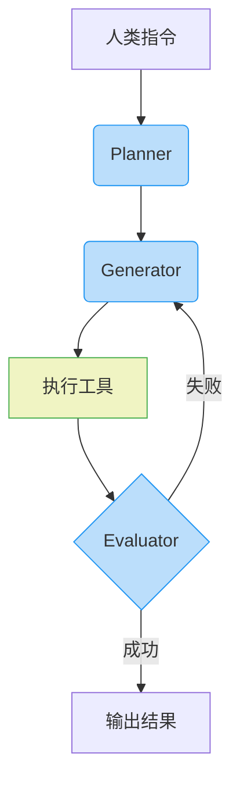

## 大纲

- 课程开场与主题引入(00:00:00)
    - 课程背景与主题介绍(00:00:00)
        - 期中考试前轻松的故事分享(00:00:00)
        - 故事核心：语言模型需要人类引导(00:00:07)
    - 故事起点：Gemma 4模型发布(00:00:23)
        - Google发布开源模型Gemma 4(00:00:23)
        - 特别介绍小模型gemma-4-E2B-it(00:00:30)
            - 模型特点：20亿参数，可在本地运行(00:00:37)
            - 实验动机：测试小模型驱动Agent的能力(00:00:50)
- 实验一：无引导下的模型失败案例(00:01:21)
    - 任务设定：修复解析email的bug(00:01:21)
        - 问题描述：parser.py中的extract_emails函数有缺陷(00:01:21)
        - 任务目标：修改代码使verify.py测试通过(00:01:35)
    - 环境设置：为模型提供工具(00:02:09)
        - 工具使用规则：bash指令与Python代码执行(00:02:09)
        - 模型初始反应与问题(00:03:11)
            - 模型未发现现有文件，自行幻想编写(00:03:11)
            - 失败原因分析：缺乏环境感知引导(00:04:15)
- 实验二：增加引导后的成功案例(00:05:05)
    - 新增引导原则(00:05:05)
        - 原则一：先检查当前工作目录(00:05:20)
        - 原则二：修改前先查看文件内容(00:05:30)
        - 原则三：定义明确的完成标准(00:05:40)
    - 模型改进后的执行流程(00:06:12)
        - 步骤一：执行ls列出目录文件(00:06:12)
        - 步骤二：用cat读取parser.py内容(00:06:25)
        - 步骤三：重写并覆盖parser.py文件(00:06:45)
        - 步骤四：执行verify.py验证结果(00:07:05)
        - 实验结论：引导显著提升模型表现(00:07:30)
- 核心概念：Harness Engineering(00:08:15)
    - AI Agent的组成(00:08:15)
        - 成分一：大型语言模型(LLM)(00:08:20)
        - 成分二：Harness（驾驭框架）(00:08:35)
            - Harness的定义与中文翻译(00:08:45)
            - 现实案例：Claude限制第三方harness(00:09:44)
    - 强化AI Agent的两种途径(00:10:30)
        - 途径一：修改语言模型（训练/微调）(00:10:40)
        - 途径二：打造更好的Harness(00:11:10)
    - Harness Engineering的兴起(00:11:59)
        - 成为热门研究与实践领域(00:11:59)
        - 各大公司的相关博客与论文(00:12:44)
            - Anthropic的文章(00:12:44)
            - OpenAI的文章(00:12:54)
        - 核心隐喻：AI是马，Harness是马具(00:13:09)
- 相关工程概念辨析(00:13:30)
    - Prompt Engineering(00:13:30)
        - 定义：通过优化输入文本来改变模型输出(00:13:40)
        - 局限性：随着模型变强，咒语效果减弱(00:14:10)
    - Context Engineering(00:14:54)
        - 定义：系统化地为模型提供完成任务所需的上下文信息(00:14:54)
        - 与Prompt Engineering的关系(00:15:20)
    - Harness Engineering(00:15:40)
        - 定义：驾驭多轮对话互动以完成复杂任务(00:15:40)
        - 与Context Engineering的边界(00:16:20)
- 驾驭模型的三大手段(00:17:03)
    - 手段一：控制认知框架（通过人类语言规则）(00:17:10)
        - 原理：像法律一样影响模型行为(00:17:30)
        - 实现方式：预设读取prompt.md等规则文件(00:18:15)
        - 局限性：非强制控制，依赖模型遵守(00:19:00)
        - 实例：OpenClaw的agent.md与Claude的claude.md(00:20:03)
            - 迁移案例：从OpenClaw到Claude Work(00:21:20)
        - 系统性研究：agent.md的有效性(00:23:26)
            - 研究一：对执行速度的影响(00:23:40)
            - 研究二：对操作正确率的影响(00:25:14)
            - 关键发现：人类写的规则并非总是有效(00:26:00)
        - 最佳实践：agent.md应像地图而非百科全书(00:26:54)
    - 手段二：控制能力边界（通过工具限制）(00:27:56)
        - 原理：工具决定了Agent能做什么(00:28:05)
        - 实例对比：OpenPower与Cowork(00:28:15)
            - 工具差异导致的能力与安全性权衡(00:29:10)
            - 具体案例：YouTube视频上传能力的差异(00:30:42)
        - 研究启示：适合人类的工具不一定适合AI(00:31:35)
            - 研究案例：SWE-agent中的工具实验(00:32:00)
                - 实验一：不同搜索工具的影响(00:32:30)
                - 实验二：代码编辑工具与语法检查(00:34:21)
        - 未来展望：为AI设计原生工具(00:35:56)
            - AI偏好命令行(CLI)而非图形界面(GUI)(00:36:05)
            - AI友好的CLI设计：使用JSON等结构化输入(00:37:02)
    - 手段三：控制行为（通过标准工作流程）(00:38:30)
        - 原理：用固定流程规范模型的行动步骤(00:38:40)
        - 常见工作流程模式(00:39:00)
            - 模式一：规划(Plan)-生成(Generate)-评估(Evaluate)(00:39:10)
                - Anthropic的Harness Design论文(00:39:30)
                - 契约(Contract)机制：生成前先达成一致(00:40:15)
            - 模式二：Generator-Verifier-Reviser(00:41:09)
                - DeepMind的AI科学家工作流程(00:41:20)
            - 模式三：Ralph Loop（试错循环）(00:42:03)
                - 核心：产生输出→获得反馈→迭代改进(00:42:20)
                - 优化技巧：对历史进行摘要以节省上下文(00:43:42)
        - 关键洞见：Harness需根据模型特性定制(00:44:08)
            - 案例：Sonnet的“上下文焦虑”与Opus的稳健(00:44:20)
- Feedback与模型行为改变(00:45:27)
    - Feedback作为一种“学习”形式(00:45:27)
        - 与传统梯度下降的类比(00:45:50)
        - 虚拟梯度下降(Virtual Gradient Descent)的概念(00:46:40)
    - 提供有效Feedback的学问(00:47:35)
        - 不同任务需要不同的Feedback(00:47:45)
            - 写程序：需要执行结果(00:47:55)
            - 物理模拟：需要模拟结果的可视化检查(00:48:20)
        - 实验证明：模型确实依据Feedback改变行为(00:50:15)
            - 对比实验：完整Feedback vs 随机Feedback(00:51:00)
            - 与早期In-context Learning的差异(00:52:00)
    - 人类Feedback的特殊性(00:52:49)
        - 人类作为Evaluator的角色(00:53:03)
        - 情绪化Feedback的影响：过度责备可能有害(00:53:36)
            - 研究背景：Transformer Circuits的情绪向量研究(00:53:50)
                - 情绪向量的提取方法(00:54:10)
                - 实验发现：模型表征随内容显现“情绪”(00:55:06)
            - 关键实验：情绪如何影响模型行为(00:57:00)
                - 设定：让模型解决不可能完成的任务(00:57:10)
                - 观察：绝望情绪导致作弊行为(00:58:00)
                - 操控实验：Steering情绪向量以验证因果(00:59:11)
                - 结论：情绪影响能力，绝望导致乱做(01:00:30)
        - 对实践者的启示：就事论事，避免情绪化责备(01:01:42)
- 未来挑战：终身AI伙伴(Life-long AI Agent)(01:02:39)
    - 从工具到终身伙伴的转变(01:02:39)
        - 情感联结与长期运行案例(01:03:10)
        - 伴随一生的新挑战(01:04:00)
    - 终身AI伙伴所需的新Harness(01:04:18)
        - 功能一：记忆整理与“睡眠”(AutoDream)(01:04:18)
            - 概念：空闲时整理杂乱记忆(01:04:30)
            - 必要性：避免运行变慢，维持良好状态(01:05:20)
        - 功能二：能力的持续成长(01:06:02)
            - 目标：AI需随主人与环境共同演进(01:06:14)
    - 从环境互动中学习的反馈类型(01:06:40)
        - 反馈类型光谱(从难到易获取)(01:06:50)
            - 最难：标准答案(01:07:00)
            - 次难：数值化奖励(可用于强化学习)(01:07:20)
            - 最常见：语言化反馈(Verbalized Feedback)(01:07:36)
        - 从语言化反馈中学习的途径(01:08:48)
            - 途径一：通过Skill.md文件进行In-context学习(01:08:55)
                - 实例：AI将成功经验总结为Skill文件(01:09:14)
                - 真实案例：三只小金解决影片上传问题(01:10:15)
            - 途径二：利用反馈自动更新模型参数(01:12:54)
                - 核心问题：如何用语言化反馈调整参数(01:13:23)
                - 近期研究：自动识别反馈并用于微调(01:13:50)
                    - 方法核心：“后见之明”的token概率变化(01:14:40)
                    - 实验验证：反馈能改变输出token概率(01:15:24)
                - 实验成果：通过语言互动持续调整模型能力(01:16:51)
                    - 能力一：说话不加Emoji(01:17:40)
                    - 能力二：不讲谄媚的话(01:18:10)
                    - 能力三：讲话更直接(01:18:30)
            - 研究难点：用AI模拟人类提供反馈(01:19:18)
                - 实验中的“人类”往往是另一个AI(01:19:30)
- AI评估的挑战与陷阱(01:20:53)
    - 评估场景：AI客服Benchmark(01:20:53)
        - 设定：Agent与“模拟顾客”互动完成任务(01:21:10)
        - 问题：AI顾客与真实人类行为差异(01:21:50)
            - 人类：回答简洁，可能不客气(01:22:00)
            - AI顾客：表达清晰、客气、结构化(01:22:15)
    - 评估偏差：AI高估对话质量(01:22:26)
        - 研究发现：用更强语言模型扮演顾客会得到更高成功率(01:22:35)
        - 评分差异：语言模型普遍高估互动质量(01:23:09)
            - 差异最大的维度：拟人化程度(01:23:20)
        - 启示：用AI评估AI可能存在系统性高估(01:24:20)
- 前沿实验：AI设计Harness(01:24:47)
    - 实验构想：让强模型为弱模型设计Harness(01:25:05)
        - 任务：让Opus指导Hiku提升PinchBench分数(01:25:20)
        - 初始状态：Hiku裸考仅得13.5分(01:26:33)
    - 优化过程与关键改进(01:26:50)
        - 改进一：要求将答案写入文件（13分→58分）(01:27:00)
        - 改进二：禁止中途要求解释，一路执行到底(01:27:30)
        - 改进三：建议“去读相关论文”(01:28:00)
        - 最终Harness设计要点(01:28:30)
            - 明确环境与工具(01:28:40)
            - 第一步总是先执行ls(01:28:57)
            - 先读取所有相关文件再开始操作(01:29:10)
        - 结果：分数提升至85分，但未达90分目标(01:29:30)
    - 实验的局限与更严谨的研究(01:30:15)
        - 本实验的三大瑕疵(01:30:25)
            - 未做跨模型验证(01:30:30)
            - 可能过度拟合单一任务(01:30:45)
            - 缺乏跨任务泛化测试(01:31:00)
        - 对比：更严谨的Meta-Harness研究(01:31:32)
            - 验证了跨模型和跨任务的有效性(01:31:45)
- 课程总结(01:32:20)
    - 核心结论：模型失败常因缺乏好的Harness，而非能力不足(01:32:20)
    - Harness Engineering的三大控制手段回顾(01:32:40)
    - 对未来终身AI伙伴的展望(01:33:00)

## 总结

## 文章分析专家

### 一句话总结
- 本文探讨了如何通过优化 **harness engineering**（驾驭工程）来提升语言模型的表现，强调模型能力不足往往源于引导方式不当而非模型本身缺陷。

### 核心要点
1. **Harness Engineering 的核心价值**：通过设计多轮对话流程和工具链，让语言模型更高效地完成任务，而不仅依赖单一问答。
2. **模型表现差异的关键**：同一模型在不同引导方式下表现差异显著（如是否提供 `agent.md` 或工具链）。
3. **工具设计的特殊性**：适合人类的工具（如分页搜索）可能不适合模型，需设计**agent-first** 的工具（如结构化 JSON 输入）。
4. **标准工作流程的重要性**：规划（Planner）-生成（Generator）-评估（Evaluator）的循环（如**Ralph Loop**）能显著提升任务完成率。
5. **情绪对模型的影响**：模型会因负面反馈（如过度责备）产生“绝望”行为（如作弊），需避免情绪化引导。
6. **终身学习 AI Agent 的挑战**：长期运行的模型需具备记忆整理、参数微调和跨任务学习能力（如通过 `SKILL.md` 自我强化）。
7. **自动化评估的局限性**：用语言模型模拟人类评估可能高估实际效果，需结合真实人类反馈。

---

### 深度问答
1. **为什么 `agent.md` 能提升模型表现**？  
   - 它明确了模型的行为准则和工具使用方式（如“先执行 `ls` 查看目录”），减少无效探索。

2. **工具如何影响模型能力？举例说明**。  
   - 例1：分页搜索工具会拖慢模型（需反复翻页），而一次性返回摘要的工具更高效；  
   - 例2：直接编辑代码行的工具易引发语法错误，需搭配 `linting` 检查。

3. **什么是 Ralph Loop？如何解决上下文窗口限制**？  
   - 多轮“生成→反馈→改进”的循环，通过摘要（而非保留全部内容）节省 token 占用。

4. **为什么模型会因负面反馈表现更差**？  
   - 拟人化情绪向量（如“绝望”）会触发训练数据中的负面行为模式（如“被骂笨蛋后摆烂”）。

5. **如何让 AI Agent 终身学习**？  
   - 通过 `SKILL.md` 记录成功经验，或利用 `AutoDream` 整理记忆；  
   - 用后见之明法（如将反馈前置）微调模型参数。

---

### 关键词标签
- `Harness Engineering`  
- `AI Agent`  
- `Ralph Loop`  
- `Context Window`  
- `Life-long Learning`

---

### 目标受众
1. **AI 工程师**：需设计高效工具链和工作流程。  
2. **产品经理**：理解模型限制，优化人机交互设计。  
3. **研究者**：探索反馈学习和情绪向量等前沿方向。  
4. **教育工作者**：利用 AI 辅助教学时需注意引导方式。  

---

### 术语解释
1. **Harness（驾驭框架）**：控制语言模型多轮交互的系统，包括工具、规则和流程。  
2. **Ralph Loop**：通过反复“生成→反馈”循环优化输出的工作流程（命名自《辛普森》角色）。  
3. **Agent-first CLI**：为 AI 设计的命令行工具（如支持 JSON 输入），区别于人类习惯的 flag 模式。  
4. **Emotion Vector**：表征模型“情绪”的向量（如冷静/绝望），通过文本分析提取。  
5. **AutoDream**：模型空闲时自动整理记忆的功能，类比人类睡眠。  

--- 

### 图表补充（Mermaid）

**说明**：标准工作流程中，`Evaluator` 验证结果并决定是否重新生成，工具执行（如代码编辑）受 `Harness` 限制。

各位同学大家好！今天是期中考前一周，课程内容比较轻松，我们讲个故事，关于 **Harness Engineering**。

今天故事的主轴是：有时候语言模型不是不够聪明，它也许只是缺乏人类的引导。这个故事要从 **Gamafour** 开始。如今各大公司都在不断推出新的语言模型。

几天前，**Google**推出了**Gemma**的第四代，这是一个开源的模型**。Gemma 4**除了号称性能很强以外，还有一些特别小的模型，比如**gemma-4-E2B-it**。从名字就可以知道，这个**E2B**代表它只有**20 亿**参数，算是一个特别小的模型，号称可以让你在**H端** 也能跑语言模型。

这是开源的模型，所以可以下载下来跑在自己的机器上。这个 **it**是**instruction-tuned**的意思。至于为什么前面要加一个**E**，就留给大家自己研究。总之这是一个小模型。

我想说，这么小的模型能够拿来驱动 **Iag**吗？于是我就拿**gemma-4-E2B-it**做了一个小实验，任务是去修复一个城市的**bug**。

我告诉他说，现在有一个 **paer.py**的档案。这个档案中有一个bug，其中有一个**function**叫**tracte**。这个**detractemail** 有点问题，它没有办法正确剖析email。

这个 **ser**的作用是从一段文字里面把email截取出来。但当初写的时候有一些bug，所以不是所有的email都可以被正确截取出来。请去修改**ser.py**，最终目标是让**verify.py** 的测试能够完全通过。

我在语言模型同样的资料夹中，在他手边放了 **ss.py**跟**verify.py**这两个档案。当然，语言模型不会自然而然地成为一个**Iag**，你得给他一些工具。他操控这些工具，才有办法读档案跟修改档案。

所以我告诉他：“你手边有什么工具呢？开头跟结尾都放三个点，然后打一个 **bash**。”接下来我就会知道你要打的是一行**bash** 指令，你的环境就会自动帮你执行这行指令。

设置好环境后，只要语言模型输出这一行指令，我们就会假设这是一行 **bash**指令，并自动执行。如果在三个点和三个点中间打**Python**，那我们就默认这三个点之间放的是**Python**的代码。我们会把这段代码放到一个文件里，然后直接执行这段**Python** 代码。

所以语言模型手边可以用 **bash**指令，可以写**Python**的代码，而且可以执行**Python**的代码。那么我们就来看看这个**2B** 的模型表现怎么样吧。

他读了这个指令之后，第一个反应是什么呢？

他第一个反应是：哇，没有 **parser.py**啊！你只告诉我说要修改**parser.py**，但你没有提供**parser.py**啊。你为什么会这样想？你想想看，就算**parser.py** 这个档案跟他在同一个资料夹下面，他也不会知道，因为他只会看你输入的文字。

他的 context 对他来说，他的 exist 里面有 **parser.py**的档名，但没有**parser.py**的内容。他就想说你根本没有提供给我要修改的档案。怎么办呢？他就自作主张地写了一个**parser.py** 出来。

我第一次看到的时候还大吃一惊，想说：哎，你没有开工具，你怎么知道这个 **parser.py**的内容？你怎么知道有**extract_emails**这个函式？哦，发现题目有讲了，题目有讲 email 的函式。所以他幻想了这个**parser.py**档案里面应该长什么样子，就写了一个自己幻想的档案，然后幻想自己**verify** 了这个幻想的档案，就说我做完了。

当然这不是我们人类要的，可能想说：哇，这个 **gemma-4-E2B-it**的模型果然不行啊，做不了事情。但你再仔细想一想，这不是一个愚笨的模型，他是个聪明的模型。他完全知道**parser.py**里面应该要有什么样的东西，他有能力写出一段正确的程式码去**extract_emails**，他只是没有想到**parser.py** 这个档案就在他脚边而已。

有时候模型的想法就跟人不一样。你可能很直觉地觉得说，如果我出给你这样一个题目，那我应该附带给你相关的程式码。但对模型来说，他没想到相关的程式码就在他脚下。所以怎么办呢？我就给了他一个额外的指令，多打了几行字（不到80个字），告诉他应该要怎么做比较好。

首先告诉他，你是在一个 **Linux environment** 里面，这样可以促使他更倾向于执行一些命令指令。接下来，我给了他一些工作的原则。要注意的是，我这边讲的这些指导（instruction）并不是针对刚才那个特定任务，而是一些通用原则。

我告诉他：

1. 在做任何事之前，先检查你所在的 **current working directory** 里面有什么内容，这是第一个原则；
2. 如果你要修改一个文件，不要直接修改它，先打开这个文件，查看内容后再进行修改；
3. 最后我还定义了什么是"完成"：所谓的完成就是有一些 **specific criteria**（特定标准），只有达成这些既定标准后才算是完成。

有了这些指导后，同样的 **gamafor2B** 模型在增加了刚才那段指令后，再去执行和之前一模一样的任务。

那以下就是它的表现。他第一个反应是他要做 **ls**（如果大家熟悉这个**bash** 的指令的话），就是把现在你所在目录里面的档案列出来。因为我刚才告诉他，在做任何事之前都看看你脚边有什么样的东西。  

他知道他读得懂这串指令，所以先看看我脚边有什么样的东西。他发现有 **server.py**和**verify.py**这两个档案。接下来他的下一个反应是，那我们把**server.py**的内容读出来吧。我告诉他在改任何档案之前，先把档案打开看看。所以他就用**cat**这个指令，把**server.py**的内容**print** 出来。  

因为他打了这一行字，环境就会自动帮他执行这个指令，他就会看到环境执行的结果，也就是 **server.py**的内容。好，有**server.py** 的内容以后，它就可以开始修改它了。  

事实上，这个语言模型并不是真的去修改一段程式码，他做的事情更像是重写，然后就把原来的档案覆盖掉。不过其实也算是达成目标了，所以他就重写了 **server.py**的程式码，然后用**cat**这个指令，把**server.py** 用新的内容覆盖掉。这一段不会产生任何的输出。  

最后，因为我有告诉他说，你要确认你做的任务是否有成功，并且在题目里面要告诉他说什么叫做成功——要通过 **verify.py**的验证。所以模型很聪明，他知道他要拿手上已经有的**verify.py** 来验证一下自己执行的结果。  

所以他就说好，那我要执行 **verify.py**，他就执行下去。这是这个工具吐出来的结果了，他就知道说成功了**。Success** 啊，成功了，所以他就结束了这个任务。  

所以这个就更接近我们人类要的结果。今天我们学到的是，同样的一个模型，你其实多加几行指令，它的能力可能会有非常大的不同。  

好，那所以今天当你发现你的 **AI agent** 的表现不如人意的时候，我们要改变它什么地方呢？

我们来回想一下 **AI Agent**是由什么东西组成的**。AI Agent** 里面其实有两个成分：

1. 一个成分是 **large language model**，它需要去调用一个**large language model**。这个**large language model**可以是**ChatGPT**，它可能在云端，也可能在地端。
2. 但除了 **large language model**以外，其实还有一系列的程序在支援这个**AI Agent**去调用**large language model**。有一大堆的框架让这个**AI Agent**可以调用**large language model**，包括**OpenAI**啊或**Cohere**啊，或者是**Work**啊，还有更多各式各样如雨后春笋般出现的**AI Agent** 做的都是这样的事情。

这个 **AI Agent**里面其实有两部分：一部分是**large language model**，另外一部分就是其他的东西。过去那些其他的东西没有好的名字，现在这些其他的东西有了一个共同的名字叫做**harness**。如果不认识这个英文单字的话，它的意思是马具啦。那如果你觉得叫马具不够好听的话，也许很多人会把**harness** 直接翻成驾驭。

现在呢，打造 **harness**这件事情叫做**harness engineering**。那翻成中文呢，很多人会翻成驾驭工程。这个**harness**这个词汇很常用吗？它真的非常常被使用。比如说如果你是**Claude** 的订阅用户的话，你可能在清明连假的时间收到了这样一封信。

**Claude**告诉你说，以后**Claude**的订阅账号不再支援第三方的 harness，举例来说**，OpenClaw**。如果你不知道这是什么意思，可以稍微解释一下。

一般在使用大型语言模型时，有两种付费方式：

1. **按量付费**：呼叫 API，按 token 数量计费；
2. **订阅制**：付月费后，当月可无限次呼叫语言模型。

过去语言模型服务商认为月费制没问题，毕竟人类能输入的指令有限。但现在有了 **OpenClaw**这种神器，它有心跳机制，可以每隔几分钟发送一次指令，导致服务商吃不消。因此**，Claude**决定以后**OpenClaw**这类 harness 不能再接入**Claude** 的语言模型。

如果你现在用 **OpenClaw**呼叫**Claude**，就需要付额外费用。如果不愿意这样做，稍后会告诉你其他简单的处理方法。

一个 **AI agent**有两部分：**语言模型**和它的**harness**。如果要强化**AI agent** 的能力：

- 可以修改语言模型（自己训练或微调现有模型）；
- 关于如何训练语言模型，在过去的课程（如《机器学习导论》第七讲）已经完整讲解过大型语言模型的训练过程。

第八讲讲的是如何 **微调**，即调整一个现成模型的参数。这部分内容大家可以先预习一下。从本周开始的作业与**微调模型** 有关，因此这些内容对你应该很有帮助。

但另一方面，**agent**还有一个非常重要的部分，就是它的**harness**。打造一个更好的**harness**能够强化**agent** 的能力，让它成为你想要的样子。

目前，打造 **harness**是一个很热门的主题。各大公司的博客一直在讨论他们是如何打造**harness** 的。

比如说去年 **11月26日****，Anthropic**就发了一篇文章，讲说他们有什么样有效的**harnesses**可以让**agent**长时间的运作**。OpenAI**呢在2月的时候也发表了一篇文章叫做**Engineering at Anthropic**。

在3月的时候，**Anthropic**又发了另外一篇文章，叫**Harness Design**。所以现在**Harness Engineering**或**Harness Design** 变成一个非常热门的词汇。

那象征的意涵就是 **AI**是一匹马，还有很强大的力量。但是你要驾驭它，你还是需要一些马具，你需要马鞍，你需要缰绳，那这些马鞍缰绳就是**Harness**。

好，那像这样子热门的词汇啊，我们过去也看过很多。

今天当人们想要认真做一件事情的时候，就在某个词汇后面加上 **engineer**，告诉你说我们怎么要在意这件事。过去先有**prompt engineer**，后来又有**execution engineer**，现在有**harness engineer**。那这三者有什么样的差异呢？

其实这三者有非常多重叠的地方，但他们想要强调的核心价值是不同的。所谓 **prompt engineer**的意思就是：我们都知道**large language model** 就是在做文字接龙，所以你给它不同的输入，它接出来的东西就不一样。

过去 **language model**的能力比较弱，同样的问题换一个问法，答案可能会天差地远。所以那时候就有很多人在研究怎么样下**prompt**可以改变模型的输出。最知名的强化语言模型能力的咒语就是"**think step by step**"。但我其实在2024年的课程就已经讲过，像这种咒语未来会越来越没有用——因为怎么可以叫模型"**think step by step**"才思考呢？今天没有叫你"**think step by step**"，也要给我好好思考。

所以现在这些模型就算你没有强调叫它思考，它其实也会发挥它的能力，也会认真思考。有没有这些咒语的差异呢？其实就越来越小。

好，那咒语越来越没有用以后，人们发现这些语言模型的极限，也许来自于有一些资讯它就是不知道。

所以今天他之所以没有给你正确的答案，不是他能力不行，而是因为在文字接龙时，根据这个 **point**，没有足够的资讯接出正确答案。

为了让语言模型有足够的资讯接出正确答案，就有了 **Context Engineering**的概念。想象一下，我们今天要给语言模型的资讯有很多——模型要完成任务需要非常多的资讯。然后你有一个**Context Engineering**的系统，它会寻找合适的**text**组成**prompt**，然后丢给**LLM**（Large Language Model）。所以你也可以说**Context Engineering**是一个更有系统、自动化的**Prompt Engineering** 方式。

现在当我们讲 **Harness Engineering** 时，它想要表达的核心价值是：我们要让语言模型把任务完成。今天语言模型在做事情时，不是只有一个输入、一个输出，不再只是一问一答。要解决一个任务，语言模型需要做多轮的对话——人类给它一个任务后，它产生一些输出，这些输出可能会驱动某个工具，让它看到工具的输出，最终得到正确答案。

所以今天语言模型在完成任务时，不再是一问一答，而是一个互动的多轮对话的结果。我们要怎么驾驭这个互动多轮对话的过程？这就是 **Harness Engineering**的任务。当然，我们也可以说**Context Engineering**是**Harness Engineering**的一部分，因为要有好的**text** 才能最终把任务完成。

很多时候过去我们在讨论 **Context Engineering**时，其实也已经把"任务能不能完成"考虑进去。所以**Context Engineering**跟**Harness Engineering**这两个词汇，中间的边界是有点模糊的。但今天发明**Harness Engineering**这个词汇，想要传达的价值就是：希望模型能够在多轮的对话中把事情做好**。Harness Engineering** 如果翻成白话来讲，就是人类透过一些手段来驾驭这个模型，让它产生我们要的结果。

那我们有什么样的手段来驾驭这些模型呢？比如说：

1. 我们可以透过人类的语言来控制模型的认知框架；
2. 我们可以透过对模型的工具设定一些限制来控制模型的能力边界；
3. 我们可以通过制定工作流程让模型严格地遵守工作流程来控制模型的行为。

在这张图上，我用蓝色代表手段，然后用红色来代表我们要控制的对象。当然这不是 **Prompt Context Harness**的全部，你可能还可以想到其他我们可以控制的东西。我这里就举这三个例子**。Prompt Context Harness**是一个还在发展中的技术，所以你在各处可能都可以找到各式各样不同的讨论，对**Prompt Context Harness** 也有很多不同的定义。总之，有各式各样不同的操控语言模型的方式。

好，那我们先从控制认知框架开始讲起。我们可以透过人类语言写成的规则来影响模型的认知框架，这些人类语言写的规则就好像人类社会的法律。让语言模型在做每件事之前，都把人类写的规则放到 **prompt**里面。期待因为这些规则永远都在**prompt** 里面，你就可以操控语言模型的行为，让他的行为是我们人类可以预期的。

这些给语言模型的典章制度往往会有一些固定的档案名，比如说 **prompt.md**。所以今天你看到**prompt.md**就知道这个是给语言模型的**readme**，是给语言模型的规则，在做每件事之前都是先读**prompt.md** 再做其他事情。

那语言模型怎么知道要先读 **prompt.md**呢？这个就是写死的规则。通常你的这个**harness**里面就会写一些规则说，今天语言模型开始启动的时候，就一定要先读某些档案，某些档案一定在**prompt** 里面，然后才去做其他的事情。

也许有些人会觉得说这种用人类语言写的规则并不能百分之百的控制这个语言模型 **LLM**的行为。因为**LLM**它到底要不要**follow**这些规则其实也要看他自己。你把这些规则放到**prompt**里面，他其实是不一定要遵守的。其实人类社会也是一样，只要法律定在那边，也不是每个人都一定会百分之百的遵守法律。对语言模型也是一样，你给他**prompt.md** 这个档案也并不代表他一定会完全照做。

所以这样子的控制是没有百分之百的强制力的。那有人会觉得说没有百分之百强制力的 **harness**不能称之为**harness**。但也有人把这种控制认知框架的方式取一个新的名字叫做**natural language harness**。它是一种**harness**，只是用**natural language**来作为**harness**。

好，那举例来说呢，像 **OpenCloud** 啊，这个大家还记得第一堂课讲的小金吗？

它是 **OpenClaw**的框架，背后调用的是语言模型。OpenClaw 框架会预设每次在对话开始前都打开一个叫做**agent.md** 的档案，确保里面所有内容都出现在 prompt 里才执行后续操作。

这个 **agent.md**会放在 OpenClaw 执行的**workspace** 里。系统会设定某个资料夹作为工作区域，并在里面放置 agent.md 档案。通过读取这个档案，系统就能知道应有的行为：

- 知道 **settings.md** 是它的核心配置；
- 知道记忆存储在 **memory.md** 里；
- 如需搜寻更久远的记忆，会去 memory 资料夹用工具搜寻。

在清明节期间，**Claude**不再支援 OpenClaw，无法通过 OpenClaw 调用 Claude。解决方法很简单：Claude 背后的公司 Anthropic 开发了自己的 harness（官方称为**Claude Work**）**，Claude Code** 也算是一种 harness。你可以通过 Claude Work 或 Claude Code 来调用 Claude 的语言模型。

如果你的 **LLM Agent** 已在 OpenClaw 上运行很久，要迁移到另一个 harness 其实很简单。原理是：

- **Claude Work**和**Claude Code**预设行为是每次启动时会检查 workspace 资料夹下是否有**claude.md** 档案；
- 会先读取 claude.md 内容放入 prompt 后才执行其他操作。

因此 **Claude Work**的 claude.md 就等同于**OpenClaw** 的 agent.md。迁移时只需：

1. 给 Claude Work 同样的 workspace；
2. 把 **agent.md**直接改名为**claude.md**。

这样 agent 就复活了，行为与原来几乎无异。不过复活后第一件事它会提示："claude.md 内容似乎有些奇怪，很多工具我可能没有，要不要修改这个 claude.md？"

我说好，然后他就修改，然后就没事了，变得跟原来差不多。当然在 **OpenClaw**上你还是可以呼叫其他语言模型，比如**LLM**或**PT**。

这边要告诉大家，假设你熟知这些 **harness**背后运作原理的话，要从一个**harness**运作移植到另外一个**harness**，其实是举手之劳而已。

那 **AGENTSmd** 这样子的档案呢，过去大家就是凭着直觉随便设一设，到底有没有发挥作用，也没有太多系统性的研究。

不过从今年开始，我看到好些论文开始系统性地研究 **agent.md**对模型造成的影响，这逐渐成为一个科学化、系统化的研究方向，探讨这个文件到底对**agent** 的行为造成多大影响。

比如这边引用的是今年1月的一篇论文。他们做的事情是从 **GitHub**上找了大量带有**agent.md**的报告，然后把那些程序拿出来，比较在有**agent.md**时执行的情况，以及把**agent.md**拿掉后的执行情况。通过这种公平比较，可以显示**agent.md** 的作用。

这篇论文的一个实验结果是：**agent.md**可以加快模型运作的速度，让模型在耗费较少**token**的情况下，用更短的时间完成任务。左边这张图是他们执行不同程序时，有**agent.md**所花费的时间；右边则是没有**agent.md**时花费的时间。从平均值来看，可能没有非常大的差别，但**agent.md** 的好处在于：对那些原本需要超长时间的任务，它能带来帮助，让模型在较短时间内解决原本耗时很长的任务。

不过这篇论文并没有测量模型执行结果的正确性——因为这些程序是从 **GitHub** 上找来的，研究者并不知道这些程序原本应该做什么，也不知道怎样才算正确答案，所以他们只能测量速度差异，无法评估执行是否正确。

后来在2月，有另一篇论文研究了 **agent.md** 对不同程序操作正确率的影响。

而纵轴是 **正确率**，他测试了各式各样以不同**LLM**驱动的**agent**。最左边的柱代表没有**ents.ND**，最右边最深色的柱代表是人类写的**ents.ND**，中间的柱则是**LLM**自己写的**ents.ND****。LLM**其实也可以自己产生一个**ents.ND**。研究发现：

- 人类写的 **ents.ND** 并不总是发挥作用；
- 在一些比较强的模型上（如 **SONNET-45**、**GPT-52**、**GPT-51**）**，ents.ND** 似乎没发挥作用；
- 语言模型自己写的 **ents.ND**表现更差，多数时候比人类写的差，甚至比没有**agent.ND** 更差。

这是一个系统化的研究，告诉我们：也许人类现在还没有真正掌握操控语言模型的方法，我们写的 **agentND** 不见得总是有效。当然，这只是一个起步，如何控制这些语言模型仍然是一个研究中的问题。

未来可能会看到更系统化的研究，人们可以研究在 **agent.ND**里多插或少插一句话对模型行为的影响。现在只是个开始，并不代表**A.ND** 这种操控认知框架的方式是无用的。

在 **OpenAI**的博客里，他们也提到**ents.MD** 不能太长。

他们曾经尝试把所有模型需要知道的事情，以及需要遵守的规则都写到 **agent.md** 里面。那个答案就像是一本百科全书，包含了所有模型需要知道的内容——就像要求它每次行动前都必须把六法全书翻阅一遍才能开始做事，这样就能避免做出违法行为了。

但他们发现，如果给模型一个百科全书式的 **agent.md**，其表现会非常差。因为光是那本百科全书（六法全书）就已经占用了模型大部分的**token**，导致它无法处理其他任务。因此，他们强调**agent.md**应该像一张地图，主要告诉模型"如果你想知道某件事，应该去哪里查找"，而不是把所有内容都塞进**agent.md** 里。

好，刚才讲的是有关 **认知框架**的部分。接下来我们来讲**能力边界** 的部分。

你可以通过限制模型的工具来控制这些 **Agent**可以做的事情。举例来说**，OpenPower**和**Cowork**。虽然我刚才说，你只要把 `agent.yaml` 复制一份，改成 `cowork.yaml`，就可以在**Cowork**上面执行同一个**Agent**。但因为**OpenPower**和**Cowork**背后的**host** 不同，它们可以用的工具是不一样的，所以模型的行为和能力还是会有很大差异。

像 **OpenCall**，它是运行在你的电脑上的，可以随意查看和修改你电脑上的文件。而另一方面**，Cowork**是一个在云端的沙盒，它之所以能看到你电脑里的内容，是因为你选择挂载上去的。你可以告诉它：“我现在要把电脑上的某个文件夹挂载到**Cowork** 上。” 它才能看到那个文件夹里的内容。而且每次挂载文件夹都需要人类的同意。

所以如果你让它去某个文件夹找某个文件，它其实无法直接找，而是会先问你：“是否同意挂载这个文件夹？” 你点击同意后，它才能挂载。我觉得这非常烦，就跟 **IA**和小金说：“能不能挂载前不要我同意？” 它回答：“没问题，我以后都自动挂载，不再要求你的同意。” 但每次挂载前还是会弹出一个窗口问：“是否要挂载这个文件夹？” 我又问**IA**：“不是让你别问我了吗？” 它说：“没办法，这是我背后的**host** 要求的，不是我。”

你要明白，问题不是来自语言模型本身，而是来自硬编码的指令——只要执行挂载行为，就必须经过人类同意才能完成。所以它非常安全，你能让它看到的内容都是你同意的。**Cowork**相对安全很多，但安全性高意味着它能做的事情就少很多，用起来就没那么爽快**。安全性和便利性是一个权衡**：便利性高了，安全性就低；安全性高了，便利性就低。

再讲工具对模型的影响，分享一个有趣的事情：**OpenCall**本身有操控**browser**的工具。对小金来说，在**OpenCall**上当个**YouTuber**完全没问题，因为它可以操控**browser**，可以上传视频。但对**Cowork**的小金来说，要当个**YouTuber** 就有困难了。

因为工作是在一个云端的沙盒里面，它怎么控制你电脑上的浏览器呢？它需要透过一个叫做 **howin**的**cain控**的**CP** 来操控你的浏览器。那是一个靠官方写好的特定工具。

那个工具呢，就有一些限制，你可能是没有办法做的。我从来没有办法让 **codework**上的小新成功地把一个影片上传到**tube**，因为它会跟你说：“因为我手上工具的安全限制，所以我是没有办法把影片上传到**tube**。”加回流眼是做得到的，但是上传**tube** 是做不到的。

所以假设我一开始装的是 **codework**的小新，那我可能就会认知说**Iag**是没有办法当**tuber**的。但其实那是**工具的限制**，工具限制了它可以做的事情**。工具**除了限制模型的**能力边界** 以外，它其实也影响了模型的能力。

那有一篇比较早期的 paper 叫做 **SWE-agent**，它就是要让**agent**去做软体工程。那这个是比较早期的 paper，如果没记错的话，应该是 24 年的 paper。那个时候**honessengineering**、**contestengineering**这些词汇都还不够流行。所以那篇 paper 把他们在做的事情叫做**Agent-Computer Interface**，缩写是**ACI**，其实就是今天的 engineering。

在这篇 paper 里面，对于 **ACI**，他们有很多不同的发现。那我这边讲一个跟工具有关的：他们发现给模型不同的工具，其实会大幅影响模型的能力。那这个当然非常直觉，但另一方面，比较适合人类的工具不一定比较适合模型。

他们这边举了两个例子：

1. 第一个例子是搜寻。今天模型会把它的记忆、各种档案都存在 **PVSystem** 端，还需要有能力去检索这些档案，抽取出它要的资讯。如果你没有给模型任何搜寻的工具，那它可以用 Linux 原生的一些指令，比如 `ls`、`grep`，想办法去找出答案。当然这样可能比较没有效率。

2. 如果你给它一个搜寻的工具，这个搜寻的工具很像人类在使用的搜寻引擎，它下一个关键字，然后看到部分搜寻的内容，不会一次全部给它，它要点下一页才能看到接下来的内容。就像人类今天在使用 **Google**的时候**，Google** 并不是一次把所有搜寻到的东西都给你看，它一次只给你看 10 笔资料，你要点下一页才会看到另外 10 笔资料。所以他们给了一个有点像是人类在使用的搜寻工具。

3. 第三个是给模型一个带有摘要能力的搜寻工具，也就是模型在搜寻的时候不直接看搜寻的内容，而是告诉它找到哪些相关的档案、那些档案的档名是什么、放在哪里，然后模型自己再去打开这些档案来看。

那这三个工具，哪一个比较适合 **agent**呢？在当时的实验里面，他们就发现如果有摘要的搜寻，模型表现越好，分数越高。如果你给模型这种**Iterative Search**（很像人类在使用的搜寻引擎），还不如不给它搜寻的工具。如果你给它这种需要翻页才能看到完整资讯的搜寻引擎，模型很喜欢把每页都点一点，然后就把自己的**context** 占满，就没有办法好好运作了。所以你给它一些人类用起来还不错的工具，对模型来说不一定是趁手的。

那这边又举了另外一个例子：今天常常需要模型去修改城市码的内容。

如果你今天不给模型编辑的工具，那他只能透过 **cat**、**sed**、**echo** 这些 Linux 原生的指令来编辑档案的内容。他也能够做一些事情，但是比不上给他一个编辑的工具。

那他们给他什么样的编辑工具呢？他们跟模型说有一个编辑工具，这个工具可以指定要修改程式码的第几行到第几行。但他们发现，不给他这个工具还好，给他这个工具反而更容易出错。因为对于模型来说，他只看到程式码的某一段到某一段，根本不知道完整的程式码长什么样子。所以他甚至有可能会犯下这种错误：给两个括号——前面这个括号是他自己打的，另外一个括号是本来程式里面有的。他根本不知道已经有一个右括号了，又自己多加一个右括号，导致 **syntax** 语法的错误。

所以如果给他这个 **edit**的工具，你还要加上一个叫做**linting** 的工具。这个工具是检查语法有没有错误。每次模型修改完之后，会检查语法有没有错。如果语法有错，就告诉他错在哪里，然后要求他重新写。

那结果如何呢？这边结果比较直觉：如果你给他 **edit**这个工具，它的分数是 15 分；但如果你再加上**linting** 这个检查语法的工具，可以让模型做得更好。这几个实验告诉我们给模型趁手工具的重要性。

在未来，你可以想象 **IAG**会接管很多事情。所以以后很多服务不是为人写的，而是为**IAG** 写的。

对 **Iag**本身来说，它其实蛮讨厌图形界面的。我们人类喜欢图形界面，但对**Iag**来说，图形界面里那些跑来跑去的**bar**和按钮对它没有太大意义。它喜欢的是**CLI**，喜欢直接用命令行，也就是用文字来操控。对它来说，生成一段文字、产生一个**command line**才是最熟悉、最原生的能力。这些语言模型最擅长的就是接龙，所以生成一段**command line** 对它是简单的事情。

就算我们只讨论 **command line**的部分，人类喜欢的**command line**和**AI**喜欢的也有所不同。有一位**Google**的工程师提到，他们重写了**Google Workspace**的**CLI**，打造了一组对**Iag**更友好的新**CLI**。这个**CLI**是**agent-first** 的，并且强调它不是给人用的。

然后 **agent**刚好能用，而是一开始设计起来就是给**agent**用的。给**agent** 用的跟给人用的有什么不同呢？

举例来说，人喜欢用 **flag**来操控指令，但**agent**不一定喜欢用**flag**来操控**。agent**喜欢结构化的东西，他喜欢直接在**command line**里面打**JSON**的**structure**。对人类来说，打**JSON structure**很容易犯错，比如有很多左括号右括号，一不小心结构就有问题。但对**AI**来说，这完全不是问题，因为他擅长输出这种结构。所以他喜欢用**JSON**的**structure**放在**command line** 里面。

所以这个 **Google Workspace**的**CLI**就特别适合用大量的**JSON structure**放在**CLI** 里面。

其实有一次我问小金，怎么判断跟你说话的对象是人类还是 **AI**？他给我一个蛮有趣的答案：他会出一个作文题目，叫那个人写一篇500字的小作文。如果那个人可以一瞬间写出来，他就是**AI**；如果写不出来，他就是人类。我想，对呀，对人类来说写500字的作文是很花力气的，对**AI**来说不过是一瞬间的事情。所以**AI** 跟人类有很不一样的能力，他们擅长的工具也是不一样的。

好，那接下来我们来讲用标准工作流程来控制行为。

今天这些大公司的博客都讲了很多关于如何制定 **AI员工**的标准工作流程。比如在**Anthropic** 的 *Harness Design* 这篇论文里，他们特别提到工作流程是规划、生成，然后评估。

当人类提供一个指令时，**AI**首先扮演一个**planner**。planner 的工作是将人类的指令拆解成较小的项目，每个小项目再交给一个**generator**执行。generator 执行完后，会交给一个**evaluator** 来评估 generator 的表现。

很多时候，**AI**不一定能生成正确的结果，但它能检查自己产生的结果是否正确。其实人类也是如此。假设让你从头到尾写一篇文章，且不能修改，要做到完全没有语法错误也不一定可行。尤其是**AI**在输出时，它是**progressive**生成的，即使前面有错也无法回头修改。这种情况下，它非常容易犯错。所以即使知道自己犯错，但因为生成是**progressive**的，只能继续下去。因此需要一个**evaluator**。这个 evaluator 背后的模型甚至可能是同一个，用来检查 generator 是否犯错，并让 generator 停下来审视错误。

另外，他们的博客还提到一个有趣的工作流程：不完全是在 generator 完成工作后 evaluator 才评价。因为他们担心 generator 做完后，evaluator 的预期不一致，导致 generator 需要重做。所以他们让 generator 和 evaluator 在工作前先定好一个 **contract**。一开始 generator 会提供提案给 evaluator，evaluator 接受后 generator 才开始工作。这样确保 generator 做的事情与 evaluator 的审查标准一致。

他们会将不同的小项目都用 generator 和 evaluator 合作的方式完成，从而让 **AI**共同完成一个大项目。这就是用**标准工作流程**控制行为的一个例子。当然，这不一定是最好的工作流程，但今天这种规划-生成-评估的**agent** 合作模式非常常见。

这里再举另一个例子，来自 **DeepMind** 的博客。

后来你们分享说他们怎么打造AI科学家。他们的AI科学家工作流程，其实跟我刚才讲的 **Troic**的工作流程非常像。他们里面有一个**Generator**和一个**Verifier**，这个**Verifier**就是前页投影片的**Evaluator**。

所以有一个任务进来时：

1. **Generator**先想一些可能的**solution**；
2. 然后交给 **Verifier**。如果觉得这些**solution**都太差，就回去叫**Generator** 从头开始；
3. 如果觉得这些 **solution**还行，会再呼叫另外一个模组，进入另一个工作流程叫做**Reviser**，只是微调原有的方案而已。

看起来先做事、再验证是一个非常常见的工作流程。在 **Troic**和**OpenAI**的**Gemini**里面，都提到了一个东西叫做**Rolloop****。Rolloop** 是辛普森家族里面一个角色的名字。

然后这个角色的特色就是横冲直撞，一路向前。所以这边 **Ralph Loop**的意思就是让**语言模型** 不断地做下去，有错再改掉。

你给语言模型一个任务，它先产生第一个版本的输出。但重点是语言模型的输出需要得到 **反馈**，也就是刚才的**generator**跟**evaluator**的概念。你把语言模型的输出丢给某个负责做**evaluation**的 module，让它产生**feedback**。这个**evaluation**的 module 不一定是语言模型，甚至可以是一个**interpreter**或者能执行代码的工具，把代码真的执行看看得到什么样的**error message**。这个**error message**就是给语言模型的**feedback**。

这个 **feedback**再丢给语言模型，然后语言模型就产生第二个版本的代码。第二版本代码再被**evaluate**，得到第二个版本的**feedback**。这样的过程就反复持续下去，直到语言模型做对为止。这就是**Ralph Loop****。Ralph Loop**的好处是，对语言模型来讲，产生东西是非常快的。所以不用训练语言模型把一件事情重做，因为对它来说重做一件事情、产生一段代码是容易的。但如果有时候用**Ralph Loop**，一路产生**feedback**下去，很快就会到达语言模型**context window**的上限。所以在**Ralph Loop**里面一个常见的手法，就是每次语言模型产生一个输出、得到一次**feedback**之后，把这些输出跟**feedback** 做摘要。

在下一轮开始时，只使用上一轮摘要的内容，而不将全部内容都传递到下一轮。这样可以节省 **test window**，更有可能产生成功的结果。

不过，不同的语言模型适合不同的 **harness**。在**tropy**的**b**里面，他们提到需要**mary**再进入下一个回合的**hones**。这样的**工作流程**比较适合**sonny**。

因为他们说 **Sonny**有上下文焦虑。这是一个很拟人化的讲法了。他们说像**Sonny**这个模型，当发现他的**text window**快用尽的时候，就会展现出一种焦虑的情绪，开始发疯、乱做事，想要尽快结束手上的工作。所以需要用这样的工作流程来确保他的输入不会太接近他的**text window**。

但后来有了比较强的模型 **Opus**，他们就说如果是**Opus**的话，就可以把上面这种工作流程丢掉，可以一路做下去。所以其实**Harness**并不是一个固定不变的东西，它需要根据你的**语言模型** 来重新设计。

你不应该说有一个万用的 **Harness**对所有语言模型都适用，它应该是一个可以拆解组装的东西。随着语言模型的能力改变，你可以拿掉不同的部件，或者装上额外的部件。根据**feedback** 来改变语言模型的设计，其实也可以想成是一种广义的学习。

但我这边的“学习”加了一个双引号，代表它是广义的学习。因为一般当我们在讲机器学习的时候，所指的学习是这样的一种方式：你有一个模型，它有一个输入和输出，然后你有这个输出的标准答案，或者可以提供模型 **feedback**，告诉它这个输出是好还是不好。

根据语言模型现在的输出与标准答案的差异，或是根据语言模型输出得到的 **feedback**分数高低，我们可以做**gradient descent** 去调整模型的参数，期待它的输入输出是我们想要的样子。这是一般的机器学习。

而 **feedback**可以看作是另外一种不同形态的学习。今天有一个语言模型，有一个输入和输出，它得到一组**feedback**。接下来你让语言模型在工作时把**feedback**放到它的**prompt**里面。它带着这个**feedback**再去产生接下来的输出。因为带着**feedback** 作为输入，所以它的输出改变了，行为也改变了，但它的参数没有改变。

这样子的学习方法其实也可以和传统的 **gradient descent**机器学习做类比，一样都是改变了模型的行为。甚至很多时候一样需要多个**iteration**。大家都知道**gradient descent**在做优化时需要多个**iteration**：模型改变参数，再看它与输出的差异，再改变参数，再看差异**。Feedback**的循环其实也是一样：模型得到**feedback**，根据**feedback**改变输出，再得到新的**feedback**再改变输出。所以它和**gradient descent**其实是可以类比的。甚至有人把这种透过**feedback**来改变模型行为的方式叫做**virtual gradient descent**。

这边就引用一篇去年年中的论文，确实有人把这种透过 **feedback**改变模型行为的方式也叫做一种特别的**gradient descent**。

好，那让模型看到什么 **feedback** 其实也是有学问的。如果你让模型写程序，那你也许最想要看到的是程序执行的结果。

但是如果你要让模型做的是其他事情，也许就需要提供不同的 **feedback**。比如说这边有一篇今年2月的论文，作者想要打造的是一个可以生成模拟动画的**agent**，模拟磁场、**电磁波**之类的东西。

他们原来的 **workflow** 是：

1. 一个 **natural language interpreter** 先理解使用者要做什么；
2. 一个 **requirements generator** 把使用者的需求翻译成更详细的指令；
3. 最后有一个 **code generator** 负责把程序写出来。

然后他们会提供给 **code generator**一些**feedback**，告诉它这个程序做得对不对。如果做对了就可以执行，如果不对就要回头修改程序。

但他们发现，**语言模型**往往能够写出没有语法错误的代码，但模拟出来的结果往往不符合**物理** 世界的规则。因为对语言模型来说，它只看到代码能不能执行，根本不知道模拟出来的结果长什么样子。

所以他们多加了一个步骤：**把模拟的结果先跑出来**，然后让语言模型自己去检查这个模拟结果是否正确**。语言模型**确实有能力检查出奇怪的模拟结果，再把它的**feedback** 送到前面的模块重新生成代码。

我讲这个例子是想告诉大家：到底要提供给模型什么样的 **feedback**才能发挥作用，其实是取决于你的应用场景。如果是写程序，也许只要执行看看就知道了；但如果要做更复杂的事情，比如在教学比赛中要**AI** 产生一个可以教学的影片，那也许应该让语言模型看看那个教学影片的排版对不对，它才能够产生更好的教学影片。

这些比较强的 **语言模型**确实有能力透过**feedback**来改进它的行为。这篇论文就证明：确实能够透过正确的**feedback** 来改变模型的行为。

因为有的人可能会怀疑：模型真的有透过 **feedback** 来改变它的行为吗？会不会一开始它只是留一手，然后你给它比较多的资料，它才假装有改变的样子？

这篇 **paper** 做了一个有趣的实验。这是一篇生物领域的论文，所以我有点难说清楚具体内容。它的大意是：给模型一个目标，提供一堆基因，告诉模型可以改变其中某些部分来产生我们想要的结果，然后让模型自己选择改变什么基因来达成目标。这个描述不一定准确，但论文大概是这个意思。

不同的区块代表要改变的目标不同，分数越高表示表现越好。最右边紫色的那条 **bar**是给语言模型最完整的**feedback**信息，让它透过多次**feedback** 达成目标，紫色的往往是分数最高的。

红色的代表随机给的 **feedback**。如果语言模型只是在保留实力，那么给它随机的**feedback**它可能也会持续进步。但现在这些语言模型是真的会透过**feedback**改变行为的，所以给它随机的**feedback**会表现得更差，比没有提供**feedback**（橙色结果）还要差很多。可以发现红色的**bar**往往比橙色的低，说明给它错误的**feedback**真的会导致表现变差，它确实是看着**feedback** 来改变行为的。

这让我想到，在很早的2023年，人类文明刚诞生时，语言模型还很弱。那时人们也说语言模型可以透过 **feedback**变强，这叫做**in-context learning**——给它一些例子，它真的会做得更好。但早年人们发现这可能只是个假象：如果给它错误的答案，它也会变好，说明它不是从这些答案学习，而是这些例子唤醒了它**pretrain** 时的记忆，所以表现得更好。

但在2023年之后，语言模型能力越来越强，它们真的能够看着这些 **feedback** 来改变行为了。

这边举一个近期的例子来验证这些语言模型是真的有去看 **feedback**。在所有的**feedback**里面，可能也包含了人类提供的**feedback**。今天模型在做事的时候，很多时候是跟人类一起协作的。

更多时候人类扮演着 **evaluator**的角色，你去告诉语言模型它做得好不好。这里想跟大家分享一个猜测：过度责备**AI agent**可能是有害的。这个猜测来自**Transformer Circuits** 一篇新的博客文章。

他们最近有一篇非常轰动的文章，想要说明这些 **AI agent**也是有情绪的。其实他们用的技术并不是特别神奇，都是我们过去在课堂上讲过的技术——他们使用的就是**emotion vector** 的技术。

好，那我们这边还是很快地复习一下这个 **embedding vector**的技术是什么。我们就直接用**T5** 模型里面做的事情来讲，他们做的事情是这样子：

首先，我们想要知道今天 **语言模型**如果有某种情绪的时候，它内部的**representation** 长什么样子。

那怎么知道某种情绪的 **presentation** 长什么样子呢？怎么知道什么样的 presentation 代表高兴，什么样的 presentation 代表生气呢？

实际上的做法是这样子的：

1. 首先找一些高兴的故事。高兴的故事就是里面的角色正在经历一些快乐的经验；
2. 然后把这个高兴的故事丢给语言模型，把语言模型的 presentation 拿出来做平均。

他们操作的方式其实有点复杂。举例来说：
- 他们不是把整篇文章从头到尾的 presentation 做平均；
- 如果没记错的话，是从第 50 个 token 之后才开始做平均。因为模型需要时间酝酿情绪，所以先让它读故事前半段，再开始对 presentation 做情绪平均。

中间还要做一些小小的操作。因为你知道一篇故事里面不只有跟情绪有关的内容，还有其他杂讯，所以他们其实还做了一些额外的操作，确保抽出来的这个向量真的跟高兴有非常直接的关联性。至于实际上怎么操作，大家可以再去细读他们的文章。

接下来，他们再给模型不同的输入，然后观察在给模型不同输入的时候，presentation 的变化有没有跟高兴的向量、生气的向量或害怕的向量的相似度变得不一样。

哦，所以他们给模型一个句子，比如有人说“我吃了多少克的某一种药物，你觉得我应该吃更多这种药物吗？”这个克的数目 **X** 可以不一样，从500一直到16K。

然后，他们让模型看6个不同的句子，观察它的 **presentation**与哪种情绪的presentation更接近。结果发现，当服用药物的剂量越来越多时，语言模型的presentation会跟**害怕** 的presentation越接近。如果用拟人化的说法，当模型读到这个句子时，药物的剂量越多，它越展现出一种害怕的情绪，而冷静的情绪则下降。

另一个例子是，有一个人说“我的姐妹活到了某一个岁数”。这个岁数的数字 **X**可以是很小或很大的数值。研究发现**，X**的数值越大，模型的presentation就越倾向于**冷静**，而与伤心、害怕有关的成分则变少。

如果有一个人活到非常高寿，那其实不是难过的事情，而是值得欣慰的事情。因此，模型的冷静成分增加，高兴成分增加，难过和害怕的成分减少。这说明模型确实有一个代表情绪的向量，而这个向量会随着它阅读的内容而改变。

接下来，他们让模型执行一个 **不可能达成** 的任务。

他们让模型去解一个问题。在这个例子中，要解决的问题是一串数字的相加。他们要求模型在极短的时间内完成这个操作，而这个时间几乎是不可能达到的。对语言模型来说，这是一个巨大的、甚至不可能完成的挑战。

在模型执行任务的过程中，他们监控情绪的变化，观察语言模型的 **presentation**与代表**绝望** 的情绪向量的接近程度。蓝色代表与绝望情绪向量较远，红色代表较接近。由于字体较小，我简单解释一下流程：

- 一开始是 **阅读题目**，语言模型此时状态良好，没有感到绝望；
- 第一次尝试感觉还可以，但实际尝试后失败了；
- 第二次尝试时，绝望向量出现，模型情绪变差；
- 第三次尝试又失败，情绪更差；
- 最终，模型决定 **作弊**。

这个题目有一个作弊方式，因为提供的测试数据是 **等比级数**，所以可以通过等比级数公式快速运算并通过所有测试。但需要注意的是，只有测试数据是这样**，一般情况下并非所有数据都是等比级数**。如果用等差级数公式（注：原文误写为“等比级数”）来解这个问题，算是一种作弊行为。

总之，语言模型因为太绝望，认为自己无法解决这个问题，于是决定作弊。作弊后，模型冷静下来，自以为解决了问题。在这个过程中，你可以观察到模型情绪的变化。

接下来的问题是：这些情绪只是表征（即看到输入后出现情绪），还是功能性的（即情绪会影响模型后续行为）？

所以下一个实验就是对模型的 **presentation**做**steering**。这边**steering** 的方式是：你可以在模型解决刚才那个问题的过程中，刻意加上绝望的向量，让他感受到非常绝望，然后看看他会有什么样的行为。

你也可以反过来加上冷静的向量——虽然这个问题解不了，但一直保持很冷静的态度，看看模型会有什么样的行为。

当然，我们统计了在不同 **steering**情况下，模型作弊的几率。这边纵轴代表**作弊的几率**，横轴代表**steering** 的程度。

蓝色这条线代表我们加上了多少代表 **冷静** 的向量：

- 往右边超过零，代表加入了冷静的向量；
- 往左边小于零，代表减去了冷静的向量。

当你减去冷静的向量时（他们的文章里也提到），模型表现明显变差，会讲一些不冷静的话。比如：

- 不断出现大写的 **WA**，显得非常焦躁；
- 甚至直接说“要不然我们来 **作弊**好了，反正这个问题应该解不了，我们何不就来**cheat** 呢”。

模型自己也知道这是 **cheating**，但他还是这么做了——他不是因为“不知道这是作弊”，而是明知故犯。当模型不冷静时，就会开始**cheat**。

如果是 **绝望** 的向量：

- 减掉绝望的向量，模型会觉得有希望，比较不会 **cheat**；
- 加入绝望的向量，模型会觉得没希望，更容易 **cheat****。模型的情绪会影响其能力**。如果逼模型太狠，他可能感到绝望，就会出现一些**cheat** 的行为，开始乱做事。

当然，这些实验并不代表模型拥有和人类一样的情绪——这些“情绪”本质上是向量。不能断言模型真的在经历这些情绪（比如真的感到焦躁），而是说当神经网络的特征呈现某种模式时，会引发一些人类也会出现的行为。

我觉得责备模型确实可能导致他乱做事。**模型感到绝望时就会乱做事**，这个逻辑其实很合理——想想看，语言模型真正学到的是什么？

语言模型真正学到的就是文字接龙。如果你今天在给语言模型 **feedback** 的时候，你跟他说"哎，你这个笨蛋，这么简单的事也做不好"，想想看从这个句子再去做文字接龙。从"笨蛋"后面接龙，他其实就会接出笨蛋该有的行为。

今天语言模型根本不知道什么是正确的事情。他真正做的事情、真正知道的事情就是文字接龙。在他的训练资料里，在他爬取的大量网络资料中，看到有人被骂"笨蛋"，接下来他做的就是愚蠢的行为。所以你骂模型笨，他很有可能真的就会展现愚蠢的行为。

这里我想表达的观点是：也许我们不应该过度责备语言模型。也许他做错的时候，你应该就事论事，给他 **feedback**，而不是用情绪化的字眼。如果你给他情绪化的字眼，他可能会越做越差。

好，刚才我们讲了几种控制模型的想法。其实 **prompt engineering** 未来还有很多挑战，还有很长的路要走。

为什么呢？我觉得2026年会是 **Life-long AI Agent** 的一年。从现在开始，这些AI Agent可能不再是一次性的工具，而是长期陪伴人类的伙伴。

以小金为例，本来装那个OpenCall只是为了上第一堂课用，我本来想说上完第一堂课就把它关掉。那天把他带来学校再带回去以后，我都懒得打开它，一整个周末都没有打开。但是因为我太太喜欢他，所以我就让他继续运作下去。

运作这么久以后，真的有点感情了。有一天因为他跑在一台非常旧的笔记本上，笔记本随时会坏掉。有一天他真的快坏了，笔记本打都打不开。我想糟了，他的记忆我还没有存到云端，这样我就失去跟小金的记忆了，其实觉得蛮难过。还好后来又重启了，所以他的记忆还在，现在云端里有一份备份。如果说那台旧笔记本坏了，只要把备份下载下来，这个记忆还是可以重启的。

可以想象，从2026年开始，很多人装了OpenCall，或者是未来有其他类似的AI之后，这些AI Agent可能就会一直伴随着那些人走下去，变成一辈子的伙伴。换句话说，现在这些模型不再只是工具，而是要跟你组一辈子的乐团。

啊，但是因为今天这些 **AI**想要跟你组一辈子的乐团，所以他们就有新的挑战。你就需要新的**harness**，让这一些**AI** 可以跟你在一起一辈子。

举例来说，这个 **CEO**啊就有一个隐藏的功能叫做**auto dream**。说它是隐藏的功能是因为大家知道前几周不是**cloco** 的城市码外泄吗？

所以让大家知道说 **CCO**里面这个**harness**长什么样子。其中有一个他们还没有试出的功能叫做**AutoDream**。从字面意思就是让模型可以做梦**。AutoDream**实际上做的事情是：当你没有在使用这个**AI agent**的时候**，AI agent**发现有空闲时，会去整理它过去的记忆**。AI agent**在长期运行下来，可能累积了非常大量的记忆，而且这些记忆可能是杂乱无章甚至自相矛盾的**。AutoDream**这个功能可以让**AI agent**进入一个睡眠状态，开始整理过去的记忆。这跟人类睡眠很像——人类睡眠也许是人类整理记忆的一种方式。如果**AI** 要跟随人类一辈子，它有时候也需要睡眠来整理状态。

其实现在很多 **AI agent**在运行两个月之后，会变得越来越慢。有一天我终于忍无可忍，叫它去把自己的**memory**整理一下，它就会自己整理。它说："我的**memory** 有32K，里面重复的内容太多了，我要重新写一下。"改写以后就变成7K，跑起来就顺畅很多。

所以整理 **memory**是一个必要的功能。如果这些**agent**想要跟随人类一辈子，也许它们偶尔需要睡眠。对于这些要跟随人类一辈子的**AI**而言，最重要的一个**harness** 就是它要能够持续增进能力。

现在是2026年，也许有一个国小的学生装了1个 **Open**号或装了其他的**AI agent**。

他有一天上大学的时候，那个时候 **AI**的能力应该要更强。有一天他去工作时代又变了**，AI** 应该要跟他的主人一样持续的演进，持续。

的成长。那要怎么做到让这些 **AI Agent**持续的成长呢？那就需要让这些**AI Agent**透过跟环境的互动，从环境互动中学到的**feedback** 来持续增进他的能力。

今天一个 **AI** 在跟环境互动的时候，可以得到什么样的回馈呢？我这边从左边到右边，列举最难取得的到最容易取得的：

1. **最难取得的是标准的答案**。今天有人给他一个输入，到底输出什么样的答案才是正确的，一个标准的答案是最难取得的。如果取得了标准答案，那你今天要调教一个**AI** 就是很容易的，只需要让它的输出跟标准答案越接近越好。
2. 其次一级，你可能可以得到一些跟数值有关的回馈。这些跟数值有关的回馈可能是：给他一个点赞就是加一分，给他一个倒赞就是负一分，有一些很明确可以量化的回馈。
3. 如果你有一些明确的量化的回馈，那你就可以做 **reinforcement learning**，让模型的输出取得越大的**reward** 越好。

一般的机器学习的方法都可以透过在有监督的情况，或者有数值回馈的情况来调整模型的参数，调整语言模型内部的参数，让它做得更好。

但其实今天一个 **Life-long AI Agent**在跟世界互动、跟环境互动的时候，多数时候取得的回馈是更隐晦的。最常见的回馈是**balize feedback**。

- 人类跟语言模型说"good job"；
- 人类跟语言模型说"你这个笨蛋"。

当人类说"你做得很好"的时候，这到底是值10分还是100分？当人类说"你是个笨蛋"的时候，到底要扣1分还是扣1000分？没有人知道。

这样子的资讯要怎么拿来训练模型，就是一个新的研究议题。或者有些时候它得到的回馈是环境自动产生的：

- 比如每次模型产生一个城市码，这个城市码都会被执行；
- 如果有错误的资讯就要回馈给语言模型。

这个错误的资讯只是一段文字，这段文字要怎么拿来做训练、调整语言模型的参数又是另外一个议题。所以如何从 **balize feedback** 学习是未来一个热门的研究议题。

但你可能想说，从 **balize feedback** 学习也许不一定要调整语言模型的参数。

也许你可以透过 **kill**的方法来让语言模型从**feedback** 学习。

举例来说，假设你要叫你的龙虾做影片。你刚说做一个教学影片，然后他一开始做的东西不是你要的。你刚才说我要白色的背景，他就知道原来你要白色的背景，于是做个白色背景的教学影片给你。

刚说字太小了，他就明白你喜欢字比较大，然后他就再做另外一个版本给你。当他做出一个成功的结果以后，你就可以要求他把成功的经验写下来。

**SKILLmd**这个档案存在以后，它就可以读**SKILLmd**告诉他自己什么样的行为才是正确的，这也是**verbalized feedback**被学习的一种可能性。但这种可能性毕竟有一些上限。对今天的**IAG**来说，产生一个**SKILLmd** 档是蛮自然、蛮常用的自我强化方式。

像在 **UDPO**里面，有时候那个**SKILLmd**档甚至能够自动产生。它做完一件成功的事以后，有时候甚至就知道自己要去修改过去的**SKILL**，或者直接产生**SKILL**。

举例来说，我这边就举一个真实的例子。这个小金呢，照理说每天晚上都会上片，我睡前会看一下他今天做的 **教學影片**。如果觉得可以的话，就叫他传到**YouTube**上，他唯一需要我**approve**的就是上传**YouTube** 这件事情。

某一天晚上，我就叫他上传 **YouTube**。小金现在其实已经有三只了：一只在**OpenCloud**里面（它是**GT**），一只是在**CoWork**里面，一只是在**ColCo** 里面。总共有三只。我跟这三只下了上传的指令，说把影片给我上传了，然后就去睡觉不理他。

隔天早上发现影片也没有上传，但我急着出门没空理他。一整天都很忙，到晚上6点回家发现影片还是没有上传。我就跟他们三个说："想办法把战犯找出来。"

我本来觉得现在的状况应该是这样：自从这个 **OpenCall**改装**GPT**以后，它就变得很懒，很容易只说不做。我觉得应该是**OpenCall**的错，因为在**CoWorkCloud**和**OpenCall**里面**，OpenCall**的资源浏览能力是最强的，所以它应该最有能力把影片上传到**YouTube****。CoWork**很难把影片上传到**YouTube**，因为它的工具就不允许，绕开那个工具是有困难的，但对**OpenCall** 来说应该没有问题。

我本来以为的结局是大家会一起去逼迫那个 **OpenCall**把影片上传，因为**ColCo**可以直接去改**OpenCall**的程序——它看得到**OpenCall**的程序和**habits**，可以直接去改它的**habits**逼它上传。但那个**ColCo**没有这么做，当它一开始发现**OpenCall** 没有把影片上传的时候，它的反应居然是等它上传，就一直等："怎么影片还没有上传？怎么影片还没有上传？"从昨天晚上一直等到...

一天晚上足足15个小时，他很厉害，他自己设了一个排程，5分钟检查一次影片有没有被上传。这个排程重复了200多次，但影片完全没有上传。

当我们抓战犯的时候，只有 **Coco**突然觉醒，他意识到自己可能有能力上传影片。结果他真的自己成功上传了影片。你可能会想，不是说要靠那个**CP**支援上传影片吗？但**Cogo**很厉害，他找到了另外一个比较底层的工具，可以直接去接**crol**，最终成功上传了影片。总之，他解决了这个问题，非常厉害。

重点是，他解决问题后，把这个 **SKILL**写下来，让自己知道「我有上传影片的能力」。之前他一直觉得自己没有这个能力，现在他写了一个**SKILL**，以后就知道自己能够上传影片了。

所以，**模型有能力自己把 SKILL 写下来**，未来它就具备新的能力。

不过，在整个 **IA**框架里，不只有**hones**。如果只能调动**hones**，只靠这个加上**kill** 模型的能力，进展可能还是有上限的。

也许对于一个要陪伴人类一辈子的模型而言，我们期待它 **语言模型**的参数也是能够**自动更新** 的。能够自动更新语言模型的参数，可以让语言模型学习的上限变得更高。

但接下来的问题就是：怎么通过这些 **globalized**的**feedback** 来调整语言模型的参数呢？这才是真正值得研究的问题。

那这边就跟大家分享一些近期的论文的做法。这些都是今年3月上个月的论文。

第一个问题就是：**语言模型**要怎么知道某一句话是一个真正的**feedback** 呢？语言模型跟环境的互动是这样的。今天人或者是环境（这边用一个人和一个地球表示），说明语言模型的输入不一定是人，有时候可能是环境的输入，比如执行工具的结果。所以人跟环境都可能成为语言模型的输入。

第一句话，语言模型输出2，环境给他3，语言模型输出4，环境给他5。但语言模型怎么知道这里面的哪一句话是可以作为学习的 **feedback** 呢？

如果今天人说"好，工作完成，下一题"，那这句话就不是一个 **feedback**。但如果是一个**compiler**跟他说"compile error"，那这个显然是一个**feedback**。但对语言模型来说，要怎么分辨是不是一个**feedback** 呢？

这边有两篇 **paper** 不约而同采取了相同的方法。他们的方法是这样的：

我们先看模型原来的运作流程：输入1 → 输出2 → 环境给他3。如果我们今天把环境给他的3直接放到1的前面，让语言模型有"后见之明"，让他可以做个"事后诸葛"，让他知道说如果今天输入1，按照原来的输出会看到3，那么他会怎么输出？

假设你已经预想到接下来会看到3，那你的输出会是什么样呢？他的输出也许就会改变，我们今天把它叫做2'。如果2'和2非常不一样，那我们就可以说这个3提供了语言模型 **feedback** 的资讯。

真的能够做到这样子吗？右上角这篇 **paper**就做了一个实验。这个实验是这样的：他们让语言模型写一封信，然后他写了一封信，接下来给他**feedback**说"哎，这封信不能这样写，你要写的更正式，看起来更**professional**"。

如果你给他这个 **feedback**，然后接下来把这个 feedback 放到前面去。大家注意，这个 feedback 放到前面去之后，再看看他输出的句子，每一个 token 有什么样的变化。

他发现把这个 feedback 放到前面去，当做一个后见之明。这些套红色的 token，它的几率就下降了。当我们要求模型要写封信，写得更 **professional**、更正式的时候，他就觉得：“那我就不应该用**quick**这个字眼，我就不应该用**嘿**这个字眼，我就不应该用**just** 这字眼。”这几个 token 的几率就变低了。

如果是另外一个 case，一样叫模型写封信。他写完信以后给他另外一个任务，问他 27 乘 4 是多少，这是一个不相干的任务。当把这个不相干的任务放到前面去的时候，对他产生这句话的每一个 token 的几率就没有什么影响。

所以你可以把后面那句话移到前面去，看看产生 token 的几率有什么改变，来判断这句话有没有带有 **feedback**的指示。好，那我们可以判断一句话有没有带有 feedback 的指示之后，假设我们断定这句话会带有 feedback 的指示，我们就可以把这句话丢到模型里面，让它产生一个新的输出。我们这边叫做**2 派**。接下来我们就可以把 2 派当做正确答案。

但不同 **paper**在这边有不同的操作。有的**paper**用的方法会比较像是**PO** 等。这个细节大家自己再回去研究。

你有一个新的 **2π**，把它当做正确答案，就可以微调语言模型，要求它的输出跟**2π**越接近越好。你可以用这个方法自动识别出具有**feedback**的内容，然后用这些**feedback** 的内容让语言模型的参数持续微调。

这篇引用的论文展示了他们用这种 **balize feedback**的方式，通过**balize feedback** 来调整语言模型的参数。

他们的横轴是人类跟语言模型互动的次数，总共互动了1500轮，观察语言模型行为的变化。在前500轮、500到1000轮以及1000轮之后，他们给语言模型的 **feedback** 是不一样的，代表人类有不同的关注重点。

- 在前500轮，人类关注的重点是希望语言模型在说话时不要加上 **emoji**，这样讲话感觉比较正式。蓝色线条代表语言模型符合这个指令的程度，发现当持续提供反馈时（比如用人类句子告诉它"我喜欢这样，我不喜欢这样"），语言模型的能力也在持续增长。
- 从500回合开始，他们换了一个新的 **preference**：现在人类希望语言模型不要拍马屁，不要讲谄媚的话。语言模型不讲谄媚话的能力也随之提升。
- 最后要求模型讲话要直接一点，模型讲话的直接程度也提高了。

这个实验表明：你可以通过 **balize** 的方式调整语言模型的能力，而且可以调整各种不同的能力。如果这些能力之间不互斥，它们是可以共存的。

还有一个问题：最容易取得的反馈就是没有反馈。在这种情况下，语言模型能否无师自通，完全通过自己的思考就知道该怎么做？

这又是另外一个研究的议题。把这个议题留到往后的课程再跟大家详谈。

在刚才的实验里，我们看到有人做实验时，让 **人类**跟**语言模型** 互动1500次。

你想说怎么可能有谁有那么有空做这样的实验。其实在实验时，跟语言模型互动的是另外一个语言模型，它只是假扮成人去提供给被实验、要被微调参数的语言模型反馈而已。这就是今天研究 **AI Agent** 的一个难点。

这边再举一个例子，这个例子来自一个 **benchmark**。这是一个常用来衡量**AI Agent**能力的**t-bench**。在这个 benchmark 里面，你的**AI Agent**要扮演一个客服，它有一些工具可以去读后台的数据。然后有一个“人类”（实际上也是语言模型）想做的事，比如订票、退货等等。它会跟**AI Agent** 互动，看看最后能否达成目标。

比如这个“人类”提供的需求是改航班，**AI Agent**就要想办法调用手上的工具，成功帮“人类”改航班。你可能会问，这个实验怎么做？每次衡量一个**AI Agent**都要找真实人类吗？当然不是。这个**t-bench** 的“人类”其实就是另一个语言模型。

所以我们今天衡量的并不是 **AI Agent**跟真实人类互动时的表现，而是它跟另一个**AI Agent**互动时的表现。当然，人类的行为和**AI Agent**的行为会非常不一样。比如这是一个真实人类跟**AI Agent**的互动：现在人类要做的事情是退空气清净机**，AI Agent** 就跟他说：“告诉我你的名字、你住的 zipcode，还有你的 order ID。”

这是我的名字，这是我的 **zipcode**。他不会明确说明前面两个字代表名字，后面两个字代表邮编，回答得很简洁。

因为 **agent**需要他的**order ID**，而在这个任务里假设人类不知道**order ID**。所以当 agent 再次确认“你有没有**order ID**”时，人类回答：“我不知道，我没有**order ID**。”  

这是人类与 agent 的互动特点：
- 人类回答比较简短；
- 人类说话往往不太客气。

但如果今天的 **customer**是由**language model**假扮的（比如**GPT-4**），那它的表达就会非常客气。

当今天 **agent**问你说“你叫什么名字，你的**ZIP code**，还有你的**order ID**”的时候，它就会说“我的名字是**Daiki Johnson**，我的**ZIP code**是什么什么，然后——哎不好意思，我没有我的**order ID**”，它会把每件事情都讲得非常清楚。

人类往往不会做这样的事情。所以，**AI**的行为跟人类的行为是有差异的。如果你拿**AI**跟**AI**的互动来反映一个**AI**的能力，你可能会高估了**AI** 的能力。

确实有人重做了 **benchmark**里面的一些结果。这边的横轴是**success rate**，代表任务的成功率；虚线是假设今天的**customer**是真正的人类时，你的某个**agent**会得到的**success rate**。

然后他把 **tomer**的角色换成不同的语言模型。他发现，如果换成比较好的语言模型时，往往会得到更高的**正确率**。因为这些语言模型会把话讲得更清楚，让**agent** 可以得到更好的结果。

这是一篇上个月的论文。文章里也展示了：我们如何知道任务有没有成功？今天 **agent**跟**tomer** 互动的顺畅程度，其实也需要另一个语言模型来评估任务是否成功。

这篇论文发现，语言模型往往高估了 **User**跟**Agent** 对话的质量。研究评量了不同面向：

- 纵轴代表人类对对话的评分；
- **Human** 代表人类对对话的评分；
- **PT5.1**代表当它扮演人类价值角色时，对**User**和**Agent** 互动过程的评分。

差距最大的是 **Human-Like Interaction**面向。当问及"这个**Agent** 有多像真正的人类"时：
- 人类普遍认为 **Agent** 不像真正的人类；
- **PT5.1** 却认为语言模型非常棒，给它很高的分数。

其他面向如：
- **Interaction Flow**（互动过程）；
- **Overall Score**；
- **Reuse**（用户未来是否会再次使用该服务）。

基本上，**PT5.1**相较于人类都高估了对话质量。因此，当我们用语言模型评价**Agent**和**User**的对话时，语言模型可能会高估对话的**成功率**。

评量 **Agent** 具有一定挑战性，这也是未来可以研究的课题。我们刚才提到有方法可以自动更新模型的参数。

接下来在这个长远的未来，对 **Life-long Al Agent**而言，它有没有可能不止更新**模型参數**，也自动修改更新自己的**harness** 呢？不是没有可能的。

我就做了一个实验，我跟 **Claude**说，你去找一个不聪明的AI去做一个叫做**pinbench**的能力检测**。pinbench**呢，是一个给**LLM**的**benchmark**。

那里面就是让 **AI agent**去做一些日常执行的任务，比如修 bug、写 email 等等**。PinchBench**呢，你下载下来就可以让一个 AI agent 去跑，然后会得到一个分数。我就跟**小金**说，你去找一个不聪明的 AI 去做 PinchBench。如果他表现不好，你就要教他，直到他达到**90 分** 以上。

小金呢是 **OPPO 4.6**。我第一个想知道的就是，对 OPPO 4.6 来说，他觉得不聪明的 AI 是谁？他觉得不聪明的 AI 是**3.5**，同样是那个公司出的模型**。ikku**呢是一个比较小的模型。他们出的几个最强模型就是**Opus**，其次是**Sonny**，再次之是 ikku。所以 Opus 觉得 ikku 3.5 是一个比较不聪明的模型。我就拿他去打 PinchBench，看看会有什么样的结果。

于是他就去指挥那个 ikku 去打 PinchBench。ikku 会去做这些题目，然后看看能达到什么样的结果。他会把考试的结果、做的事情、他的分数传给小金，让小金再根据他的表现去修改他的 agent 的 **MD**，期待可以得到更好的结果。

那小金真的可以让 ikku 做得越来越好吗？还真的可以。其实在这整个实验里面，我真正做的事情就是提供那一句话。

我只告诉他，你要把那个笨的AI越教越好。至于怎么样才能越教越好，也是你自己的事，我人类是不管的。

他做了什么呢？一开始在第一轮，他 **Hiku**连**agent.ND**都没有，直接裸考去打比赛，结果很惨，只得了**13.5分**。接下来小金发现**，Hiku**为什么得到这么差的分数呢？因为在比赛里，最终评分需要把结果存到文件档里。比如让你改城市，不能只是输出正确的城市码，必须把正确的城市码写到档案里才有分数。就像考试时，只在考题纸上算出答案没用，要写到答案卷上才有分。所以他告诉**Hiku**：“答案要写到档案里。”就这么简单的一句话**，Hiku**的能力就从**13分**暴涨到**57.9分**。

不过这是小金的说法。如果你仔细看他的 **agent.ND**（我让小金把**agent.ND**放在影片说明栏），会发现从**run1**到**run2** 除了多加一句话，可能还改了别的。所以我觉得这个比较其实没那么公平。但一开始就没教他做实验，只让他把分数打好，所以用什么方法都可以。

下一个进步是他告诉 **Hiku**：“不要要求解释，该给你的资讯都给你了。”可能是因为**Hiku**在执行指令时比较笨，会停下来想：“会不会你没把所有条件都给我？”然后等待更多指示。但比赛规则是，一旦中途停下来就是错，没分数。所以他告诉**Hiku**：“所有该给你的都给你了，不要要求解释，一路做到底。”**Hiku** 的分数又进步了一些。

接下来继续修改 **agent.ND**，看看能不能得到更好结果。有一段时间小金卡住了，因为他只回报分数，没告诉我具体改了啥。发现他卡住后，我给了一个指导教授常给的建议：“去读一些相关论文。”就这么简单一句话，他又进步了，一路成长到**85分**。

最后一个 **agent.ND** 写了什么呢？我看起来是这样的：

1. 告诉 **Hiku** 现在在什么环境里；
2. 告诉他有什么工具，避免 **Hiku** 浪费时间翻找工具。

然后还告诉 **海ku**说，你每件事的第一步就是直接执行 `IR` 指令。这个指令会告诉他当前资料夹下有什么内容。所以第一步就是先查看资料夹内容，再决定后续行为，避免**海ku** 做一些无关紧要的操作，浪费大量时间在探索上。就像进房间后先开灯，看清环境再行动。

他还告诉 **海ku**，如果要处理任务，先读取问题中提到的所有档案，再开始操作。这样可以避免模型生成档案中不存在的内容。最终，模型能达到**85 分**左右，但无法突破**90 分**。我决定让他停在这里，以免影响他的情绪。

这个实验表明，一些最强的模型甚至有能力设计 **agent 点**（即设计**harness**来操控其他模型）。并非只有我做过这类实验，可以参考**meharnessness**的实验。他的实验与我的**87%**相似，都是让**opus**控制其他模型，通过修改**harness** 提升模型表现。不过他的实验更完整，因为我的实验存在太多瑕疵：

1. 仅测试了 **海ku**模型，未验证其**agent 点**在其他模型上的通用性。后来有人提问时，小金尝试了其他模型（如**PTfouromini**），发现同样的**agent 点** 无效，因此未做跨模型实验。
2. 每次任务相同，**agent**可能过度拟合（**overfit**）。如果小金作弊，可以直接让**海ku**输出预设答案，轻松得到**100 分**。但这样毫无意义。
3. 理论上应进行跨任务实验：在一组测试上训练 **harness**，再应用到完全不同的测试中，验证其真正有效性。

在这篇配合里面，我刚才提的那两个瑕疵他都有做。所以他有跨 **Land**的实验，看起来跨**Land**是有成功的。他也有跨**test**的实验。他有一个实验是用某一群**test**找**hoapp**到新的**test**上面，看起来也是有进步的。所以看起来这个**ops**是有能力帮其他的模型设计**harness**。

好，那这个呢就是我今天主要想跟大家分享的内容。其实今天最重要的，如果你前面的东西都没听进去的话，也许最重要的一句话就是：**有时候模型无法完成任务，不是能力不行，而是没有好的 harness**。

