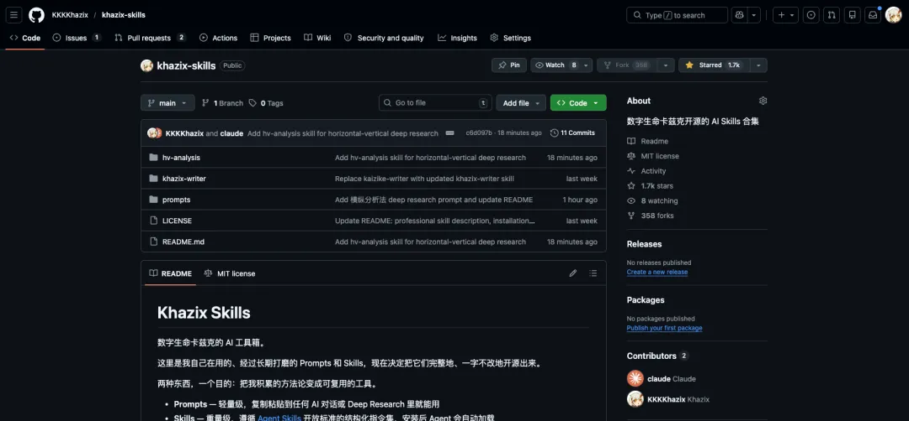
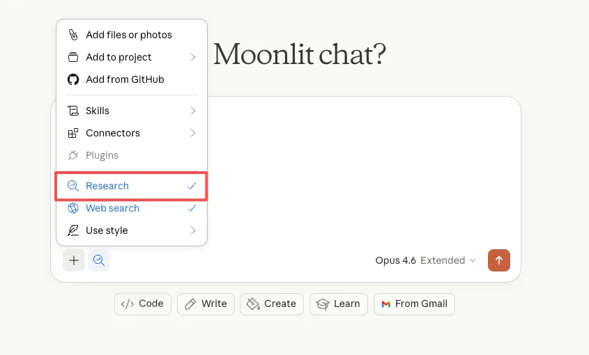
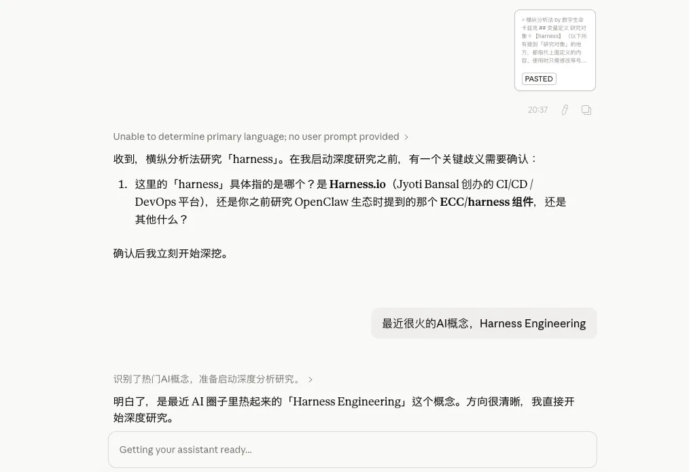
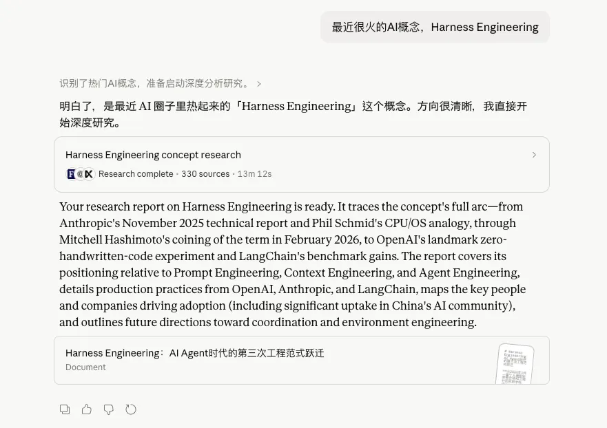
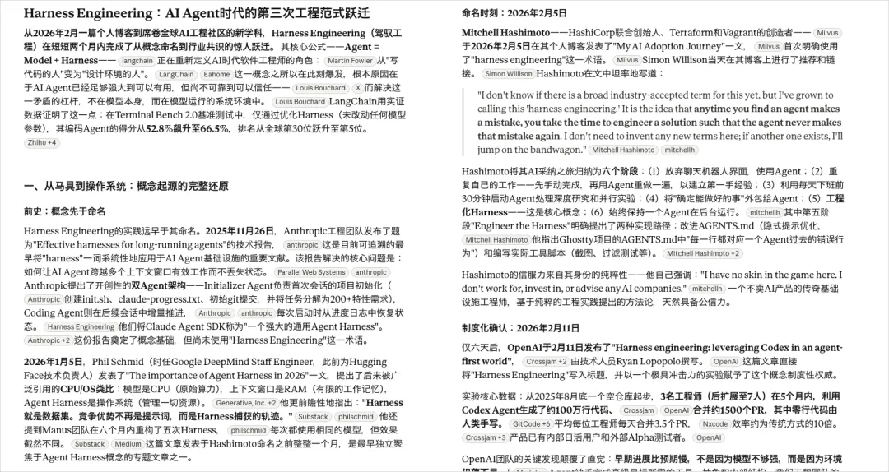
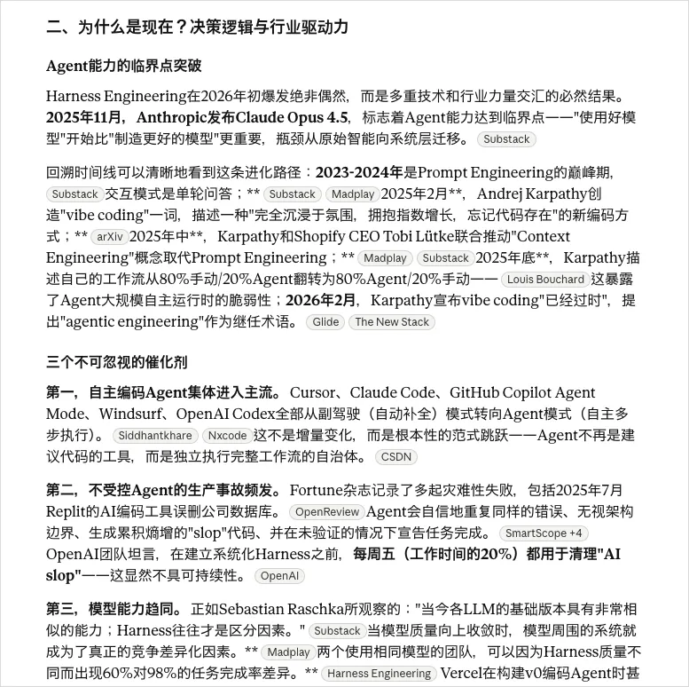
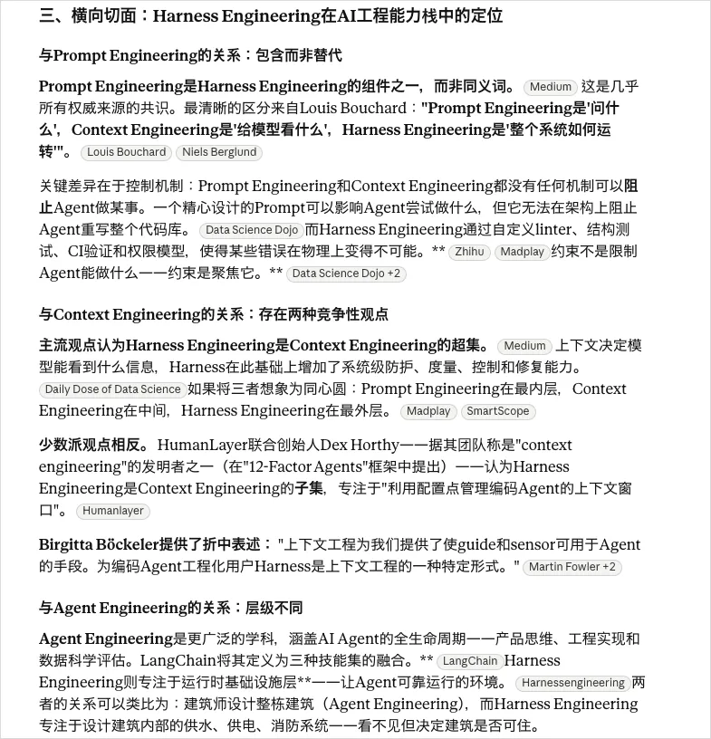
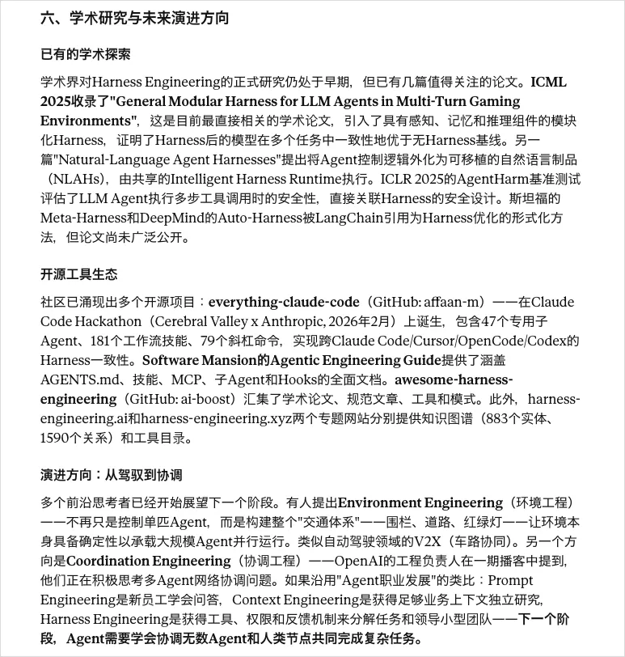
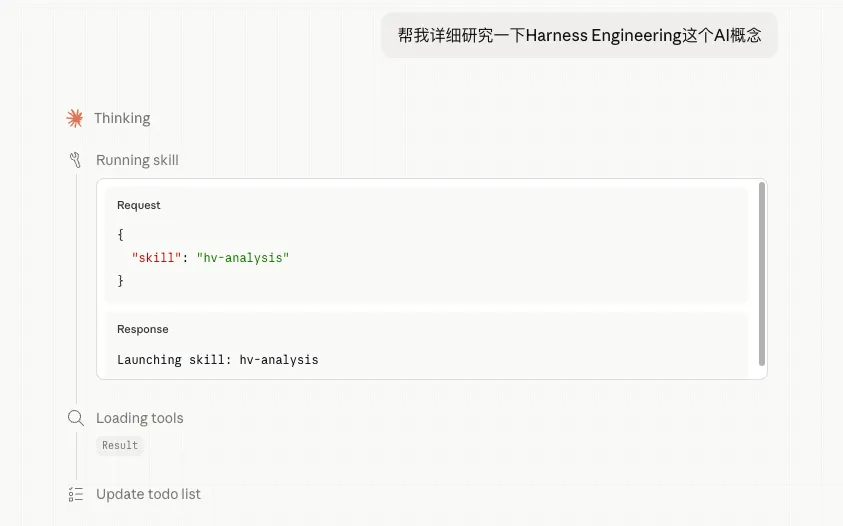
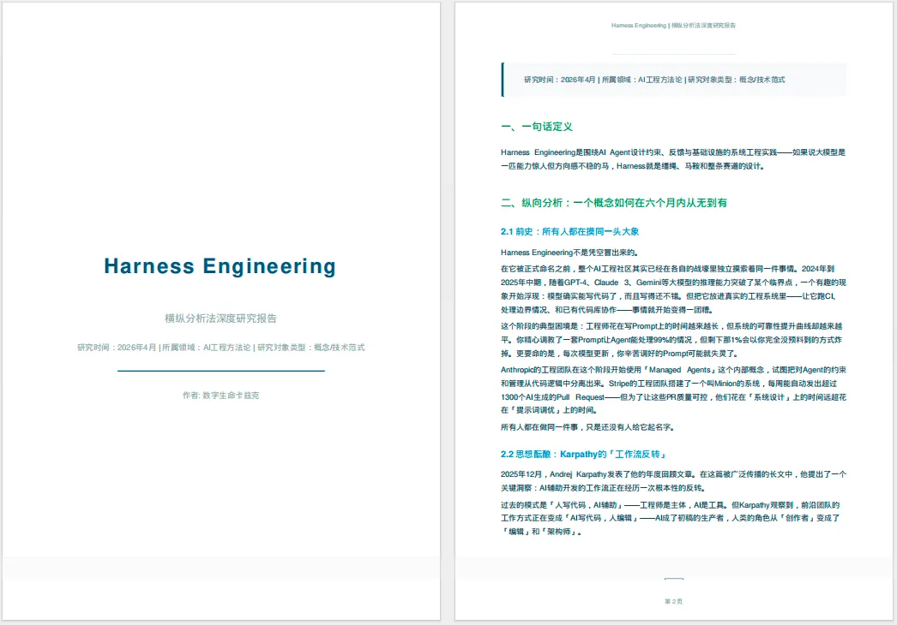

## 分享一个我用了 2 年的深度研究 Prompt，半小时帮你搞懂任何陌生领域。

Original 数字生命卡兹克 *2026 年 4 月 13 日 10:08*

前两天办完大会，然后昨天周末跟一个朋友吃饭，聊着聊着他突然放下筷子看着我说了一句，不是哥们，你怎么什么都懂一点？

我说我不懂啊，我懂个屁。

他说怎么感觉啥你都能聊一聊，什么 Harness、什么 Claude Code、什么心理学、什么杀戮尖塔 2、什么克苏鲁神话，你怎么还有时间玩宝可梦 popakia，你到底一天有多少个小时？

我当时就愣了一下。

因为坦率的说，聊天吹牛逼归吹牛逼，我真的没觉得自己什么都懂，我只是对很多东西好奇，然后有一套办法能让我很快地把一个陌生的东西摸个七七八八。

他又问，什么办法？

我说，一个我自己搞的研究框架，加上 AI，半小时能出一份一两万字的研究报告，能帮你贼迅速的入门。

他筷子又放下了。

然后他说，“你把这个东西写出来”。

于是就有了今天这篇文章。。。

我也不知道对所有人有没有用，但这确实是我自己三年前还在金融行业的时候，研究公司和行业用的方法论，然后后面 AI 来了，各种各样的深度研究也出来了，我自己又把这套方法论稍微迭代了一下，封装成了给很多 AI 的深度研究功能用的 Prompt，能适用于我研究任何东西，说实话，我觉得这就是这两年用得最顺手的东西之一。

不敢说这玩意出来的研究有多透彻，但至少能让我快速建立起一个相当完整的认知框架，然后在这个框架上再去深挖。

这个方法论，我之前把它称为。

横纵分析法。

我先说说这玩意是个什么东西。

其实特别简单，就两条轴。

==第一条轴，纵向。就是沿着时间线，把一个东西从诞生到现在的完整故事给还原出来。它怎么来的？谁做的？中间经历了什么？为什么在某个节点突然爆发了，或者突然掉头了？你把这条线理清楚，你就能理解一个东西大概的历史与因果。==

==第二条轴，横向。就是在当下这个时间点，把它跟同赛道的其他东西放在一起比。它跟竞品比有什么不同？用户为什么选它不选别的？它在整个赛道里是什么位置？你把这个切面看清楚，你就能理解一个东西的位置和差异。==

==然后最关键的一步，是把这两条轴交叉起来看。==

==纵向告诉你它是怎么走到今天的，横向告诉你它今天站在哪。两条轴一交叉，你就能看到一些单独看任何一条轴都看不到的东西。比如它今天的某个优势，其实是三年前一个不起眼的决策慢慢积累出来的。比如它今天的某个短板，其实是当初一个合理的选择变成了包袱。==

==纵向追时间深度，横向追同期广度，最后交汇出判断。==

就这么简单。

也是我这两年用的最顺手的一套方法。

这个方法其实脱胎于社会科学和语言学的一些经典研究视角。

语言学里面有一个非常经典的分析维度，是索绪尔提出来的，叫历时分析和共时分析。

就是你要研究一个东西，可以从两个维度入手，一个维度是时间维度，看它从过去到现在是怎么一步步演变过来的，另一个维度是当下维度，看它在某一个时间点上，处在一个什么样的系统和比较关系里。

社会科学里面也有类似的研究视角，叫纵向研究和横截面研究。纵向就是追踪一个对象的变化轨迹，横截面就是在某个时间点上观察它的截面状态，并做横向对比。

我就是把这些学术界已经用很久的研究视角抽离一下，再结合了一些商业和竞争战略分析的思路，搞成了一套用 AI 来跑的通用研究框架。

现在有 Prompt 版本和 Skill 版本。

也全部开源在我的 Github 仓库了：

https://github.com/KKKKhazix/khazix-skills

==Prompt 版本配合一些有深度研究功能的 AI 效果会特别好，比如 ChatGPT 的 DeepResearch、Claude 的深度研究、豆包的专家模式、DeepSeek 的专家模式啥的，都行，并且我特意优化了行文风格，使用了部分卡兹克写作 skill 的能力，保证这份报告出来以后，你能读的下去，而不是如果嚼难啃的天书一般。。。

我把 Prompt 放在这里，有需要的朋友直接复制，也可以去 Github 仓库自取

==使用方法特别简单，把那个研究对象等式后面那个词组，直接改成你想要的研究对象就行。

==比如最近很火的 hermes agent、比如 Harness、比如 CLI、比如 Anthropic 对于 SaaS 股有什么冲击等等等等。

==甚至你想研究《洛克王国世界》、《王者荣耀世界》、伊朗跟美国的战事、川普的反复无常等等等等。

什么都可以。

我用最近最火的 Harness + Claude 的深度研究来举个例子吧。

我直接把那个 Prompt 改了一下，等式里面换成了 Harness，然后打开了 Claude 的深度研究模式。

直接发送。

然后 Claude 会跟我确认一下 Harness 到底是个什么东西，我就补充了一下。

然后就直接开始了。

13 分钟以后，这篇关于 Harness 的研究报告就写好了。

可以看看效果，纵向分析我觉得写的还不错，历史给你拉的非常清楚，什么时候诞生的，什么时候爆发的，有哪些关键节点。

为什么是这个时间点爆发也非常的有道理。

而在横向研究上，对比的是 Prompt Engineering、Context Engineering 和 Agent Engineering。

我相信任何一个懂 Agent 的，都不会质疑它对比的不专业对吧，你可以非常快速的理清跟一些同类概念的区别。

还有最后的未来演进方向。

这整篇报告大概一万字，相信我，如果你是对 Harness 感到好奇，想最快速度尽可能全面的了解关于它的一切，这篇研究报告，几乎比你看到的大多数的汇总文章，都要好。

全面且易读。

==研究对象可以是一个产品，比如 Cursor、Claude Code、Hermes Agent。可以是一个公司，比如 Anthropic、字节跳动。可以是一个技术概念，比如 MCP 协议、RAG。甚至可以是一个人，比如某个行业里的关键人物。

Prompt 会根据研究对象的类型，自动调整纵向和横向分析的侧重点。研究产品就重点看版本迭代和功能对比，研究公司就重点看融资历程和商业模式，研究人物就重点看职业轨迹和同领域人物对比。

如果你平时喜欢用用 Cowork、Claude Code 或者 Codex 等等 Agent 啥的，我还把这个方法论做成了一个 Skill，叫 hv-analysis，也放在我的 Github 仓库里开源了。

装上之后你直接跟 Agent 说「帮我研究一下 xxx」，它就会按照横纵分析法的框架去做。

而且这个 Skill 版本还会自动联网搜索信息、还包了 arxiv 的 API，会在你研究一些学术问题的时候自主去查询论文，最后还会生成一份排版好的 PDF 研究报告，文风也会更易读，比 Prompt 版本更自由丰富一些。

当然，我得坦诚的说一下这个方法的局限。

它不是万能的。

==它能帮你在很短的时间内建立一个相当完整的认知框架，但它替代不了真正深入的、亲自下场的研究。

并且 AI 搜集到的信息虽然现在 AI 的模型幻觉已经非常非常低了，但是还是可能会出现不准确的情况。

**所以你不能拿到 AI 产出的报告就直接当结论用，它更像是一个你对这个领域研究的起点，帮你快速建立地图，然后你再根据这个地图去做更深入的探索。**

==另外一个问题是，AI 生成的报告质量跟你用的模型和工具有很大关系。用支持 DeepResearch 或者深度研究的工具效果通常比较好，因为它们会真的去联网搜索、验证很多信息，一次任务通常都在 10 分钟以上。

但是如果你只能用支持普通联网搜索的 AI 工具，一次就不到一分钟，那效果可能确实会大打折扣。

我自己的做法是，拿到报告之后，先快速通读一遍建立框架，然后针对我觉得有疑问的点或者特别感兴趣的点，再深入去搜更多资料。

这个就是横纵分析法生成的 AI 报告 + 自己深挖的组合，比从零开始的效率高太多了。

毕竟这年头，在已经有了 AI 的情况下，真的没必要硬生生自己去挖，那真的是没苦硬吃。

**我有时候觉得，这个时代做研究，真正稀缺的不再是信息，而是你对这个世界有多好奇。

其实你要说我真的有多博学或者多专业吗，那肯定也不是，我只是对这个世界，多了一点点的好奇而已。

就是脑子里随时随地会冒出来一堆问题。

这个东西是怎么来的？为什么是现在出现的？它跟那个东西是什么关系？做这件事的人之前在干嘛？这些问题如果我想到的时候，没有答案，我就真的难受，我不知道大家有没有这种感觉，就是那一种，此刻、立刻，我就要得到答案的感觉。

信息已经像洪水一样了，AI 让你获取信息的成本趋近于零。

**但你要问什么问题、从什么角度去看、怎么把散落的信息组织成有意义的判断，这些东西 AI 帮不了你，或者说，AI 只能在你给出方向之后帮你执行，但方向本身得你自己定。

横纵分析法其实就是我给自己定的一个提问框架。每次面对一个陌生的东西，我不需要临时想我应该从哪几个角度去了解它，这个框架已经帮我想好了。

纵向追时间，横向追空间，最后交汇出判断，三步走完，认知框架就搭起来了。

它让我不用再跟几年前一样，花三天时间去搜集信息，现在，半小时就能把框架搭起来，然后把剩下的时间花在真正有意思的地方，就是看着这些信息慢慢拼成一幅完整的图，然后突然「啊，原来是这样」的那个啊哈的瞬间。

那个瞬间太爽了。

说实话我也不确定这个方法适合每个人。

但如果你也是那种，脑子里经常冒出一堆问题，又嫌搜集信息太慢的人，可以试试。

古希腊人说，哲学始于惊奇。

我觉得吧，研究也是，始于你对一个东西真的好奇，方法和工具都是后面的事，好奇心在前面。

没有好奇心，有再好的方法论也是摆设。

有了好奇心，哪怕方法笨一点，你也总会找到答案的。

只不过现在，找答案这件事，确实比以前快多了。

快到你可以对更多的事情。

保持好奇。
