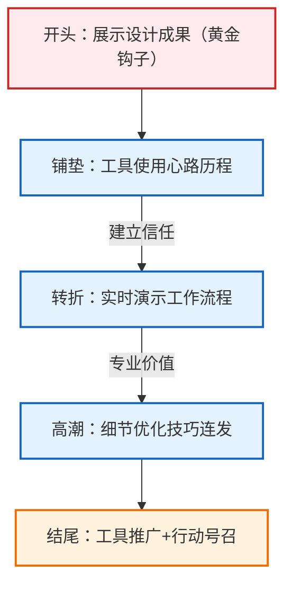

## 视频来源

user_2nMOjltugKNw1QtG7a8C0ypW0Cr/video/2026-3-25/d0c160ad-f422-4780-9354-e09aa14f4324/TailwindCSS%20%E8%AE%BE%E8%AE%A1%E5%A4%A7%E7%A5%9E%E7%9A%84%E8%BF%99%E4%B8%AA%E8%A7%86%E9%A2%91%E5%BC%BA%E7%83%88%E6%8E%A8%E8%8D%90.mp4

## 大纲

- 使用C代码设计金融应用营销页面(00:00:00)
    - 项目背景与设计动机(00:00:00)
        - 设计工具探索：使用Cloud Code完成多个项目(00:00:00)
            - 已完成项目：三层定价页面、年度报告、常见问题解答
            - 学习目的：熟悉Cloud Code作为设计工具的应用
        - 当前项目：财务仪表盘营销页面(00:00:09)
            - 数据可视化：整合多收入流到单一仪表盘
            - 虚拟内容填充：仅为视觉效果展示
    - 工作环境配置(00:01:01)
        - 技术准备：从空白画布启动项目(00:01:06)
            - 开发环境：Ghosty应用中的专用文件夹
            - 技术局限：仅掌握基础命令行操作
        - 初始设置：复制V项目模板并启动本地服务(00:01:06)
    - AI辅助设计流程(00:02:04)
        - 提示词工程：定义页面核心要素(00:02:30)
            - 核心功能描述：收入追踪/支出管理/财务预测/税务准备
            - 页面结构：导航栏+英雄区域+功能板块+数据统计+客户评价+CTA
        - 生成效果评估：接受AI初稿布局(00:03:14)
            - 色彩偏好：赞赏非默认靛蓝色的复古色调方案
    - 视觉元素优化(00:04:07)
        - 截图替换策略：使用真实界面截图增强可信度(00:04:25)
            - 技术规范：3倍分辨率捕捉确保高清效果
            - 细节调整：统一圆角半径与中性灰配色(00:04:34)
        - 边框设计技巧(00:05:18)
            - 透明边框：采用灰-950色+10%不透明度(00:05:45)
            - 视觉效果：避免纯色边框造成的浑浊阴影(00:05:56)
    - 字体系统精调(00:07:11)
        - 字体选择：强制使用Inter可变版本(00:08:05)
            - 特性优势：展示字体形态与高级字体特性
            - 技术细节：从SMS获取完整字体包(00:08:19)
        - 排版微调(00:08:57)
            - 字重定制：550中等偏粗权重(00:08:57)
            - 标题处理：紧缩大字号字距(00:09:40)
    - 布局重构(00:10:37)
        - 分栏式标题：3/5与2/5比例分割(00:10:56)
            - 对齐原则：辅助文本顶部与主标题对齐
            - 尺寸调整：缩小辅助文字至16px(00:11:39)
        - 容器扩展：加宽至1280px并优化换行(00:12:32)
    - 按钮系统优化(00:13:50)
        - 尺寸规范：38px高度+14px字号(00:12:49)
            - 胶囊形状：采用药丸状按钮样式(00:13:39)
            - 技术方案：Adam Wathan的inline-flex魔法(00:14:27)
        - 视觉层级：次级按钮采用外环设计(00:14:38)
    - 品牌元素更新(00:17:13)
        - Logo替换：使用虚构Logo库资源(00:17:49)
            - 品牌名称统一：全部更新为Xiom(00:18:07)
        - 导航栏调整：左对齐链接+紧凑按钮(00:18:56)
            - 模糊效果：保留背景模糊特性(00:19:44)
            - 底部边框：采用ring-950/10样式(00:20:50)
    - 客户Logo云设计(00:21:21)
        - 真实感营造：使用公开可用Logo(00:22:06)
            - 显示设置：H6字号+70%不透明度
            - 容器约束：等宽排列(00:22:32)
    - 内容区块优化(00:23:58)
        - 标题样式：内联式处理(00:24:30)
            - 行业参考：Stripe与Audio的案例(00:24:43)
            - 技术实现：标题辅助文本同字号(00:25:08)
        - 段落宽度：字符数限制(00:25:56)
            - 动态调整：反复调试至40字符(00:26:28)
            - 原理说明：基于零字符计算的容纳量
    - 视觉标识系统(00:28:11)
        - 眉标设计：等宽字体+全大写(00:28:30)
            - 字体选择：Geist Mono
            - 间距控制：宽松字距+灰色600(00:29:43)
    - 功能截图展示(00:31:10)
        - 重点突出：收入图表与预测界面(00:31:40)
            - 裁剪技巧：全屏截图后局部聚焦(00:32:14)
            - 视觉容器：8px内边距+同心圆角(00:32:44)
        - 边框增强：950灰色+5%不透明度轮廓(00:33:18)
    - 交互工具开发(00:35:59)
        - 定位辅助：临时图片定位工具(00:36:09)
            - 使用流程：获取坐标后写入代码(00:36:47)
        - 背景处理：灰-950+2.5%透明度(00:37:35)
    - 统计区域改造(00:43:45)
        - 布局调整：左对齐+全宽容器(00:44:27)
            - 数据展示：常规字重+适度对比(00:45:04)
            - 分隔线：项间添加视觉区分(00:46:34)
    - 客户评价设计(00:46:52)
        - 背景处理：图片卡片+深色遮罩(00:47:35)
            - 人物信息：中性化名称+底部渐变(00:48:24)
            - 尺寸调整：缩小署名文字(00:48:52)
    - 页脚系统(00:49:43)
        - 品牌标识：纯图标版Logo(00:51:35)
            - 网格基础：五列等宽布局(00:52:47)
            - 链接精简：text-sm字号+灰色图标(00:53:05)
    - 画布网格系统(00:54:52)
        - 行业参考：Stripe/Audio案例(00:55:08)
            - 实现方式：全宽边框+容器贴合(00:56:08)
            - 细节处理：16px顶部内边距调整(00:58:00)
    - 项目总结(00:58:23)
        - 工具预告：Ui.sh开发进展(00:58:23)
            - 合作团队：OtN与Wind
            - 功能范围：C代码/AMmp等技能集

## 总结

## 内容拆解专家

### 1. 宏观数据与定位
- **预估赛道**：设计工具教程/效率工具展示
- **核心受众**：UI/UX设计师、前端开发者、对设计工具有兴趣的创意工作者
- **情绪基调**：专业自信 -> 探索乐趣 -> 成果展示

### 2. 黄金前三秒 (黄金钩子)
- **钩子类型**：成果展示型 + 专业背书
- **原文金句**：*"我使用C代码作为主要设计工具已经一个多月了。效果相当惊艳。期间我完成了几个项目，包括这个带对比表的三层定价页面。"*
- **解析**：开场即展示具体成果（定价页面），用"惊艳"强化情绪价值，同时暗示观众能通过本视频获得同等能力。

### 3. 脚本结构透视

### 4. 逐段拆解与技巧分析
| 时间/阶段 | 原文片段 (摘要) | 写作技巧/底层逻辑 | 可复用性 |
| :--- | :--- | :--- | :---: |
| **成果展示** | "完成了几个项目包括..." | **具象化成果**：用具体案例替代抽象描述 | ⭐⭐⭐⭐⭐ |
| **痛点共鸣** | "对命令行操作还非常陌生..." | **自曝短板**：降低观众学习心理门槛 | ⭐⭐⭐⭐ |
| **实时演示** | "我要在这里把它全部启动..." | **过程可视化**：展示而非讲述工作流程 | ⭐⭐⭐⭐⭐ |
| **细节教学** | "将不透明度降低到10%..." | **颗粒度控制**：给出精确参数而非模糊建议 | ⭐⭐⭐⭐ |
| **工具推广** | "我们在开发名为Ui.sh的工具..." | **软性植入**：将推广包装成资源分享 | ⭐⭐⭐ |

### 5. 爆款公式提炼
- **模板总结**：惊艳成果开场 + 工具学习曲线展示 + 实时操作演示 + 精确参数技巧 + 资源福利钩子
- **金句仿写建议**：
    - 原句：*"效果相当惊艳。期间我完成了几个项目..."*
    - 仿写公式：*"[工具名称]的[时间维度]使用体验：[情感形容词]。已完成[具体数量]个[项目类型]..."*

### 6. 特别技巧标注
1. **技术口语化**：将"ring-950/10"等专业术语与"童话选床"等生活化比喻结合
2. **错误展示**：公开调试过程（如"这个角落不太对劲"）增强真实感
3. **视觉锚点**：反复强调具体数值（"38像素"、"45字符"）建立专业权威
4. **悬念设计**：用"Adam Wathan的魔法"埋下技术彩蛋吸引深度用户

Speaker0: *00:00:00 - 00:00:09*

我使用C代码作为主要设计工具已经一个多月了。效果相当惊艳。期间我完成了几个项目，包括**这个带对比表的三层定价页面**。

So I've been using C code as my primary design tool for just over a month now. It's been pretty spectacular. I've made a few things here, including **this three-tier pricing page with a comparison table**.

Speaker0: *00:00:09 - 00:01:01*

这里还有其他内容，比如年度报告和常见问题解答部分。这并不是为了什么特别目的——我只是出于兴趣制作它，以便熟悉将Cloud Code作为设计工具的使用。  

我还为**Tail Labs**制作了这种财务仪表盘，将我们所有的收入流整合到一个简洁的仪表盘中。我填充了一堆虚拟内容，只是为了让它看起来丰富多彩。  

我觉得今天为这个应用构建一个营销页面会很有趣，并向你们展示我的工作流程，或许还能分享一些设计技巧。现在我有了——

And it's got other stuff here, like an annual and FAQ section. This isn't for anything particular—I just made it for fun to get familiar with using Cloud Code as a design tool.  

I also made this sort of finance dashboard for **Tail Labs** to consolidate all of our revenue streams into one clean dashboard. I populated this with a bunch of fake content just to make it look colorful and whatnot.  

I thought it would be cool today to build a marketing page for this app and show you my workflow, maybe sharing a few design tips along the way. Now I have—

Speaker0: *00:01:01 - 00:01:06*

它在我这里的Ghosty应用中打开了。我创建了这个项目专用的文件夹。坦白说：我对命令行操作还非常陌生——这一切对我来说都很陌生。最初是Adam Wan帮我完成了环境配置，现在我只有一个从每个新项目复制过来的V项目模板。目前，我基本上只敢自信地说自己会切换目录和启动云端服务。

It opened up in my Ghosty app here. I have the folder I created for this project. Full disclosure: I'm still incredibly new to the command line—this is all pretty foreign to me. Adam Wan helped me get set up initially, and now I just have this V project template that I copied from every project that I start. At this point, I'm pretty much only confident in changing directories and getting cloud started up.

Speaker0: *00:01:06 - 00:02:04*

不过确实，我打开了这个项目。我要在这里把它全部启动并运行起来。好了，现在它已经在我的本地主机上运行了。我只是从一个空白画布开始工作——没有使用任何现成的技能。完全是从零开始。好的，接下来我要把这个窗口分割一下。

But yeah, I have this project open. I'm going to get it all started up and running here. Okay, so this is now running on my local host. I'm just working from a blank canvas—there are no skills I'm using. I'm starting from complete scratch. Okay, so I'm going to split this window up.

Speaker0: *00:02:04 - 00:02:30*

好的，现在我要运行Laude了。让我们开始吧。我之前其实已经预先写好了一段提示词。我准备把它复制粘贴进去然后重新加载。

好的，那么我要说的是：**为一个金融应用设计一个简单的营销页面**。这个应用本质上是一个整合你所有收入来源的工具，让你可以在一个仪表盘上查看所有活动。它主要聚焦于收入追踪、支出管理、财务预测和税务准备。

Okay, and now I'm going to run Laude. Let's get started here. I did sort of pre-write a prompt here. I'm going to copy and paste that in and reload. 

Okay, so I'm going to say: **Design a simple marketing page for a finance app**. It's essentially an app that consolidates all of your revenue streams to see all the activity in one dashboard. It focuses on revenue tracking, expense management, forecasting, and tax prep.

Speaker0: *00:02:30 - 00:03:13*

保持简洁明了。包含一个**导航栏**、标志、英雄区域（展示核心内容）、突出两个主要功能的特色板块、数据统计区、客户评价，最后以行动号召区和页脚结束。来看看它会生成什么。哦，现在显示出来了。好的，这是一个不错的起点。

Keep it pretty simple. Include a **navbar**, logo, hero, feature section that highlights two of the main features, a stat section, testimonials, and finish it with a CTA section and footer. Let's see what it puts. Oh, we have it showing now. Okay, so this is a decent starting point.

Speaker0: *00:03:14 - 00:04:07*

这个方案我可以接受。很好，我喜欢它使用了这种**复古色调**而非靛蓝色——我发现AI总是默认选择靛蓝。这点很酷。

我首先要把这个根据描述生成的假界面，替换成应用的真实截图。在页面上放置截图——当你没有任何图形素材时——是引入视觉元素的绝佳方式。如果没有现成的视觉素材，这能让页面看起来更炫酷有趣。

所以，我准备替换首页的演示图，直接从代码金融应用的`index`界面截取一张实机截图。

I could work with this. Okay, I like that it used this **old color** instead of indigo, which I find AI kind of defaults to every time. That's cool.  

The first thing I want to do is put an actual screenshot of the app in here, replacing this kind of generated fake UI that guessed based on how I described the app. Putting a screenshot on your page—if you don't have any graphics or anything—is just a great way to bring a graphical element into your page. It makes it look a little bit more flashy and interesting if you don't have any visual graphics to work with.  

So, I'm going to swap the demo in the hero and grab a screenshot of the app in the code finance app in the `index`.

Speaker0: *00:04:07 - 00:04:22*

HTML文件。请确保使用所有必要的依赖项以保证正确渲染。以3倍分辨率进行捕捉以获得高清效果。

HTML file. Make sure you use any dependencies so it renders correctly. Capture it at 3X so it's high resolution.

Speaker0: *00:04:25 - 00:04:34*

好的，选中部分处理得还不错。让我仔细看看这里——我已经能发现那个角落不太对劲。即便放大查看，也能看出我在这个应用里使用的灰色调...

Okay, selected did a decent job. Let me just look in here—I can already see the corner isn't quite right there. Even when I zoom in here, I can also see that the grays I'm using on this app are...

Speaker0: *00:04:34 - 00:04:49*

这里用的是类似板岩灰的颜色。我先更新几样东西。

It's using what looks like a slate gray here. I'm going to update a few things first.

Speaker0: *00:04:50 - 00:04:59*

Ttan。点亮这张截图的圆角半径。不错，看起来效果刚刚好。稍微好一点了，有点匹配我在截图中生成的圆角半径。

Ttan. Lighting up the corner radius on this screenshot. Cool, that looks like it's just balling it. It's a little bit better, kind of matches the corner radius of the corner radius that I generated in the screenshot.

Speaker0: *00:04:59 - 00:05:18*

我也打算更新灰度色值。现在看起来它似乎更多地使用了板岩灰——而我的截图里用的应该是中性灰，比如中性灰度。所以我会把所有灰度都更新一遍。

I'm also going to update the grays. Now this is using—it looks like it's using more with slate—and my screenshot is using, I think, neutrals in there, like neutral grays. So I'll update all the grays.

Speaker0: *00:05:18 - 00:05:45*

在这个网站上，我打算采用中性风格。目前这里由于阴影和内部灰色边框的缘故，看起来有些浑浊。它在这里使用了什么边框样式？哦，它用的是实心卷曲彩色边框。我在为按钮和图标等元素设计边框时，喜欢采用的一个技巧是使用...

On the site, I'm going to use neutral. Right now it looks muddy here with the shadow and inner gray border. What is it using for a border here? Yeah, it's using a solid curled colorful border. One thing I like to do when making borders on elements like buttons and shots is to use...

Speaker0: *00:05:45 - 00:05:56*

我尽量避免使用纯色，因为那样会在阴影和边框之间产生一种浑浊的效果。我更喜欢使用灰-950色，然后将不透明度降低到10%左右，并让它附着在外侧。

I try to avoid using solid colors because you get that muddy-looking effect between the shadow and the border. What I like to do is use a gray-950 and then reduce the opacity to about 10% and make it stick on the outside.

Speaker0: *00:05:56 - 00:06:42*

这样你就能在边框后方获得一道清晰的阴影效果。我建议在截图上使用外环而非边框，并将灰度设置为**95%**。好了，现在这个边框看起来专业多了。它与阴影的融合非常自然，整体显得更加干净利落，不像之前那样浑浊模糊。

接下来我要做的是——正如我所说，我很欣赏自己选择了这个绿色而非靛蓝色——但我确实希望保持这种中性视觉效果。

So you get that crisp-looking shadow that sits behind the border. I'm going to say use an outer ring on the screenshot instead of a border to make it gray **95%**. Okay, and now we have a much PR-looking border here. It blends into the shadow nicely. It looks a lot cleaner and not as muddy as it was. 

Okay, so the next thing I'm gonna do—like I said, I do admire that I chose this green instead of indigo—but I do want to keep this kind of neutral-looking.

Speaker0: *00:06:42 - 00:06:52*

Ledgr的所有用途中。

So of all the uses of Ledgr.

Speaker0: *00:06:52 - 00:07:11*

调成950灰色。好的，我更喜欢这个。下一项。看起来这里用的是这个（效果），我挺喜欢的。我再确认一下。

To gray 950. Okay, I like that better. Next thing. This looks like it's using in here, which I like. I'm just going to confirm that.

Speaker0: *00:07:11 - 00:08:05*

是的。好的，不过我想确认一下是否使用了**Inter**字体的可变版本，目前看起来似乎没有。**Inter**可变版本的好处在于它同时包含文本字体和展示字体两种形态。展示字体看起来更——更具视觉冲击力，我不知该如何准确描述，就是更有"展示范儿"。所以我想确保用的是展示版本。另外，可变版本还支持所有高级字体特性，比如单层结构的"A"字母。  

我发现生成网站时，系统通常只会调用**Inter**的基础默认版本。所以我要强调：务必使用**Inter**的可变版本，开启所有高级字体特性设置，并采用展示字体——记得要从SMS获取这个版本。  

（注：根据技术语境保留"SMS"缩写，假设指代特定字体资源库；"单层结构A"指字母A的无衬线简化设计；"展示范儿"口语化表达"display"的视觉特性）

Yep. Okay, but I want to make sure it's using the variable version of the font, and it doesn't look like it's doing that. The nice thing about the variable version of **Inter** is that it's got a text version of the font and a display version of the font. The display version just looks a little bit more—has a little more higher impact to it. I don't really know how to describe it; it just feels more "display." So I want to make sure I'm using that one. Plus, the variable version has all the fancy font features, like if I want to do a single-story "A."  

I find that when it generates sites, it typically leans into just the sort of basic default version of Inter. So I'm going to say: make sure you're using the variable version of **Inter** with all the fancy font feature settings and the display version of the font—and get it from the SMS.

Speaker0: *00:08:05 - 00:08:19*

新加坡管理大学风险管理学院的网站。好的。

SMU's RMU's website. Okay.

Speaker0: *00:08:19 - 00:08:27*

这样更好，我不想使用那个版本的 L。不要使用 **lowerre** 的版本。

So that's better, I don't want to use that version of the L. Don't use the version of the **lowerre**.

Speaker0: *00:08:27 - 00:08:57*

带细节尾部的L形案例。好的，让我们仔细看看。使用**Inter**字体的另一个优点是，我可以使用所有中间字重。如果中等粗细感觉有点太细，而半粗体又感觉有点太粗，我可以在中间找到合适的粗细。我要调整一下字体粗细。

Case L with detail tail. Okay, let's look better. Another cool thing about using **Inter** is I can use all the in-between weights. If medium feels a little too thin and semi-bold feels a bit too bold, I can find something in the middle. I'm going to change the font weight.

Speaker0: *00:08:57 - 00:09:40*

应该是这样，我打算设定在**550**左右，介于中等和半粗体之间，因为中等通常是500，半粗体是600，我想。好的，我还要把字间距稍微调紧一点，让它更有冲击力。我发现当字体大小超过24到30像素时，我喜欢把字间距调得稍紧一些。所以我要稍微收紧一点——让标题的字距更紧凑些。

Should be, I'm going to say **550** somewhere in between medium and semi-bold, because medium will be 500, semi-bold to be 600, I believe. Okay, and I'm also going to make the tracking just a bit tighter to give it a little bit more impact. I find when you get two font sizes over like 24 to 30 pixels, I like to make my tracking just a bit tighter. So I'm going to tighten that off a bit—make the tracking in the headline a bit tighter.

Speaker0: *00:09:40 - 00:10:37*

在我们的项目中，我发现用AI生成网站时有个现象：默认情况下所有内容都会自动居中。但我个人更偏好左对齐。还有个做法可以参考我在**Tailwind Labs**官网的实现——具体在哪里来着？啊对，在Tailwind页面，我采用了这种分栏式标题设计：标题和副标题并非严格五五开，标题占比稍大些。这种布局比单纯居中或左对齐的标题更有趣，也能更好地填充空间。所以建议修改主标题的布局：将标题左对齐，支持性文本和按钮放在右侧。

For our project, one thing I find when I generate sites with AI is that it defaults to centering everything by default. I'm more of a left-align guy. Another thing you could do is what I did on the **Tailwind Labs** website. If I go into... Where did I do this? Yeah, on the Tailwind page, I kind of did this sort of split headline with the heading—not quite 50-50, there's a little more weight given to the headline. It's just a bit more interesting than a center-aligned or left-aligned headline, and it fills that space nicer. So change the layout of the hero headline: make the headline left-aligned and put the supporting text on the right with the buttons.

Speaker0: *00:10:37 - 00:10:55*

左对齐，确保**辅助文本**的顶部与标题顶部对齐。采用3/5和2/5的比例分割布局。我们来看看效果如何。

Left aligned, make sure the top of the **supporting text** lines up with the top of the headline. Make it like a 3/5 and 2/5 split. Let's see what that does.

Speaker0: *00:10:56 - 00:11:37*

这句话写得相当糟糕。我差不多就这样搞定了——看起来还不错。我要去掉这个眉毛处理效果，而且我不想要那个部分。好的，我还想把辅助文字调小一点。我希望这些几乎能保持相同高度。或许这些按钮也可以稍微缩小些。把辅助文字设为16像素吧，看看效果如何。我猜现在大概是18或20像素。

It's a pretty badly written sentence. I just kind of got it pretty right there—that looks pretty good. I'm going to get rid of this eyebrow treatment, and I don't want that in there. Okay, I also want to make the supporting text a bit smaller. I want these to almost be the same height. I might make these buttons a bit smaller too. Let's make the supporting text 16 pixels. Let's see what that looks like. I'm guessing that's like 18 or 20 right now.

Speaker0: *00:11:39 - 00:12:31*

这样好一些了。我打算把这个也调宽一点，把页面容器加宽些。1280像素怎么样？嗯，这样看起来好多了。

我不喜欢这里文字换行的方式。希望这句话能单独成行，把标题里的每句话都各自放一行。这样就好多了，对吧？

接下来——首先，我不喜欢这种锯齿状的排列效果。对，把这张截图设为全宽显示。

That's a bit better. I'm going to make this a bit wider too, so make the page container wider. Maybe 1280? Okay, that's a bit better.  

I don't like the way this sort of wrapped here. I'd like this to be with this sentence, so put each sentence in the headline on its own line. That's better, okay?  

Next thing—first of all, I don't like that this is kind of doing this ziggy thing. Yeah, so make this screenshot full width.

Speaker0: *00:12:32 - 00:12:49*

在页面容器中，这样看起来更好了。我也觉得那些按钮看起来相当笨重。我认为文字可以比二号字更小些。把英雄区域的按钮也缩小一些。

In the page container, that looks better. I also think those buttons are looking pretty clunky. I think the text could be smaller than two. Mix the buttons in the hero smaller.

Speaker0: *00:12:49 - 00:13:39*

以14像素字号来思考。按钮高度我偏好36-38像素范围。直接决定：将按钮高度设为**38像素**，但不要固定高度。通过内边距调整实现即可。

不喜欢那个图标。说不上来，就是觉得不合适。把"观看演示"按钮里的图标去掉。我要简洁的效果，明白吗？

好的，我还觉得水平内边距有点大。这样吧，我先把这些按钮做成胶囊形状看看效果。先把按钮做出来。

Thinking like 14 pixel font size. I like somewhere in the 36-38 pixel range for button height. I'm just going to say: make the button height **38 pixels**, not fixed height though. Just make it work with padding stuff. 

I don't like that icon in there. I don't know, not into it. Get rid of the icon in the "Watch Demo" button. I want it looking clean, you know? 

Okay, I also think that the X padding is a little bit more. You know what? I'm going to make these pill buttons and I'll see what happens from there. So make the buttons.

Speaker0: *00:13:39 - 00:13:46*

药丸形状。全体作者与清酒。

Pill shaped. All author and sake.

Speaker0: *00:13:50 - 00:14:06*

好的，看起来相当不错。把次级按钮再稍微抬高一点。捐赠部分稍微下调了一些。

Okay, it looks pretty good. Make the secondary button a bit more elevated. The give did a small dow.

Speaker0: *00:14:10 - 00:14:27*

好的，那么这个是怎么构建的呢？好的，我认为它现在实现的效果和截图中一样——边框采用了纯色，你现在看到的就是类似Buddy风格的边框效果。所以我打算选择使用一个...

Okay, and how is this built? Okay, so I think this is doing what it was doing on the screenshot where the border is using a solid color, and you're kind of getting that buddy-looking border right now. So I'm going to say use a...

Speaker0: *00:14:27 - 00:14:34*

次级按钮采用外环替代边框，950，10。

Outer ring instead of a border on the secondary button, 950, 10.

Speaker0: *00:14:38 - 00:15:56*

好了，现在你得到了一个看起来更清爽的子元素。这是怎么构建出来的呢？

这个按钮周围有一圈边框，而这个没有。结果就是，这个按钮在技术上比那个按钮高出两个像素。这可不行——我晚上会因此失眠的。**Adam Wathan，给我整点解决方案吧。** 我已经把它保存在Tailwind Play里了。

基本上，你需要做的是把这个带边框的按钮包裹在一个带有`inline-flex`和`px`工具的span里，然后他把所有这些属性都加了上去。说实话，我自个儿可整不出这活儿。这就是Adam Wathan的魔法。不过他确实给了我这段Tailwind Play代码——我一定会把这段Play的链接放在评论区里，方便你们自己用。

我还没完全搞懂它的原理，但我会把这里的结构拿来用，把所有按钮都改成这种结构，咱们看看效果如何。

Okay, now you get a much more crisp-looking child. How is this built? 

This button has a ring around it, and this one doesn't. As a result, this is technically two pixels taller than this button. We can't have that—that's how I lose sleep at night. **Adam Wathan, cook something up for me to solve this problem.** I have it saved in a Tailwind Play here.

Basically, what you want to do is wrap this border button in a span with this `inline-flex` and `px` utility, and then he puts all this stuff on here. Honestly, I could not have cooked this up myself. This is some Adam Wathan magic happening. But he did give me this Tailwind Play—I'll be sure to put a link to this Play in the comments so you can use it yourself.

I don't fully understand how it works, but I'm going to take this structure here, updated all the buttons to be structured like this, and let's see what it does.

Speaker0: *00:15:56 - 00:16:15*

但它是否达到了我预期的效果？我想在这里给父元素添加阴影。好的，确保那个按钮。

But did it do what I wanted it to do? I want to put the shadow on the parent here. Okay, make sure the button.

Speaker0: *00:16:15 - 00:17:13*

现在，按钮是开启状态，而非父级的span元素。最后这样看起来好多了。好的，现在看起来相当不错，正在逐步完善——整体显得很简洁。

好的，接下来我要更新这个英雄区域。让我们换个不同的logo放进去。我之前随便生成了这个假logo，它的对齐方式有点奇怪。我有个**Figma文件**。这是我至今仍会偶尔打开Figma的少数原因之一——用来生成矢量图形。我专门有个文件存放这些虚构的logo，时不时会翻出来用用。那么，我就直接使用眼前这个我自己编造的logo吧。

Now, the button is on, not the parent span. Last, that's looking better. Okay, this is looking pretty good, coming along—it's looking clean. 

Okay, so I'm going to update the hero. Let's put a different logo in there. I just kind of generated this fake logo, and it has weird alignment. I have a **Figma file**. This is one of the few reasons I still open up Figma—to generate vector graphics. I just have this file of all these fake logos that I kind of go through every now and then. So, I'm just going to use this logo right here that I made up.

Speaker0: *00:17:13 - 00:17:49*

不过确实，这是我至今仍会打开 **Sigma** 的少数原因之一——用它来处理矢量图形。最近推出的 **Quiver AI** 工具看起来很有前景，AI 在这方面还在持续优化。我还没机会上手试试，但已经迫不及待想深入探索了。  

接下来我要复制这个 logo。我用的高清版，所以你看我这里开了很多标签页。总之，把 logo 更新成这个就对了。

But yeah, this is one of the few reasons I still open up **Sigma**—to get vector graphics going. AI is still kind of working on that **Quiver AI** tool that recently came up, which looks very promising. I haven't had a chance to dabble in it yet, but I'm excited to dive into it.  

So I'm going to copy this logo. I have HD, so as you can see, I have a lot of tabs here. But yeah, update the logo to use this.

Speaker0: *00:17:49 - 00:18:07*

既然我们现在使用这个标志，就把所有提到**Ledger**的地方都更新为**Xiom**。全部更新。

And now that we're using this logo, let's update all mentions of the word **Ledger** to be **Xiom**. Date all.

Speaker0: *00:18:07 - 00:18:56*

提到**Ledgr**这个词。给网站上的AXIoMSVG。好的，现在我们来稍微调整一下这个导航栏。我要把那个logo稍微调大一点。把logo调大一点。这样看起来不错。好的。然后我想把这些链接左对齐，让它们紧挨着logo，而不是居中。现在这三个元素挤在一起感觉有点乱，所以把导航栏里的链接左对齐。

Mention of the word **Ledgr**. To AXIoMSVG on the site. Okay, now let's work on this nav a little bit. I'm going to make that logo just a tinge bigger. Make the logo a tinge bigger. That seems fine. Okay. And I think I want to left-align these links to be kind of snug with the logo instead of centered. It just feels kind of busy in here with these three elements, so left-align the links in the nav bar.

Speaker0: *00:18:56 - 00:19:33*

靠近logo一些。好的，不错。我希望导航栏里的按钮能稍微小一点。它看起来可能比主按钮还要大些，所以我想让它更紧凑些，这样就不会和那个按钮形成视觉竞争。也许我还会把这个登录按钮也做成次级样式，所以把...

To be closer to the logo. Okay, good. And I want the button in the navbar to be a bit smaller. It looks like it might be even a bit bigger than the hero button, so I want it to be a bit tighter, so it's not competing with that button. Maybe I'll put this sign-in button into a secondary-looking treatment as well, so make the...

Speaker0: *00:19:33 - 00:19:42*

导航栏中的按钮较小——我估计高度大约28像素。

The button in the nav is smaller—I'd say around 28 pixels tall.

Speaker0: *00:19:44 - 00:20:50*

提供登录链接。采用次级按钮样式。做得太小了，24像素。就是24像素。做成828。我希望它是文本访问。用小号文本，不是XS号。不错，这样看起来好多了。  

我觉得挺不错的。我喜欢那个模糊效果——不是我做的，我只是加了一下，看起来还挺酷的。但导航栏的边框现在看起来有点浑浊，可能用了实心渐变。对。  

所以给导航栏加个底部边框。

Give the sign-in link. A secondary button treatment. Made it too small, 24 pixels. That's 24 pixels. Make 828. And I want it to be text access. A text small, not XS. Cool, that looks better.

I think it's pretty good. I like that blur treatment that gave — I didn't do that, I just kind of added it and it looks kind of cool. But the border just doing on the nav is doing that same thing where it's looking kind of muddy. It's probably using a solid gradient. Yeah.

So make the bottom border on the nav.

Speaker0: *00:20:50 - 00:21:21*

带过来。我猜应该不是戒指，对，像是**环-950/10**那种。一个外环。对。好的。这样好多了，看起来更清晰一些。我们往下移。我要移到这个logo云这里。放些真实的假logo进去，别只是这些文字logo。  

（注：保持"ring-950/10"作为专业术语未直译，根据上下文将"ring"分别处理为"戒指"和"环"；"crisp"译为"清晰"贴合设计语境；"real fake logos"采用矛盾修辞直译"真实的假logo"保留原文幽默感）

Bring. I guess it wouldn't be a ring, yeah, like a **ring-950/10**. An outer ring. Yeah. Okay. That's better. That looks a little more crisp. Let's move down. I'm going to move down to this logo cloud. Let's put some real fake logos in there, not just these text logos.

Speaker0: *00:21:21 - 00:21:29*

我的Fig文件里存着所有Logo去哪儿了？我要批量抓取这些标签和标志。我手头有全部素材——就选这边整齐排列的这一列吧。

Where's my Fig file with all my logos? I'm going to grab a bunch of these labels and logos. I have all of them—let me just grab these ones right here that are in a nice column.

Speaker0: *00:21:29 - 00:21:48*

我会将它们导出为Gs格式，并放在这个项目的文件夹中。

I'm going to export them as Gs, and I'll put them in the folder of this project.

Speaker0: *00:22:02 - 00:22:06*

所以我将更新标识云中的标识，使用公开可用的那些标识。

So I'm going to update the logos in the logo cloud to use the logos in the public.

Speaker0: *00:22:06 - 00:22:32*

斜杠标识较旧。它们设置为H6且不透明度为70%。请勿使用任何。

Slash logos older. They're set at H6 with opacity 70. Don't use any.

Speaker0: *00:22:32 - 00:23:02*

让它们都在容器内保持相同的宽度。再稍微调大一点。好的，现在是红色了。

Make them all a width in the container. Make them a bit bigger. Okay, it's red.

Speaker0: *00:23:02 - 00:23:58*

关于偏移背景。在这一部分，移除顶部和底部的边框。去掉这个部分的标题。好的，我喜欢这样。我认为标题并不是必要的。我在很多网站上看到过这种情况，它们并没有为这个部分设置标题——只有当用户很明显会是这个应用的使用者时，才会在下方显示人员信息。好的，让我继续处理这个功能部分。我将把这个部分的标题左对齐。

Of the offset background. In this section, get rid of the top and bottom borders. Get rid of the title of this section. Okay, I like that. I don't think the title was necessary. I see these on a lot of sites, and they don't really have a title for the section—just people below when it's very clear that they're likely going to be users of this app. Okay, let me move on to this feature section. I'm going to left-align this section heading.

Speaker0: *00:23:58 - 00:24:30*

左对齐线段部分。在特性部分，我将对这种处理方式采取不同的做法——我会采用那种内联式的处理方式。我记得最初是在苹果产品上看到这种效果的。**内联处理是这样的**，标题会以某种方式...

Left align line section. In the feature section, I'm going to do something different with this treatment—I'm going to do that sort of inline treatment. I think I first saw it on Apple. **Inline does this**, where the title kind of...

Speaker0: *00:24:30 - 00:24:43*

将广告融入辅助文案中——这种排版方式较为统一，只是用不同颜色区分辅助文本。我觉得这样看起来更有趣一些。**Stripe也采用了这种做法**——他们现在在首页主视觉区和这些版块都这么处理。

Ads into the supporting copy—it's sort of in line, and they just use a different color for the supporting text. I think that looks a bit more interesting. **Stripe does this too**—they do it on their hero now and in these sections.

Speaker0: *00:24:43 - 00:25:08*

我认为音频也有同样的效果。他们在这里某种程度上也这么做了，所以我觉得这现在是一种很酷的风格。我打算更新成那种风格——更新特性部分标题的样式。

I think audio does the same thing. They sort of do it here as well, so I think that's a cool style right now. I'm going to update that to do that style — update the style of the feature section heading.

Speaker0: *00:25:08 - 00:25:55*

将标题和辅助文本设为相同大小。让标题与辅助文本内联排列，使其看起来像一个整体。暂时将辅助文本设为**Bra 600**字体以便预览效果。采用中等字重。中等程度——我觉得这样能呈现那种视觉效果。我们看看效果如何。我是说，这样确实达到了。

Make the title and supporting text the same size. Make that title inline with the supporting text, so it reads like one block. Make the supporting text **Bra 600** for now just to see what that looks like. Make it the medium weight. Make it mediumly—I think that kind of captures that look. We'll see what it does. I mean, that did it.

Speaker0: *00:25:56 - 00:28:11*

把它做得更大一些，比如4XL尺寸。同时，把辅助句稍微拉长一点——我觉得这种标题处理方式在应用时，需要搭配稍长的句子才更合适。对，这样看起来不错。  

房子已经建好了——它的宽度是混合的。**最大宽度设为XL**，比起固定最大宽度，我更喜欢用字符数来定义最大宽度。现在这个最大宽度是怎么写的来着？就像那种…我直接查一下。CH 45。45。或许可以再收紧一点——40吧。  

让我看看——35，35。不过40更合我心意。有时候就得像童话里选床一样反复调试。  

这个字符规则的原理是：根据当前空间能容纳的字符数来确定文本块的宽度。我猜它是基于零字符计算的——比如用这个字号，一行能塞下45个零字符，大概就是这么运作的。  

在排版时这招特别灵活，因为你有时只希望文本拥有舒适的阅读宽度，而非固定数值。按可容纳字符数来定宽度，正是个巧妙的小工具。  

我决定加上它——刚才删掉了眉标，现在可以补回来。把眉标加上。好。没错。就这样。  

（注：译文保留"goldilock it"的童话隐喻，将技术术语如"max-width character thing"转化为"用字符数定义宽度"，并通过"眉标"对应"eyebrow"的设计术语，同时用"反复调试"等口语化表达还原即兴讨论的语境）

Make it bigger, like 4XL. Also, make the supporting sentence a bit longer. I feel like this treatment, the style of title, kind of requires a bit of a longer sentence if you're going to use it. Yeah, that seems fine.  

The house is built—it's got mixed width on it. **Max width XL**, so instead of giving it a fixed max width, I like to use the max-width character thing. Make the max—how is that written now? Max width, like the... I'm just going to see you. CH 45. 45. Maybe a bit tighter than that—40.  

Let me see—35, 35. I like 40 better. Sometimes you got to goldilock it.  

What this character rule does is it bases the width of this text block on the amount of characters it could fit into that. I think it's based on the zero character. So I could fit like 45 zeros of this font size in this space—I think that's how it works.  

But that's a little bit more flexible for when you're working with typography because sometimes you just want typography to have a nice reading width. You don't really want a set width; you want it based on how many characters you can fit. So that's a nice little tool for that.  

I'm going to say add it—got rid of the eyebrow there, so I can add that back. Add the eyebrow. Okay. Yep. Okay.

Speaker0: *00:28:11 - 00:28:30*

这期进展如何？你做得不错。我喜欢用等宽字体处理这些眉毛部分——我觉得这样看起来更有设计感，也更有趣些。所以我打算说，把眉毛部分做成这样。

How are you doing this session? You're doing good. I like using a monospace for these eyebrows—I think it just looks a little bit more designed, a little more interesting. So I'm going to say, make the eyebrow.

Speaker0: *00:28:30 - 00:29:43*

单空格字体。或许用Geist字体。这样效果不错。当我这么做时，我喜欢全部转为大写。转为大写时，我会把字间距调宽些。字间距放宽。我打算用灰色600。或许XS字号。对，我还要把字距调得更宽些，给文字更多呼吸空间。好了，这样看起来更有意思。我希望所有章节标题都采用同样的处理方式。应用这个样式。

Mono space. Maybe Geist wo. That's a good fight. When I do that, I like to make them all uppercase. I like to make the tracking a bit wider when I make everything uppercase. Tracking wide. I'm going to make it gray 600. Maybe text XS. Yeah, and I'm going to say tracking wider, just to give it a little bit more room to breathe. Okay, so that looks more interesting. I want this same treatment for all of these section headings. Apply this.

Speaker0: *00:29:43 - 00:30:25*

相同功能。章节标题。统一应用样式。下方操作。我明明做对了，但这里显示得特别紧凑。这是怎么回事？为什么会这样？我设置了最大4000字符。字体大小需要保持一致。确保最大值。

Same feature. Section heading. Style to all of them. Actions below. I did it right, but it kept it pretty tight there. What's going on here? Why is that happening? I put the max with 4000 characters in. It needs to be the same size that the font is set. Make sure max.

Speaker0: *00:30:25 - 00:31:10*

在同一行设置了字体大小的40个字符中，我不喜欢那个孤立的词。稍后我会处理这个问题。现在让我们先专注于这个功能部分。

我打算在这里插入一些实际截图。这里展示的是统一收入追踪和智能预测功能。我会使用更多截图，然后...

With 40 characters on the same line where the font size is set, I don't like that **phaned** word right there. I'll get to that in a minute. Let's just focus on this feature section.

I'm going to put some actual shots in here. What I have here is unified revenue tracking and smart forecasting. I'll just use more shots and kind of...

Speaker0: *00:31:10 - 00:31:40*

聚焦高亮显示的功能。对于统一收入追踪，我会专注于这张图表，或许让那个小提示框保持展开状态。

关于智能预测功能，如果我进入实际应用界面，底部会有一个趋势预测图表。我可能会让焦点停留在那里，并显示这个提示信息。

我说过，要把**功能**版块中的图形换成实际截图。像在首页那样从财务应用文件中截取，先获取完整截图然后在空间里裁剪，这样我就能突出特定部分。

为统一收入版块准备截图时，确保收入图表上的提示信息可见。预测版块则要截取带有预测工具提示的界面。看看我能不能搞定这个。

Focus in on the feature that's highlighting. For unified revenue tracking, I'll just focus on this chart and maybe have that little tooltip thing opened up. 

For the smart forecasting, if I go to the actual app here, there's this sort of trend forecast graph at the bottom. Maybe I'll have it focus on that with this tip showing.

I said, swap the graphics in the **Features** section to use an actual screenshot. Grab a screenshot from the finance app file like you did in the hero, capture the whole screenshot and crop it in the space so I can focus on a specific part. 

When bringing a screenshot for the unified revenue section, make sure the tip on the revenue chart is showing. For the forecasting section, grab a screenshot with a forecasting tooltip showing. Let's see if I could pull that off.

Speaker0: *00:31:40 - 00:32:14*

小男孩已经喋喋不休了五分钟。好了，就这样吧。好的，我要把那个。

Little boy been razzing for five minutes. Well, there we go. Okay, I'm going to put the.

Speaker0: *00:32:14 - 00:32:23*

文字上方的截图。移动这些截图。

Shots on top of the text. Move the screenshots.

Speaker0: *00:32:24 - 00:32:44*

在容器内的文字上方，我们将稍微插入一些内容。在容器内部，设置镜头。

Above the text in the containers, we're going to insert them a bit. Inside the containers, set the shots.

Speaker0: *00:32:44 - 00:33:18*

我喜欢那种紧凑的感觉。大概八像素左右，或许可以作为起点。确保截图的圆角与容器的圆角同心对齐。这样圆角就能完美匹配——仿佛紧紧贴合外缘的弧度。

I like when it's pretty tight. Thinking like eight pixels, maybe that's the starting point. Make sure the border radius on the screenshot is centric with container radius. That's just so that the radius kind of matches—it kind of hugs the outer radius.

Speaker0: *00:33:18 - 00:33:49*

这样看起来更正确。我打算给这些镜头加上轮廓线。我想说暂时先设为950，5这样。对，就像这样。这就是我想要的。

That looks more correct. I'm going to add an outline to the shots. I want to say like 950, the five for now. Yeah, just like that. I want it to be.

Speaker0: *00:33:49 - 00:34:26*

它位于图片上方。很可能就在那里，大概在图片下方。我想让它放在F的位置。很喜欢这张图片。现在它可能被图片挡住了。我不懂怎么操作这些——我觉得你更在行。

It's on top of the image. It's probably there, likely underneath it. I want it to be on F. Love the image. Right now it's probably behind it. I don't know how to do this stuff—I think you got a leg.

Speaker0: *00:34:26 - 00:35:59*

把它单独放置并绝对定位。我真搞不懂为什么之前不行，但现在它终于按我想要的方式工作了。上面有个圆环，稍微盖住了图片的一角，这样就在周围形成了一道清晰利落的边框。嗯，看起来不错。

现在我想把图片再放大一点——目前每张都稍微缩小了些。把每张图片都放大些。也许从**25%**开始试。这样应该可以，我觉得。好了，但我想调整它们的位置。现在它们都堆在右上角。我本可以指定移动位置，但你知道吗？我打算临时做个小工具，一个能让我手动拖动图片到理想位置的临时工具。

做个临时工具让我能在里面移动图片。但是要带提示功能。所以我得这么做——建个临时工具，让我能在裁剪区域内自由移动图片。看看效果如何。

Put it on its own thing and absolutely position it. I have no idea how this doesn't work, but now it's doing what I want it to do. There's a ring on there, and it's sort of covering the corner of the image, giving me a nice crisp border around it. Yeah, looks good.

Now I wanted to zoom in on the images a bit more—it's a little zoomed out on each. Zoom in on each of the images. Maybe **25%** as a starting point. That seems fine, I think. Okay, but I want to move these around. Right now, they're just positioned to the top right. I could tell it where I want to move to, but you know what? I'm going to build a little tool here, a temporary tool that I can use to move the image around myself and get it to the spot I want.

Build a temporary tool so I can move the images around in. But prompted. And so I'm going to have to do that—build me a temporary tool so that I can move the images around in the crop area. Let's see what does.

Speaker1: *00:35:59 - 00:35:59*

这里。

here.

Speaker0: *00:35:59 - 00:36:09*

好的，这让我在另一个logo托管平台上看到了这个小工具。

Okay, so it made me see this little tool here on a different logo host.

Speaker0: *00:36:09 - 00:36:28*

你能暂时把它做成内联样式放在我正在开发的网站上吗？

Can you just make it temporary inline on the site I'm working on?

Speaker0: *00:36:30 - 00:36:47*

是的，它确实帮我创建了一个工具，但好像是在另一个独立域里。我只想在这里直接看到它内联显示。我希望能够就在这个位置自由调整元素，把它们精准定位到我想要的地方。

不错。现在我可以在这里直接移动这个了。

Yeah, so it built me a tool, but it's like in a separate domain. I just want to see it inline here. I want to be able to move things around right here, so I can position them exactly where I want. 

Cool. So now I can move this around right here.

Speaker0: *00:36:47 - 00:37:35*

我觉得我想要它就像比例那样。虽然不知道具体是哪个漂亮的比例尺，不过对哦。它们应该是这样，红熊。然后是这一个。我们要保持同样的冲击力。但我想把这块小面板展示在这里给我看。所以它告诉我，一旦我确定了喜欢的位置，就共享这些数值或者点击复制，我会把它们写入代码并移除工具。好了，这些就是数值。

And I think I want it just like rate. I don't know which pretty scale is, but oh yeah. They be like, right. Red bear. And then this one. We're going to have the same oom. But I want to show this little panel to me right there. So it's telling me once I've got the positions I like, share the values or hit copy and I'll bake them into the code and remove the tool. So here are the values.

Speaker0: *00:37:35 - 00:38:54*

对于第一张图片，以下是相关数值。至于第二张图片，直接复制那段代码即可。  

好的，与其——没错，我希望这个容器不仅仅是纯白样式，而是采用更精致的处理方式，让图片能更突出些。所以我要给容器添加背景色——就用灰-950吧——我希望效果非常柔和，大概2.5%的透明度。先看看效果如何。  

给容器加上圆角边框。嗯...这个效果有点太淡了。再调整下透明度吧。  

（注：根据技术文档惯例保留"gray-950"等专业参数不译；"pop"译为"突出"符合设计语境；将"well-styled treatment"意译为"精致的处理方式"以保持设计术语的专业性；最后一句通过"效果有点太淡了"自然承接前文透明度调整的语境）

For the first image, here are the values. For the second image, copy that code.  

Okay, instead of—yeah, so I want this container to be more of a well-styled treatment instead of just a white container, to help the image pop a little more. So, I'm going to give the container a background color—I'm going to say gray-950—I want it to be really soft, maybe like 2.5%. Let's just see how that looks.  

Add a border radius around the container. Okay, that's... that's pretty soft. Let's make it opacity.

Speaker0: *00:38:54 - 00:39:38*

5. 这样好一些了。让我们把这些容器之间的间距调整得更统一些。我希望它基本上和这张图片周围的间隙相同，所以这里需要非常紧凑。两个元素之间保持8像素间距。

他们去掉截图上的边框了吗？不，并没有——只是边框颜色和背景色一致了。让我们把这个处理得更干净些。

5. That's a bit better. Let's make it a little more consistent between these containers. I want it to basically be the same as the gap around this image, so I want it to be pretty tight there. Between the two features, eight pixels. 

Did they get rid of the border on the screenshot? No, it didn't—it just matches the color of the background. So let's make that a bit cleaner.

Speaker0: *00:39:38 - 00:39:45*

按顺序射击。贝瑞森。阿西蒂。

Order on the shots. Bererson. Acity.

Speaker0: *00:39:48 - 00:41:55*

对，然后它就会稍微再突出一点。好，我觉得这段文字也有点厚重了。我要把它调得更紧凑些。把功能文字缩小，可能标题和描述都缩小。我还要把行高调高一点。把字间距调小。不知道——文字最小能到14吗？我要把它放大一倍，所以从当前字号基础上翻倍，也就是放大到20像素。干净。不错，我喜欢这个边框效果。你知道吗？我可能也会在顶部大图区域用同样的边框效果。  

好了，我要把截图放在顶部大图区域，用类似功能区块的边框容器。但因为它尺寸大得多——我确实希望它有更宽松的边距。现在这些都太紧凑了，所以我会给截图周围加上64像素的内边距。  

虽然这些指令经常语无伦次，但它每次都能准确理解。对，这就实现了我想要的效果。为什么它突然改了截图的圆角半径？把圆角半径调回来。

Yeah, and then it just kind of pops a little bit more. Okay, I think this text is a little chunky too. I'm going to make it tighter. Make the feature text small, maybe both the title and description. And I'm going to make the lighting a bit taller. Make the lettering smaller. I don't know—what is text smallest 14? I'm going to double it, so I'm going to make it like double it from the text size, so the big 20 pixels. Clean. Cool, I like this well treatment. You know what? I might do the same well treatment for the hero too.  

All right, so I'm going to put the screenshot in the hero in a well-style container like the feature sections. But I want it—because it's much bigger—I do want it to have much more liberal spacing. This is all pretty tight, so give it, I'm going to say like 64-pixel padding around the screenshot.  

I feel these sentences rarely make sense, but it understands me every single time. Yeah, that's like doing what I wanted to do. Why did it change the radius of the screenshot there? Make the radius.

Speaker0: *00:41:55 - 00:42:21*

在这个屏幕上，8位热图要更大些。这样更好。我想裁剪到底部，让它紧贴容器底部。不要四周留白，底部边距设为0。

On this screen, hot 8-bit bigger. That's better. I want to crop to the bottom, I want it sitting on the bottom of the container. Instead of having equal space all around, 0 padding at the bottom.

Speaker0: *00:42:21 - 00:42:48*

我想把屏幕顶部在底部稍微裁切一下。大概裁掉10个像素左右，这样就能去掉底部那些粗糙的边缘了。

I want the top of the screen to be cropped a bit at the bottom. Cut it by like 10 pixels just to get rid of that rough edge around it at the bottom.

Speaker0: *00:42:50 - 00:43:43*

底部去除圆角半径并注意它已被裁剪。我需要在这里添加一点边框。在容器上添加一个透明度为5%的环形设置。确保它位于截图上方。好的，这样好多了。现在边缘和截图之间有了些区分度。好的。

At the bottom, get rid of the corner radius and note that it's cropped. I need to add a little bit of a border here. Add a set ring on the container with 5% opacity. Make sure it's on top of the screenshot. Okay, that's better. Now it has some definition between the edge and the screenshot. Okay.

Speaker0: *00:43:45 - 00:43:48*

让我按顺序来处理。接下来我要做这个统计部分。

Let's work my way down here. I'm going to do this stat section.

Speaker0: *00:43:48 - 00:44:27*

首先，我对这个深色背景并不感冒。我希望界面能简洁一些。把统计区域的深色背景去掉。好的。然后我们把所有数据集左对齐。我要求将数据集左对齐，让它们填满页面容器的整个宽度。

First of all, I'm not crazy about this dark background. I want it to be pretty simple. Get rid of the dark background on the stat section. Okay. And let's left-align all the sets. I'm going to say left-align the sets, make them fill the entire width of the page container.

Speaker0: *00:44:27 - 00:45:04*

我也要这个。我对这种字体文本并不着迷，所以请把章节标题做得漂亮些。既然它很漂亮，这正是我想表达的，但它完全理解了我的意思。好吧，这些数字相当古怪。把数值放进文本里。

I'm going to have it also. I'm not crazy with this font text, so apply pretty to the section heading. Since it's pretty, that's what I meant to say, but it understood me perfectly. Okay, these numbers are pretty funky. Make the values in the text.

Speaker0: *00:45:04 - 00:46:30*

我不知道，就用常规字号吧。我觉得可以稍微调大一点，大概五个Xel。哦，我本来想说的是常规字重。系统已经识别对了。对，再把标签也做得柔和些。标签就用...比如**ray 600**这种？现在已经是这个了吗？不，现在这样好多了，对比度再稍微提高一点就行。

好，这部分看起来挺不错了。或许我可以在每个统计项之间加个分隔线。嗯，效果很好。接下来处理这个模块——该怎么设计呢？我想增加些视觉元素。干脆用真实图片好了。知道我要怎么做吗？我准备把图片设为卡片背景，然后加个深色遮罩层，这样文字就能浮在上面了。我现在就去......

I don't know, just regular font size. I think I can make them a bit bigger. Maybe five Xel. Oh, I meant to say regular font weight. It got it right. Yeah, and make the labels also look a little bit soft. Labels like, I don't know, **ray 600**. Is that what it is already? No, that's a bit better, just a little bit higher contrast.

Okay, so this section is looking pretty good. Maybe I could add a divider between each stat. Yeah, it looks pretty good. I'm going to move on to this section. What can I do here? I just want to make it look a bit more visual. I'm going to get some real images in here. You know what I'm going to do? I'm going to put the images. I'm going to generate some images and make them like the background of the card, then put a sort of dark shim on it so the text could sit on top. So I'm going to go over to.

Speaker0: *00:46:34 - 00:46:52*

于是我让BT为我生成了一堆图片。我会把这些全部复制到这里的提示词中：第一张图、第二张图、第三张图。在**onial部分**使用这些图片，每张图作为背景或卡片容器。

So I got BT to generate a bunch of images for me. I'm going to copy all of these into the prompt here: first image, second image, third image. Use these images in the **onial section**, with each image as the background or the card container.

Speaker0: *00:46:52 - 00:47:35*

为引文设计文本内容。去掉星号和圆圈。在肖像底部添加一个容器和一条引文分隔线。

好的，它要求我把这些图片放到公共文件夹里。我这就操作。

Make the text for the quote. Get rid of the stars and the circle. Add a container and a line for the quote at the bottom of the portrait. 

Okay, so it wants me to put these images into my public folder. I'm going to do that right here.

Speaker0: *00:47:35 - 00:47:42*

U.

U.

Speaker0: *00:47:43 - 00:47:54*

好的，我这就把它们放进去。我要把这三个重命名一下。好了，现在它们都保存好了，已经在那儿了。

And yeah, I'm just going to pop them in there. I'm going to rename these three. Okay, so those are all saved in there. They are there now.

Speaker0: *00:47:54 - 00:48:23*

这里有**公理**和**普丽娅·帕特尔**，随便啦。另外，把名字更新成中性化的。哦对了，它甚至自动调整了间距，因为我本来打算手动匹配的，但它自己就学会了。

There are **Axiom** and **Priya Patel**, whatever. Also, update the names to be unisex. Oh yeah, and it even updated the spacing because I was planning to match that with this, but it just kind of learned from itself.

Speaker0: *00:48:24 - 00:48:37*

我还喜欢的一点是它在底部添加了一点暗色的**垫片**。对吧，我看到的没错吧？

And what I also like is that it added a bit of a dark **shim** to the bottom. Right, is that what I'm seeing correctly?

Speaker0: *00:48:40 - 00:48:52*

是的，从底部到顶部有一个渐变效果，这样文字会更突出一些。

Yeah, there's a gradient from the bottom to the top, so the text stands out a bit more.

Speaker0: *00:48:52 - 00:49:01*

我要把名字稍微调小一点。调整名字大小。

And I'm going to make the names just a bit smaller. Make the name.

Speaker0: *00:49:01 - 00:49:13*

标题。稍微小一点，也许是文字，我说，文字过多。这是圆珠笔。

Title. A bit smaller, maybe text, I say, text excess. Which is ball point.

Speaker0: *00:49:20 - 00:49:43*

泳池。或许可以将同名葡萄酒的高度调大一些。不错。

好的，最后我想谈一下这个页脚和...

Pool. Maybe make the wine height of the same title bigger. Cool.  

Okay, the last thing I want to touch on is this footer and the...

Speaker0: *00:49:43 - 00:49:51*

还有CTA部分。去掉。

And the CTA section. Get rid.

Speaker0: *00:49:51 - 00:50:43*

关于CTA区域的背景卡片。不错哦。啊，它刚刚更新了其他所有元素——连按钮样式也跟着更新了。这种边学边调整的方式还挺好的，我就不用再做额外改动了。

我是说，现在这样看着还行。我有什么需要调整的吗？不，这样就可以了。保持现状吧。不过这种自动换行的效果看着有点滑稽。

**文字美观度**。这个看起来并不美观。也许吧。

Of the background card in the CTA section. Cool. Oh, it just updated everything else—it updated the style of the button. So it was just kind of learning as it goes here, which is sort of nice. I don't have to make additional updates.  

I mean, that looks fine. What I have done differently? No, that looks fine. I'll leave it as is. I think the way this kind of wraps is funny.  

**Text pretty.** That doesn't look pretty. Maybe.

Speaker0: *00:50:44 - 00:51:35*

文本平衡——这样好多了。有时候你需要调整文本平衡才能获得理想效果。我认为当前场景下文本平衡看起来更协调，因为这样就不会出现"14天免费试用"这类文字被尴尬截断的情况。现在整体效果相当不错。

先把页脚的米白色背景去掉吧，我从这里开始修改。

我准备把Logo换成纯图标版，去掉文字部分。现在回到Figma文件里操作。

**关键修改项：**  
- 删除了填充词（"呃"、"所以"、"那个"）  
- 修正了"1 4天"→"14天"  
- 纠正了"igma"→"Figma"（根据语境推断）  
- 通过分段提升可读性  
- 首次提及**文本平衡**时加粗强调  
- 保留了对话语气与技术细节

Text balance — that's better. Sometimes you have to play with text balance to get the right results. I think text balance looks better in this situation because you don't have the funny wrapping with the 14-day free trial stuff. That's looking pretty good.  

Let's get rid of the off-white background on the footer. I'll start there.  

I'm going to swap this logo to be just the mark, not the mark and the text. I'll go back to my Figma file here.  

**Key changes:**  
- Removed filler words ("yeah," "so," "like")  
- Fixed "1 4 day" → "14-day"  
- Corrected "igma" → "Figma" (assuming context)  
- Improved readability with paragraph breaks  
- Bolded **text balance** as a key term on first mention  
- Preserved conversational tone and technical details

Speaker0: *00:51:35 - 00:52:47*

就抓取这个。我们来复制一下，然后把这个去掉。复制为SVG格式。好的。把这个用作页脚中的logo。  

这是怎么构建的？是用等宽的列构建的吗？是的，就是基于五列的网格构建的。行，没问题。  

把logo下方的文字去掉——我觉得没必要。我想稍微清理一下，这边看起来有点乱。嗯，这样就好了。  

另外我想把所有宽度都调得更紧凑些。

And grab just that. Let's duplicate this and get rid of this guy. Copy as SVG. Okay. Use this for the logo in the footer.  

How is this built? Is this built with equal columns? Yeah, it's just built on a grid with five columns. Okay, that's fine.  

Get rid of the text below the logo—I don't think that's necessary. I want to clean it up a little; it's looking kind of busy over here. Yep, that's fine.  

And I want to make all the widths tighter.

Speaker0: *00:52:47 - 00:53:01*

目前看来它使用的是**text-sm**。将页脚中所有链接的文本调小。

Right now it looks like it's using **text-sm**. Make all the links in the footer text less.

Speaker0: *00:53:05 - 00:54:52*

不错。接下来，我们来做那些社交媒体链接。把社交媒体图标调小一点，并设为灰色（色值#950）。好，这样就行。

现在整体看起来相当不错。我想调整一下这些区块之间的间距。关于这个网站，我考虑采用一种在很多网站上都见过的处理方式——**画布网格**。类似Stripe网站的做法。你可以看到这些贯穿整个站点的边框线，它们将每个区块包裹起来。Audio和Sidekick网站也采用了这种设计——它们都有这种网格布局。我们在Wind官网上也运用了这种手法。

这是目前很流行的设计处理方式。就像截图展示的那样，即便没有定制图形素材，这也是为网站增添视觉趣味性的绝佳小技巧，能有效提升页面的视觉精致度。

等我加上这个设计后，或许就能解决这里的间距问题了。现在我要把想法写下来，完成后会再复述一遍：**我要为整个网站添加装饰性边框线，每个区块都带有与页面容器尺寸匹配的包围式边框。**

Cool. Next, let's make those social media links. Make the social media icons a bit smaller and gray (#950). Cool, that's fine. 

Okay, this is looking pretty good. I want to fix up the spacing between these sections. One thing I was thinking I could do to this site — as I see this on a lot of sites — is this sort of **canvas grid**. It's something like Stripe does it. You can kind of see these borders that go around the entire site; they contain each section. Under Audio and Sidekick do it as well — they sort of have this grid. We do it on the Wind site too. 

It's a popular treatment to do. Again, like the screenshot, it's just a great little technique you could add to a site to make it a bit more interesting and visual, especially if you don't have custom graphics to work with. It's a nice way to add some visual polish to the site. 

Once I do that, maybe that will fix my spacing problems here. So I'm going to write something up and repeat it aloud when I'm done: **I want to add decorative borders to the entire site, with each section having containing borders that match the page container's size.**

Speaker0: *00:54:52 - 00:55:04*

我还希望每个部分之间都有分隔线。让我们看看这样会有什么效果。

I also want dividers between each section. Let's see what it does with that.

Speaker0: *00:55:08 - 00:55:13*

我做得相当不错。这里是个完美的双重边框。

I did a pretty good job. This was a good double border right here.

Speaker0: *00:55:13 - 00:56:08*

好的，我觉得如果边框能更贴合容器会更好。所以这些包含容器的区块，边框应该紧贴它们，但对于没有容器的元素之间可以留出更多间距。

我会试着表达清楚。我希望容器之间的间距能匹配这些包含元素之间的间隙，也就是这里的**Axiom间隙**。

明白了，我希望边框在侧边能更贴合容器。特色区块和客户评价中的容器，其侧边和底部应与容器保持8像素的间距。

Okay, I think it'd be cool if the borders kind of hug the containers a little bit better. So any of these sections that have a container sort of in them, it should hug those, but maybe give a little more space between elements that don't have containers.  

I'll try to communicate that. I think I want the space between the containers to sort of match the gap I have between these containing elements, so this **Axiom gap** right here.  

Okay, so I want the borders to hug the containers on the sides a bit better. The container in the feature section and the testimonials should have an eight-pixel space between the containers on the sides and at the bottom of the container.

Speaker0: *00:56:08 - 00:57:57*

对于未包含的元素，需要额外添加内边距，比如所有章节标题之类的内容。让我们看看这样处理的效果如何。好的，这部分表现得相当不错。没错，它甚至紧贴这些容器区块的底部，看起来效果很好。

唯一没完全处理好的是顶部横幅区域。我要说整体做得不错。但横幅图片下方还有约**16像素的内边距**，能调整一下吗？另外，请在行动号召区块和页脚之间添加双层边框。好的。

我还想让这条边框填满整个宽度。在页脚链接和版权信息之间也加上边框。咦，什么情况？

For items that are not contained, give them additional padding, like all the section headings and stuff. Let's see what it does with that. Okay, it did a pretty good job there. Yeah, it even hugs the bottom of these container sections, so that looks good. 

The only thing it didn't quite do is the hero. I'm going to say good job. There's about **16px padding** below the image in the hero. Can you fix that? Also, add a double border between the CTA section and the footer. Yeah. 

And I also want this border to be filled. Make the border between the footer links and copyright stuff. Oh, what?

Speaker0: *00:58:00 - 00:58:21*

不错。如果所有垂直边框能真正横跨整个视口的宽度，而不仅仅是这个容器的宽度，可能会很酷。这样在滚动时会更有趣一些。让它们垂直延伸。

Cool. It might be cool if all the vertical borders actually spanned the full width of the viewport, not just this container. Just to make it a little more interesting as you scroll. Make the vertical.

Speaker0: *00:58:23 - 01:00:30*

纵向事件，横向排序。让每个区块之间的横向边框撑满整个视口宽度，保持纵向线条位置不变。

先试一下。我要调出旧版界面，准备放在本项目另一个页面作参考。系统正在重建旧版本...好了，这就是之前的样式，而这里是我最终调整的版本。

这些是更有趣的版式变体——完全不同的布局思路，都可以作为网站设计备选方案。我对当前效果很满意，就保持这样不再修改了。

录制已持续一段时间，我打算后期剪辑。如果你喜欢这个内容，我们在开发名为**Ui.sh**的工具——这是套面向编程智能体的技能集，包含C代码、AMmp等，此处列出的功能都在开发中。我与OtN和Wind团队正合作推进。

目前尚未完全开放，但已有早期用户。我们会频繁更新进展，很快将全面公开，感兴趣请持续关注。

如果喜欢本期内容，我会尽快制作更多类似视频。感谢观看。

Vertical events, horizontal orders. Make the horizontal borders between each section full width of the viewport. Keep the vertical lines where they are.  

First, try. I'm going to get it to bring up the old version. I'll put it on a different page within this project so I can reference it. It's recreating the old version right now. Okay, here's what it looked like before. And here is where I landed with it.  

Just some more interesting patterns—a different way of laying it out. These are all ideas you could try on your site. I'm pretty happy with that and will leave it as is. I won't make any other changes.  

I've been recording for a while now and plan to chop this up. If you enjoyed this, we're working on a tool called **Ui.sh**. It's a set of skills for coding agents like C code, AMmp, and more—everything listed here. I'm working on this with OtN and the Wind team.  

It's not fully out yet, but there are some early users. We're sharing frequent updates and will make it more public soon. Follow along if interested.  

If you enjoyed this, I hope to make more videos like this soon. Thanks for tuning in.

